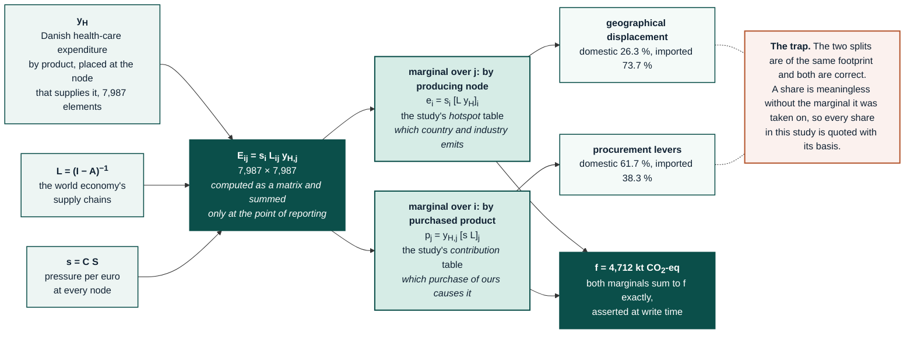
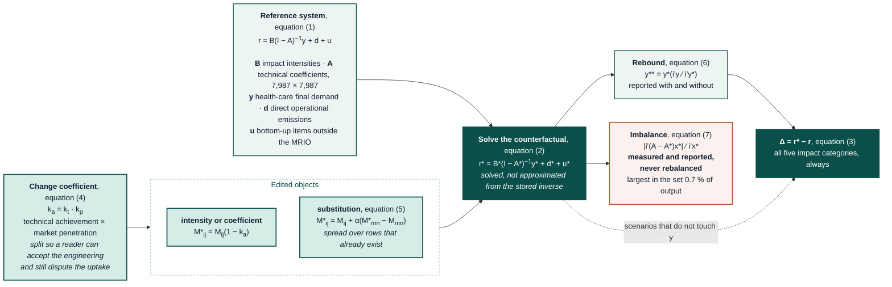

# Methods by replication layer

This document holds one section per gold-output folder, stating the source
article, the equations as they are implemented, the data each needs, the
deviations from the source, and the verification that runs against it. Each
section names its gold folder explicitly, so the parallel between a folder and
its write-up is direct: open the folder, open the matching section here. Every
gold folder's own `readme.md` links back to the matching anchor (see
`src/analysis/build_folder_metadata.py`).

These sections are written so that a reader who has the source article open
can check the implementation line by line, and so that a reader who has
neither can still reproduce the calculation. Every equation shown is the
equation in the code; where the code departs from the published form, the
departure is stated in the *Deviations* subsection rather than left for the
reader to discover.

## Contents

| # | Layer | Source | Module |
|:---|:---|:---|:---|
| [00](#r00) | Core footprint | Leontief (1970); Miller & Blair (2009) | `main_2025`, `extended_indicators`, `national_totals` |
| [01](#r01) | Eriksen replication (the manuscript) | Eriksen et al., NXSUST-D-26-01589 | `main_2025`, `eriksen_tables` |
| [02](#r02) | GHG-Protocol scopes | Hertwich & Wood (2018); OECD (2025) | `scopes_detail` |
| [03](#r03) | Target-sector scope 3 | Cabernard et al. (2019, 2022) | `cabernard_target_scope3` |
| [04](#r04) | Monte Carlo uncertainty | Lenzen et al. (2020); Rodrigues et al. (2018) | `uncertainty_2025` |
| [05](#r05) | Domestic waste from Danish accounts | Statistics Denmark AFF1MU1N / AFF3MU1N | `waste_domestic_dst` |
| [06](#r06) | Benchmarks and consistency audit | Schmidt & Merciai (2023); Eurostat FIGARO | `danish_healthcare_benchmark`, `figaro_benchmarks` |
| [07](#r07) | Malik replication | Malik et al. (2018, 2021) | `malik_replication`, `production_layers` |
| [08](#r08) | Lenzen KPI set | Lenzen et al. (2020) | `lenzen_replication` |
| [09](#r09) | EXIOBASE release defects | Rørmose Jensen & Iliev (2022) | `release_defect_audit` |
| [10](#r10) | Shipping reallocation | Rørmose Jensen & Iliev (2022) | `dk_shipping_correction` |
| [11](#r11) | Capital endogenisation | Södersten et al. (2018) | `capital_endogenised_sodersten`, `capital_gfcf` |
| [12](#r12) | Full impact-category profile | DESIRE FP7 characterisation | `impact_categories_full` |
| [13](#r13) | Steenmeijer replication | Steenmeijer et al. (2022) | `steenmeijer_replication` |
| [14](#r14) | Eckelman replication | Eckelman & Sherman (2016) | `eckelman_replication` |
| [15](#r15) | GWP revision sensitivity | IPCC AR4-AR6 | `gwp_revision` |
| 16 *(write-up not yet written)* | IMPACT World+ profile | Bulle et al. (2019); IW+ v2.2.1 | `impact_world_plus` |
| 17 *(write-up not yet written)* | Footprint by SHA function | Malik et al. (2018); OECD SHA 2011 | `health_subsector_footprints` |
| [18](#r18) | Counterfactual scenarios | Aguilar-Hernandez et al. (2018); Donati et al. (2020); Danish Klimastatus og -fremskrivning | `mitigation_scenarios` |

<a id="notation"></a>

## Notation used throughout

**Convention, stated once and held everywhere below and in every other
methods document that carries this study's own maths.** Matrices are set bold
upright upper case ($\mathbf{A}$, $\mathbf{L}$); vectors and scalars, whatever
their case, are set plain italic ($x$, $y_H$, $f$); a hat marks a vector
diagonalised into a matrix ($\hat{x}$), and a hat or bar is never bolded, even
on an upper-case symbol ($\bar{K}$ in [section 11](#r11)). A symbol quoted
verbatim from another paper's own table (for example Cabernard's $v_T$,
$v_O$ in [section 03](#r03)) keeps that paper's letter but still takes this
convention's case and weight.

| Symbol | Meaning | Shape |
|:---|:---|:---|
| $\mathbf{Z}$ | inter-industry transactions, M€ basic prices | 7,987 × 7,987 |
| $x$ | industry gross output, M€ | 7,987 |
| $\mathbf{A} = \mathbf{Z}\hat{x}^{-1}$ | direct requirements | 7,987 × 7,987 |
| $\mathbf{L} = (\mathbf{I}-\mathbf{A})^{-1}$ | Leontief inverse (total requirements) | 7,987 × 7,987 |
| $\mathbf{F}$ | stressor extension, physical units | 1,113 × 7,987 |
| $\mathbf{S} = \mathbf{F}\hat{x}^{-1}$ | direct stressor intensities | 1,113 × 7,987 |
| $\mathbf{C}$ | characterisation matrix | $k$ × 1,113 |
| $y_H$ | Danish health-care final demand, M€ | 7,987 |
| $s = \mathbf{C}\mathbf{S}$ | characterised direct intensity, one indicator | 7,987 |
| $f = s\,\mathbf{L}\,y_H$ | footprint, one indicator | scalar |
| $\mathbf{E}$, $E_{ij} = s_i\,L_{ij}\,y_{H,j}$ | bilateral pressure table, and one of its elements | 7,987 × 7,987 |

A *node* is one (region, industry) pair: 49 regions × 163 industries = 7,987.
Denmark is region index 5 (`DNK`), so the Danish block is rows/columns
$5 \times 163 \dots 6 \times 163 - 1$.

---

<a id="r00"></a>

## 00 — Core footprint (`data/gold/results/00_core_footprint/`)

**Modules** `analysis.main_2025`, `analysis.extended_indicators`, `analysis.national_totals`
**Source** Leontief (1970); Miller & Blair (2009) ch. 2, 10; Steenmeijer et al. (2022) for the health-sector application

### Question this layer answers

What environmental pressure, anywhere in the world, is caused by Danish health-care
final expenditure, and where does it physically arise?

This layer is the one every other folder builds on. It carries no study-specific
boundary choices beyond the health-care demand definition, so its outputs can be
re-aggregated to any comparator's boundary without recomputation.

### Method

#### The demand-driven identity

Danish health-care expenditure by product, $y_H$, is placed in a 7,987-element vector
at the node that supplies each product, and pushed through the world economy:

$$f = \mathbf{C}\,\mathbf{S}\,\mathbf{L}\,y_H = s\,\mathbf{L}\,y_H$$

The scalar $f$ is the footprint. What makes the result useful is that this scalar is
never computed as a scalar. It is computed as a matrix and summed only at the point of
reporting:

$$E_{ij} = s_i \, L_{ij} \, y_{H,j}, \qquad f = \sum_i \sum_j E_{ij}$$

$E_{ij}$ is the pressure arising at **producing node $i$** in supplying the
**purchased product $j$**, one element of the bilateral table $\mathbf{E}$.
Marginalising it two ways gives the two dimensions the study reports:

$$\text{by producing node:} \quad e_i = s_i \sum_j L_{ij} y_{H,j} = s_i \,[\mathbf{L}\, y_H]_i$$
$$\text{by purchased product:} \quad p_j = y_{H,j} \sum_i s_i L_{ij} = y_{H,j} \,[s\, \mathbf{L}]_j$$

Both marginals sum to $f$ exactly, which is asserted at write time. The full bilateral
table $E$ is 7,987 × 7,987 and is written compressed
(`footprint_bilateral_producer_x_purchase.csv.gz`) after dropping exact zeros.

The diagram below shows the two marginals and the trap of quoting a share without its
basis. A rendered copy is at `figures/diagrams/footprint_marginals.png` for readers
whose viewer does not draw Mermaid; `scripts/render_diagrams.py` produces it.



#### Why the marginals matter

The *producing node* marginal answers "which country and which industry emits", which
is the geographical-displacement question. The *purchased product* marginal answers
"which purchase of ours causes it", which is the procurement-lever question. They are
different tables, and neither can be derived from the other. Reporting only the
aggregate, which the submitted manuscript did, discards both.

#### Domestic and imported split

$$f_{\text{dom}} = \sum_{i \in \text{DNK}} e_i, \qquad f_{\text{imp}} = f - f_{\text{dom}}$$

taken on the **producing** index, not the purchased index. A product bought from a
Danish wholesaler but manufactured in China is imported pressure; splitting on the
purchase index would call it domestic. This distinction is why the two marginals are
both retained.

### Data requirements

| Input | Source | Note |
|:---|:---|:---|
| $\mathbf{Z}$, $x$, $y$ | EXIOBASE v3.8.2 `IOT_2022_ixi` | Zenodo 5589597; industry-by-industry |
| $\mathbf{F}$ | EXIOBASE satellite `F.txt`, `F_hh.txt` | 1,113 stressor rows |
| $\mathbf{C}$ | `characterisation_desire_version3_4_adapted.xlsx` | climate row rebuilt on AR6, see [section 15](#r15) |
| $y_H$ | Statistics Denmark health expenditure 2022 | mapped to EXIOBASE products; see `expenditure_vector_detail.csv` |
| Population | DST FOLK1A, 5,873,420 (2022) | per-capita denominators |

### Deviations from the source, stated

- **Basic prices.** EXIOBASE is in basic prices; Danish health expenditure is published
  at purchasers' prices. The expenditure vector is converted with the Danish
  trade-and-transport-margin and tax structure before entry, and the converted total is
  reported alongside the published total in `expenditure_summary.csv`.
- **Capital excluded.** $\mathbf{Z}$ carries current inputs only. This exclusion matches
  Steenmeijer, Eckelman, and the NHS reports and is the comparable convention; the
  magnitude of the omission is quantified in [section 11](#r11), not left
  unstated.
- **Households excluded from the extension.** $\mathbf{F}_{hh}$ is used only for national totals,
  never for the health-care footprint. Steenmeijer take the same position.

### Outputs

| File | Rows | Content |
|:---|:---|:---|
| `footprint_by_producing_node.csv` | 66,646 | pressure by (region, industry) of origin × indicator × demand component |
| `footprint_by_purchased_product.csv` | 30,931 | pressure by purchased product |
| `footprint_bilateral_producer_x_purchase.csv.gz` | n/a | the full $\mathbf{E}$ table, zeros dropped |
| `extended_indicators_by_producing_node.csv` | 126,403 | the same, for the non-climate indicators |
| `national_footprint_by_producing_node.csv` | 22,216 | Danish national footprint, same schema, for shares |
| `national_vs_healthcare_by_product_group.csv` | n/a | health share of each product group |
| `expenditure_vector_detail.csv` | 6,187 | $y_H$ itself, by node, with the price conversion |
| `data_dictionary.md` | n/a | column definitions (generated; common columns, region coding and the two-perspectives identity for every gold table) |

### Verification

- Six IO identities are asserted at ≤ 10⁻¹⁰: $\mathbf{A}x + y = x$; $\mathbf{L}(\mathbf{I}-\mathbf{A}) = \mathbf{I}$;
  row/column balance of $\mathbf{Z}$; the two marginals of $\mathbf{E}$ summing to $f$; and the
  domestic + imported split summing to $f$.
- `_bilateral_coverage.csv` reports the fraction of $f$ retained after dropping zeros
  from the bilateral table, per indicator, so the compression is auditable.
- `analysis.audit_consistency` check C2 reconciles every detail table to its aggregate.

---

<a id="r01"></a>

## 01 — Eriksen replication, the manuscript layer (`data/gold/results/01_eriksen_replication/`)

**Modules** `analysis.main_2025`, `analysis.eriksen_tables`
**Source** Eriksen et al., *The environmental impacts of the Danish health care system:
supply-chain origins and geographical displacement of impacts*, NXSUST-D-26-01589,
itself following Steenmeijer et al. (2022)

### Question this layer answers

This layer reproduces everything the manuscript reports, in the manuscript's own
table and figure structure, once per reference year and its matching background
model: 2019 expenditure on the 2016 background (as submitted) in `2019/`, and
2022 expenditure on the 2022 background (the resubmission) in `2022/`.

This folder is the deliverable for the resubmission. It is deliberately kept in the
submitted paper's shape (the same tables, the same figure numbering) so that the
revision can be described as a change of inputs and corrections, not a change of study.

### Method

Three quantities are reported, and they are three different things that the submitted
manuscript did not fully separate.

> **Naming warning, inherited from the original code.** The two analyses are named
> the opposite way round from how most readers will guess, and the names cannot be
> changed without breaking continuity with the submitted manuscript. In this study:
>
> * `hotspot` $= \mathbf{B}\,\mathrm{diag}(\mathbf{L}\, y)$, indexed by the **producing node**, i.e.
>   *where the pressure physically occurs*.
> * `contribution` $= \mathbf{B}\,\mathbf{L}\,\mathrm{diag}(y)$, indexed by the **purchased
>   product**, i.e. *which purchase drives it*.
>
> Reading them the intuitive way inverts the domestic/imported split: 26.3 % of the
> climate footprint is domestic on the producing-node basis, and 61.7 % on the
> purchased-product basis. Since September 2026 the output columns carry the correct
> `producing_*` / `purchased_*` prefixes, so the file schema now disambiguates them
> even though the file stems retain the legacy words.

#### Contribution

Pressure allocated to the node where it arises, driven by health final demand:

$$c_i = s_i \,[\mathbf{L}\,y_H]_i$$

This allocation is what "where does the impact occur" means. It sums to $f$ across
all nodes.

#### Hotspot

The same quantity aggregated to the **purchased product**, i.e. the second marginal of
$\mathbf{E}$ from [section 00](#r00):

$$h_j = y_{H,j}\,[s\,\mathbf{L}]_j$$

This marginal is what "which purchase drives it" means. It also sums to $f$.
Contribution and hotspot are marginals of the same table and must not be added
together; doing so double counts the whole footprint. The tables are written
separately for exactly this reason.

#### Intensity

Pressure per unit of expenditure on a product, independent of how much is bought:

$$m_j = [s\,\mathbf{L}]_j \quad \text{(kt CO}_2\text{e per M€)}$$

Intensity ranks products by how damaging a euro spent on them is; hotspot ranks them by
how much damage our actual spending causes. A product can be top of one and unremarkable
on the other, and the manuscript's discussion depends on the distinction.

#### Scope split

The scope split is reported here from [section 02](#r02) and
summarised in `scopes_summary.csv`, so the manuscript's scope figure is reproducible
from this folder alone.

### Data requirements

This layer needs the same inputs as [section 00](#r00), plus the bottom-up
items added outside the MRIO: direct provider emissions (DST DRIVHUS), medical
anaesthetic gases, patient and visitor travel, employee commuting, and the domestic
waste account ([section 05](#r05)).

### Deviations from the submitted manuscript, stated

These deviations are the ones a reviewer will need to see declared.

| Submitted | Revision | Reason |
|:---|:---|:---|
| 2019 expenditure on the 2016 model | 2022 on 2022 | reviewer R2-4; removes the deflation question entirely |
| EXIOBASE v3.7 | v3.8.2 | v3.10.2 tested and rejected, see [section 09](#r09) |
| AR4 climate factors (implicit in the DESIRE sheet) | IPCC AR6 | [section 15](#r15) |
| transport 37.5 % of the supply-chain footprint | 18.5 %, or 15.5 % of the total | EXIOBASE artefact, see [section 10](#r10) |
| aggregate results only | aggregate **and** full node detail | reviewer R1-11 |
| no uncertainty | Monte Carlo, 10⁵ draws | reviewer R1-1, see [section 04](#r04) |

### Outputs

Gold publishes tabular data only, so every manuscript table below is a CSV; no
workbook, document or image is published in this folder.

| File | Content |
|:---|:---|
| `hotspot_by_producing_node.csv` (22,229 rows) | $c_i$, indexed by **producing node** |
| `contribution_by_purchased_product.csv` (30,499) | $h_j$, indexed by **purchased product** |
| `intensity_by_purchased_product.csv` (30,487) | $m_j$, indexed by purchased product |
| `*_by_sector_group.csv`, `*_by_world_region.csv`, `*_domestic_vs_imported.csv` | the aggregations the manuscript prints |
| `table_01.csv`, `table_s05_dk.csv`, `steenmeijer_table.csv` | manuscript tables |
| `scopes_summary.csv` | the GHG-Protocol scope split for this boundary |
| `full_results_tables_fig1_absolute.csv`, `full_results_tables_fig1_relative_pct.csv`, `full_results_tables_fig2_absolute.csv`, `full_results_tables_fig2_relative_pct.csv`, `full_results_tables_fig3_absolute.csv`, `full_results_tables_fig3_relative_pct.csv` | the tables behind figures 1-3, absolute and as a percentage share |
| `figure1_activity_contributions.csv`, `figure2_sector_contributions.csv`, `figure2b_top_origin_industry_pairs.csv`, `figure3_geographical_origin.csv` | the plotted data behind figures 1, 2, 2b and 3 |

`contribution_full_detail.xlsx` and `hotspot_full_detail.xlsx`, the wide
raw-detail copies of $h_j$ and $c_i$, are written to silver (`eriksen_interim/`)
rather than gold: they are a redundant wide copy of the same two frames already
published above in long format, so nothing is lost by not publishing them here.
Manuscript figures are not published from this folder either; they are produced
separately under `figures/manuscript/`.

### Verification

- Contribution, hotspot, and the domestic/imported split each sum to the same $f$;
  asserted, not assumed.
- `analysis.audit_consistency` runs C2 (every detail table reconciles to its own
  aggregate) and C1 (this folder's headline equals the one every other module
  computes) against it.
- The headline is scope-guarded: only `HC_SCOPE=health_eldercare` writes here, so a
  sensitivity run cannot silently overwrite the manuscript numbers.

---

<a id="r02"></a>

## 02 — GHG-Protocol scope decomposition (`data/gold/results/02_scopes_wood_hertwich/`)

**Module** `analysis.scopes_detail`
**Sources** Hertwich & Wood (2018), *The growing importance of scope 3 greenhouse gas
emissions from industry*, Environ Res Lett 13:104013, table 1 and eqs. 1-3; GHG Protocol
Corporate Standard and Scope 3 Standard; Doucet et al. / OECD (2025), *Measuring
greenhouse gas emissions in the health sector*, §3.2

> An earlier version of this document and of `scopes_detail.py` attributed the scope
> partition to *Wood, Neuhoff, Moran et al., Clim Policy 20:S39-S57*. That reference is
> a real paper but not the source of this method. The table and equation numbers the module
> follows are Hertwich & Wood (2018) ERL, which is the paper held in the library.

### Question this layer answers

Of the total health-care footprint, this layer asks how much is emitted by the
providers themselves, how much by the generation of the energy they buy, and how much
everywhere else in the supply chain, using the partition a health system would
recognise from its own reporting.

### Method

The three scopes are computed from three different sources, because computing them all
from the MRIO would get Scope 1 wrong.

#### Scope 1: direct provider emissions

Scope 1 is taken from Danish national accounts (DST DRIVHUS), **not** from the MRIO.

This boundary is a structural point, not a preference. The final-demand vector $y_H$
is the providers' *purchase* column. The providers' own combustion is therefore outside
$f = s L y_H$ by construction: it never appears in what they buy. Adding a national
accounts figure is not double counting; it is filling a gap the model leaves open.

$$S_1 = \text{DRIVHUS}_{\text{Q}} - \text{medical N}_2\text{O} + \text{anaesthetic gases}_{\text{bottom-up}}$$

Medical nitrous oxide is netted out of the DRIVHUS figure before the bottom-up
anaesthetics estimate is added, so the gas is counted once. The evidence behind the
bottom-up anaesthetics estimate is set out in full in
[docs/revision/results_2022.md, "Bottom-up anaesthetic gases"](../revision/results_2022.md#bottom-up-anaesthetic-gases).

#### Scope 2: generation of purchased energy

Purchased electricity, steam, and heat reach the provider through transmission and
distribution, which are separate EXIOBASE industries. A first-tier calculation would
therefore capture the grid, not the power station. The energy block is inverted on its
own so the chain is followed to generation and no further:

$$\mathbf{L}_{EE} = (\mathbf{I}_{EE} - \mathbf{A}_{EE})^{-1}, \qquad S_2 = d_E \cdot \mathbf{L}_{EE}\, y_E$$

where $E$ indexes the electricity, steam, and hot-water nodes in all 49 regions and
$y_E$ is the providers' own first-tier energy purchases.

#### Three published conventions, all computed

Scope 2 is not one number in the EE-MRIO literature. Three conventions differ by how much
of the purchased-energy chain they count, and the study computes all three:

| Convention | Formula | Value (kt) | What it counts |
|:---|:---|:---|:---|
| OECD (Doucet et al. 2025 §3.2) | $\mathbf{F}\mathbf{A}\mathbf{Y}$, energy sectors | 72.08 | direct emissions of the *first-tier* energy supplier only |
| GHG Protocol strict | $d_E \mathbf{L}_{EE} y_E$ | **73.34** | traces through T&D to **generation**, stops inside the energy block |
| **Hertwich & Wood (2018)** | $\mathbf{E}_Z = \hat{m}\mathbf{Z}$, $m = s(\mathbf{I}-\mathbf{A})^{-1}$, energy rows | **74.98** | cradle-to-gate: generation **plus** the upstream fuel supply behind it |

**The manuscript reports 74.98**, the Hertwich & Wood convention, because that is the
method this pipeline inherits and the paper it follows. It is broader than the corporate
standard, which assigns upstream fuel supply to Scope 3 category 3.

**This folder's own partition uses 73.34**, the strict-protocol figure, so that its
Scope 1 + 2 + 3 decomposition is internally protocol-conforming.

The OECD form **under-counts on EXIOBASE `ixi`**: electricity reaches the buyer through
*Transmission* and *Distribution and trade of electricity*, whose own combustion intensity
is near zero, so generation sits one tier further back than $\mathbf{F}\mathbf{A}\mathbf{Y}$ reaches. This
shortfall is a model-layout artefact, not a flaw in their method: their ICIO tables
have a single sector D.

The spread is 72.1-75.0 kt: 3.9 % of Scope 2 and **0.06 % of the total footprint**. The
choice changes no conclusion. It is reported because the manuscript claims GHG-Protocol
scopes, and a reader is entitled to know which operationalisation produced the number.

#### Scope 3: everything else

$$S_3 = f_{\text{MRIO}} - S_2 - s_h (\mathbf{L}_{hh} - 1) E_H + \text{pMDI} + \text{commuting}$$

The subtracted term is the health sector's **self-supply loop**: the pressure the
Danish health node causes in supplying itself, which the national-accounts Scope 1
figure already contains. It is 1.83 kt. Subtracting it is what makes Scope 1 and
Scope 3 additive rather than overlapping.

#### Outside protocol

Patient and visitor travel (263.57 kt) is caused by the health system but is not
attributable to it under any GHG-Protocol scope, because the providers neither own,
control, nor purchase it. It is reported separately rather than folded into Scope 3.

### Data requirements

| Input | Source |
|:---|:---|
| Direct provider emissions | DST DRIVHUS, industry Q |
| Medical anaesthetic gases | Danish pharmacy sales, bottom-up; see [docs/revision/results_2022.md, "Bottom-up anaesthetic gases"](../revision/results_2022.md#bottom-up-anaesthetic-gases) |
| Energy purchases $y_E$ | health column of the Danish use table |
| pMDI, commuting, patient travel | Danish primary registers |

### Deviations from the source, stated

- Hertwich & Wood define the scopes for *gross production* of whole sectors; the
  application to one sector's **final demand** is ours, and the self-supply subtraction is
  a consequence of that application which their paper does not need.
- The manuscript layer ([section 01](#r01)) totals 4,712.42 kt using the
  Hertwich & Wood Scope 2; this folder totals 4,710.58 kt using the strict-protocol
  Scope 2 and removing the self-supply loop. Both are correct on their stated basis, and
  audit check C1 reconciles them: 4,710.58 + 1.83 = 4,712.42. The two terms are
  rounded independently, so adding the printed figures gives 4,712.41; the check
  runs on the unrounded values and closes to 1e-9.

### Outputs

| File | Rows | Content |
|:---|:---|:---|
| `scopes_summary_detailed.csv` | n/a | every scope and variant, with its `basis` stated |
| `scopes_by_producing_node.csv` | 23,727 | each scope resolved to producing node |
| `double_counting_ledger.csv` | n/a | every overlap risk, its test, and its verdict |

### Verification

- `analysis.audit_consistency` C1: partition total 4,710.58 + self-supply loop 1.83
  = 4,712.42, which equals the manuscript grand total. **PASS.**
- The double-counting ledger tests each bottom-up item against the MRIO for overlap and
  records the numerical result, so "we checked for double counting" is a table, not a
  claim.

### Figure-ready tables and figures

`analysis.scope_figure_tables` reshapes the partition for plotting. Scope 2 and the MRIO
part of scope 3 already carry producing nodes; scope 1 and the bottom-up items do not, and
are placed at their true Danish origin rather than dropped:

| Component | Origin | Industry label |
|:---|:---|:---|
| Scope 1 (DRIVHUS) + anaesthetic gases | DNK | Health and social work |
| pMDI propellants | DNK | Health and social work |
| Employee commuting | DNK | Bottom-up: employee commuting |
| Patient and visitor travel | DNK | Bottom-up: patient and visitor travel |

All are Danish by construction (emissions of Danish providers, staff, or patients),
so labelling them as such is what lets the bars be added back to the headline.

| Table | Grain |
|:---|:---|
| `scope_by_origin_and_industry.csv` | scope × producing country × producing industry (7,346 rows) |
| `scope_by_origin_industry_top25.csv` | the 25 largest (country, industry) pairs, remainder pooled and labelled |
| `scope_by_industry_group.csv` | scope × industry group |
| `scope_by_continent.csv` | scope × world region of origin |
| `scope_by_continent_and_industry_group.csv` | the cross |
| `scope_by_country.csv` | scope × country |

Each aggregation asserts that it preserves the total, so no view can silently lose mass.

`R/plot_scope_emissions.R` renders four TIFFs from these tables, in the study's figure
conventions (`R/_dk_common.R`): no on-figure title, facet titles the largest text, legend
at the bottom without a title, bars ranked descending with the remainder re-sorted into the
ranking by its own value, per-facet axis ceilings so no bar touches the panel edge, and
ASCII-only labels because the TIFF font renders a middle dot as `..`.

**A finding visible in the top-origins figure:** the 25 largest origin-industry pairs
account for 45 % of the footprint; the pooled remainder is the single largest bar. The
Danish health footprint is diffuse (no supplier dominates it), which is itself worth
stating, and is why the remainder bar is kept rather than cropped.

---

<a id="r03"></a>

## 03 — Target-sector scope 3 without double counting (`data/gold/results/03_cabernard_target_scope3/`)

**Module** `analysis.cabernard_target_scope3`
**Source** Cabernard, Pfister & Hellweg (2019), *A new method for analyzing
sustainability performance of global supply chains*, Sci Total Environ 684:164-177,
eqs. 8, 9, 12; extended in Cabernard & Pfister (2022)

### Question this layer answers

This layer answers a different question from the headline, and the distinction is the
point of the folder.

**(a) Final-demand footprint**, what the headline answers:
$$f = s\,\mathbf{L}\,y_H$$
Each emission is allocated once, to Danish health-care final demand. This allocation
is additive over any number of target nodes and does not double count (Wood & Hertwich
2018 p. 5).

**(b) Target-sector scope 3**, what Cabernard et al. answer: *what is the scope 3 of
the health sector-regions themselves?* Here the naive form does double count.

### Method

The notation is Cabernard's, transcribed from her Table 1 and §2.2 (2019, p. 167),
set in this repository's own convention (bold upper case for matrices, plain
italic for vectors and scalars, stated once [above](#notation)). $v_T$ and
$v_O$ are index vectors partitioning the 7,987 sector-regions into the
**target set** $T$ and the **non-target set** $O$, with $T \cup O = \text{all}$
and $T \cap O = \emptyset$.

$$\mathbf{A}_{T-O} = \mathbf{A}(v_T, v_O) \quad (1) \qquad \mathbf{A}_{O-O} = \mathbf{A}(v_O, v_O) \quad (2)$$
$$\mathbf{Y}_{T-\text{all}} = \mathbf{Y}(v_T, :) \quad (3) \qquad \mathbf{Y}_{O-\text{all}} = \mathbf{Y}(v_O, :) \quad (4)$$
$$x^T = x^{\text{tot}}(v_T) \quad (5) \qquad \mathbf{L}_{\text{all}-T} = \mathbf{L}(:, v_T) \quad (6)$$
$$\mathbf{L}'_{O-O} = (\mathbf{I}_{O-O} - \mathbf{A}_{O-O})^{-1} \quad (7)$$

$d_{\text{all},i}$ is the 1 × 7,987 row vector of direct impact per unit output.

#### Eq. (8): target scope 3 **with** double counting

$$e_{T,i} = d_{\text{all},i} \; \mathbf{L}_{\text{all}-T} \; \mathrm{diag}(x^T) \qquad (8)$$

This equation is the form Cabernard attributes to previous studies, including Hertwich
& Wood (2018). Every delivery from one target node to another is counted twice: once as
the supplying target's own output, and again inside the receiving target's upstream
chain.

#### Eq. (9): target scope 3 **without** double counting

The correction **replaces the gross output vector**; it does not subtract impacts. The
overbar is a row sum across final-demand columns:

$$e^{\text{wdc}}_{T,i} = d_{\text{all},i} \; \mathbf{L}_{\text{all}-T} \;
\mathrm{diag}\!\left( \overline{\mathbf{Y}_{T-\text{all}} + \mathbf{A}_{T-O} \, \mathbf{L}'_{O-O} \, \mathbf{Y}_{O-\text{all}}} \right) \qquad (9)$$

Gross output $x^T$ is replaced by (i) final demand met directly by target outputs, plus
(ii) final demand for target products embodied in **non-target** outputs, deliberately
omitting target-into-target inputs. Because $\mathbf{A}_{T-O}$ selects only the $T \to O$ block and
$\mathbf{L}'_{O-O}$ propagates through non-target sectors only, this substitution removes
**both** direct $T \to T$ deliveries **and** indirect $T \to \dots \to T$ loops.

$\mathbf{L}_{\text{all}-T}$ is untouched: the complete upstream chain, including inputs from other
target sectors, is still fully counted for whichever target's corrected output it attaches
to.

#### Eq. (12): the overestimation factor

$$f_{T,i} = \frac{e_{T,i} - e^{\text{wdc}}_{T,i}}{e_{T,i}} \qquad (12)$$

#### As implemented

`analysis.cabernard_target_scope3`, line for line against the equations above:

```python
L_OO  = np.linalg.inv(np.eye(len(O)) - A[np.ix_(O, O)])          # eq. 7
e_T   = float(d @ (L[:, T] @ x[T]))                              # eq. 8
q_T   = (Y[T, :] + A[np.ix_(T, O)] @ (L_OO @ Y[O, :])).sum(axis=1)  # eq. 9 bracket, overbar
e_wdc = float(d @ (L[:, T] @ q_T))                               # eq. 9
f_T   = (e_T - e_wdc) / e_T                                      # eq. 12
```

#### What it shows

| Target set | Nodes | Eq. (8) naive (Mt) | Eq. (9) corrected (Mt) | $f_T$, eq. (12) | Overestimate against the corrected value |
|:---|:---|:---|:---|:---|:---|
| T1 Danish health and social work | 1 | 4.39 | 4.33 | 1.5 % | 1.5 % |
| T2 health and social work, all regions | 49 | 2,592.1 | 2,554.5 | 1.4 % | 1.5 % |
| T3 T2 + chemicals + medical instruments | 147 | 9,280.5 | 5,999.5 | **35.4 %** | **54.7 %** |

Two statistics are reported because they answer different questions and only one of
them is equation (12). $f_T$ takes the naive figure as its denominator and therefore
says what share of the naive total is double counted. The overestimate takes the
corrected figure as its denominator and says by how much the naive total exceeds the
right answer. They coincide while double counting is small and diverge once it is not,
which is why the T3 row reads 35.4 % against 54.7 %. Both are written to
`cabernard_target_scope3.csv`, as `double_counting_factor_f_T` and
`overestimate_vs_correct_pct`.

The T3 row is the finding, and it is the same mechanism Cabernard reports: a broadly
defined target set whose members sit in each other's supply chains. Her own G20 paper
reports overestimation above 40 % for biomass and fossil resources and above 100 % for
metals and non-metallic minerals. Those are overestimates against the corrected value,
so the comparable figure here is **54.7 %**, which is of that order.

### Data requirements

This layer needs $\mathbf{A}$, $\mathbf{L}$, $x$, and the characterised intensity $s$ from
[section 00](#r00). No additional data is required.

### Does our headline inherit the Hertwich & Wood double counting?

**No, and the reason is structural rather than a correction we apply.**

Cabernard's objection is to Eq. (8) applied to a *set* of target sectors. The double
counting arises from summing $\mathbf{E}_Z$-type flows over targets that sit in each other's supply
chains. Three of our numbers could in principle be exposed to it; each is checked:

| Our quantity | Form | Exposed? |
|:---|:---|:---|
| Headline footprint | $f = s\,\mathbf{L}\,y_H$, a **final-demand** footprint | **No.** Hertwich & Wood state it themselves: $\mathbf{E}_y$ sums to the total while $\mathbf{E}_Z$ does not. Each emission is allocated once, to Danish health final demand. |
| Scope 2 ([section 02](#r02)) | energy **rows** of $E_Z$ for the single health **column** | **No.** One row-slice of one purchasing column is not a sum over overlapping targets. No second target exists to double count against. |
| Scope 1 + 2 + 3 | $S_3$ is the footprint **residual** after $S_1$ and $S_2$ | **No.** The partition is constructed to sum to $f$ exactly, so it cannot exceed it. Audit check C1 asserts this identity. |
| Target-sector scope 3 (this folder) | Eq. (8) | **Yes**, which is precisely why Eq. (9) is implemented here. |

So the exposure is confined to the one quantity this folder exists to compute, and there it
is corrected with Cabernard's own equation rather than an approximation of it. The
manuscript's reported numbers are all final-demand footprints and are unaffected.

### Deviations from the source, stated

- Cabernard et al. apply this to global sector groups; the target sets here are chosen
  to bracket plausible definitions of "the health-care supply chain", which is our
  choice and is documented in the `target` column.
- **Cabernard excludes extraction sectors** from her target set when quantifying double
  counting, "because this step is already included in the upstream supply chain of
  material processing" (2019, §2.7). Our target sets are health, chemicals, and medical
  instruments, none of which is an extraction sector, so the analogous exclusion does not
  arise. The point is stated because a reader checking our T3 against her method will
  look for it.
- Cabernard formalises **scope 3 only**. The strings "scope 1" and "scope 2" do not appear
  in either the 2019 or the 2022 paper. Our scope 1 and 2 come from
  [section 02](#r02) (Hertwich & Wood and the GHG Protocol), not from her,
  and this folder makes no scope 1 or scope 2 claim.
- **This layer does not change the headline.** The study's headline is a final-demand
  footprint, form (a), which was never subject to this double counting. The folder
  exists to demonstrate that, not to correct anything.

### Outputs

| File | Content |
|:---|:---|
| `cabernard_target_scope3.csv` | the three target sets, naive vs corrected, with the identity check |
| `cabernard_target_scope3_by_producing_node.csv.gz` | corrected result at full node detail |
| `cabernard_domestic_vs_imported.csv` | domestic/imported split of the corrected result |

### Verification

`complement_identity_rel_dev` is ≤ 2.3 × 10⁻¹⁵ for all three target sets: target plus
non-target scope 3 reconstructs the world total to machine precision.

---

<a id="r04"></a>

## 04 — Monte Carlo parameter uncertainty (`data/gold/results/04_uncertainty_lenzen_ieooc/`)

**Module** `analysis.uncertainty_2025`
**Sources** Lenzen et al. (2020) SI Tab. SI 7.1; Rodrigues, Moran, Wood & Behrens (2018),
*Uncertainty of consumption-based carbon accounts*, Environ Sci Technol 52:7577-7586;
Wood et al. (2019); the IEooc reference implementation

Full narrative version, derivation, and the manuscript/SI text ready to paste, is in
[docs/revision/uncertainty.md](../revision/uncertainty.md).

### Question this layer answers

Reviewer 1's central request: how precise is the estimate, what drives its imprecision,
and do the reported rankings hold across draws?

### Method

#### What is perturbed, and what is not

The footprint is linear in final demand and the bottom-up items are additive, so a draw
recombines precomputed components. $A$ and $L$ are held **fixed**, and $(I-A)$ is never
re-inverted. This restriction is the same choice the IEooc reference implementation
makes, and it is stated in the Methods rather than left implicit.

Each uncertain quantity enters as a **median-1 lognormal multiplier**:

$$f^{(d)} = \sum_k \lambda_k^{(d)} \, f_k, \qquad
\lambda_k \sim \mathrm{LogNormal}(0, \sigma_k^2), \quad \mathrm{median}(\lambda_k)=1$$

Median-1 means the simulation median reproduces the deterministic result and the
distribution adds dispersion without shifting the centre. (The *mean* is inflated by
$e^{\sigma^2/2}$; this inflation is why the median, not the mean, is reported as the
central value.)

#### Parameters

| Parameter | GSD / CV | Source |
|:---|:---|:---|
| `mrio` | CV 8.35 % | Lenzen et al. (2020) SI Tab. SI 7.1: Danish health GHG footprint 2.84 ± 0.24 Mt |
| `direct` | GSD 1.1 | DST DRIVHUS/AFFALD; residual risk is the α-proration |
| `anaesthetic` | GSD 1.3 | Denmark NID 2.G.3.a activity ± 25 % |
| `pmdi` | GSD 1.15 | register dispensing × producer HFC content |
| `commute` | GSD 1.25 | ratio method on NL base with DST employment and TU distances |
| `visitor` | GSD 1.4 | no Danish source; Dutch base is itself a transplanted English figure |

The widest distribution is on the parameter with the weakest provenance, which is the
correct ordering and is visible in the table rather than asserted in prose.

#### MRIO uncertainty

EXIOBASE ships no element-level standard deviations. Rather than omit the largest source
of uncertainty, it enters as **one multiplicative factor applied jointly to all MRIO
components**, i.e. correlation $\rho = 1$ between them, which is the conservative bound.
Rodrigues et al. report an empirical correlation of 0.63 ± 0.36 (median 0.76); the
$\rho = 1$ assumption is therefore an upper bound on this component's contribution, and
`uncertainty_mrio_correlation.csv` reports the interval under alternative $\rho$.

The calibration target, 8.35 %, is the only published Monte Carlo estimate of *this exact
quantity*. Wood et al. (2019) independently give 8.8 % for Denmark.

#### Structural choices are scenarios, not distributions

The pharmaceuticals mapping, the price base year, and the waste reference year are **modelling
decisions**, not measurement errors. Burying a decision inside a lognormal would
misrepresent it. They are run as a factorial of scenarios
(`uncertainty_structural_scenarios.csv`) and reported separately.

#### Variance decomposition

First-order Sobol indices are computed exactly rather than by resampling, since the
model is a sum of independent scaled components:

$$S_k = \frac{\mathrm{Var}(\lambda_k) \, f_k^2}{\mathrm{Var}(f)}$$

#### Ranking probabilities

For each contributor group, we report the fraction of draws in which it takes rank 1, 2,
or 3. These probabilities answer "does the reported ranking hold across draws?" directly,
rather than by inspection of intervals.

### Results

| Quantity | Value |
|:---|:---|
| Deterministic climate | 4,712 kt |
| Median | 4,734 kt |
| 95 % interval | 4,064 to 5,531 kt |
| CV | 7.87 % |
| MRIO share of variance | 78.8 % |

### Deviations from the source, stated

- Lenzen et al. propagate Eora's own $Q$, $A$, and $y$ uncertainties. We cannot: EXIOBASE
  publishes none. We therefore **borrow their result as a calibration** rather than
  reproduce their propagation, and say so.
- Draws are 10⁵, not 10⁶; the Monte Carlo standard error of the median is reported
  (`mcse_median_pct`) so the reader can see that this draw count is sufficient.

### What this does **not** establish

This interval is parametric uncertainty **conditional on one model**. Tukker et al.
warn that national error statistics do not transfer to sector studies; Schulte et al. (2024,
table 2) report median footprint CVs of 3 % at country level against 18 % at sector
level, and 4 % against 94 % for the emission accounts behind them. Our own change of EXIOBASE release moved the
result by more than this interval spans. A limitations paragraph making exactly this point
is drafted in [docs/revision/uncertainty.md](../revision/uncertainty.md#6-manuscript-and-si-text-ready-to-paste) and should be carried into the
manuscript; reporting the interval without it would over-claim.

### Verification

- Simulation moments are checked against the closed-form mean and variance of a sum of
  lognormals.
- Variance shares sum to 100.0 % once the covariance of the correlated travel
  pair is carried as its own row; without it the own-terms reach only 90.7 %.
- A step-by-step derivation of every equation, for a reader who does not want
  to read the code, is in [docs/revision/uncertainty.md](../revision/uncertainty.md), sections 1-9.

---

<a id="r05"></a>

## 05 — Domestic waste from Danish national accounts (`data/gold/results/05_waste_dst_accounts/`)

**Modules** `analysis.waste_domestic_dst`, `analysis.waste_validation`
**Source** Statistics Denmark StatBank AFF1MU1N / AFF3MU1N (IO-based waste multipliers,
117 industries, 2011-2023) and AFFALD01 (SEEA waste accounts)

### Question this layer answers

How much waste does Danish health care actually generate, and is the waste indicator
inherited from Steenmeijer et al. fit to answer that?

### Method

#### Why the inherited indicator was tested

The inherited waste extension applies the **2011 hybrid EXIOBASE waste-supply account** to
the analysis year's monetary output. Testing it against Denmark's own SEEA accounts shows
it is not merely out of date but a **different concept**: a total-residuals account in
which livestock manure and mining overburden dominate. 74 % of the Danish total is manure;
69 % of the health-care "waste" footprint is mining overburden plus manure.

| Quantity | Value |
|:---|:---|
| Hybrid extension, direct waste of Danish health | 240.4 kt |
| DST AFFALD01, NACE Q total waste excl. soil | 51.8 kt |
| DST, study boundary (QA + 870000 + α × 880000, α = 0.4914) | 45.1 kt |
| **Ratio, hybrid / measured** | **4.6×** |

It also fails as an allocation key: its 2011 Danish sector structure is statistically
uncorrelated with the measured 2011 structure (Pearson $r = -0.19$). A key that does not
correlate with what it is meant to distribute is not a key.

#### The Danish route

Denmark uniquely publishes IO-based waste multipliers on the **same 117-industry
classification as its own IO tables**, which removes the need for a concordance:

$$W_{\text{direct}} = \sum_i d_i \, x_i, \qquad
W_{\text{total}} = \sum_i m_i \, x_i, \qquad
W_{\text{hazardous}} = \sum_i h_i \, x_i$$

with $d_i$ the direct waste intensity (t per M DKK), $m_i$ the direct-plus-indirect
multiplier, and $h_i$ the hazardous multiplier, applied to Danish health-care
expenditure $x_i$ in million DKK.

This route is a **domestic** account by construction: DST's multipliers cover the
Danish economy. It therefore complements, rather than replaces, the MRIO waste
indicator, which covers the global chain. Both are reported.

### Data requirements

| Input | Source |
|:---|:---|
| $d_i$, $m_i$, $h_i$ | DST AFF1MU1N / AFF3MU1N, 2022 |
| $x_i$ | Danish health expenditure by industry, million DKK |
| Validation target | DST AFFALD01, NACE Q |
| α = 0.4914 | share of NACE 88 in the study's eldercare boundary |

### Deviations from the source, stated

- α-proration of NACE 880000 is ours, not DST's; it is the residual risk quantified in the
  Monte Carlo `direct` parameter ([section 04](#r04)).
- The MRIO waste indicator is **retained** in the headline for comparability with
  Steenmeijer, with the DST account reported alongside. Replacing it silently would break
  the comparison the study exists to make.

### Outputs

| File | Content |
|:---|:---|
| `waste_footprint_domestic_dst.csv` | per industry: expenditure, three intensities, three waste quantities |
| `waste_extension_validation.csv` | the four rows of the table above, with basis |

### Verification

The hybrid-versus-measured ratio and the $r = -0.19$ correlation are both computed and
written out, so the decision to report the DST account is evidenced rather than asserted.

---

<a id="r06"></a>

## 06 — Benchmarks and the standing consistency audit (`data/gold/results/06_benchmarks_validation/`)

**Modules** `analysis.danish_healthcare_benchmark`, `analysis.figaro_benchmarks`,
`analysis.figaro_recipe_validation`, `analysis.demand_vector_consistency`,
`analysis.audit_consistency`
**Sources** Schmidt & Merciai (2023), *GHG emissions from Danish consumption 2016*;
Eurostat `env_ac_ghgfp` (FIGARO); Statistics Denmark AFTRYK

### Question this layer answers

Is the result right? Two independent tests answer it: agreement with published Danish
footprints, and internal consistency across the study's own outputs.

### Method

#### Boundary-matched benchmark against the only comparable published study

Schmidt & Merciai report Danish *Health and social work services* at 6.1 Mt CO₂e,
1.07 t per capita, 8.3 % of the national total, on the EXIOBASE v4 hybrid model. It is the
only published Danish health-sector footprint on an EXIOBASE-family model.

Comparing headline to headline would mislead, so three boundary differences are removed
one at a time and each step is reported:

| Basis | Mt | t/capita | % national | ratio |
|:---|:---|:---|:---|:---|
| Schmidt & Merciai 2023 (published) | 6.10 | 1.070 | 8.3 | 1.000 |
| This study, headline | 4.71 | 0.802 | 6.1 | 0.750 |
| + their sector boundary (NACE Q incl. childcare) | 5.28 | 0.899 | 6.8 | 0.841 |
| **+ their capital treatment (endogenised)** | **6.39** | **1.088** | **8.2** | **1.017** |

Boundary-matched agreement is **1.7 % on per capita and 0.1 percentage points on the
national share**. The apparent 25 % gap was entirely boundary, not model, data, or
implementation.

What remains and cannot be adjusted away: their model is **consequential (marginal)**,
ours is attributional. This difference is stated, not corrected.

#### Model-family benchmark

Published Danish consumption-based footprints separate by **model family**, not by year:

| Source | Year | Family | t/capita |
|:---|:---|:---|:---|
| Eurostat FIGARO | 2022 | national accounts | 9.77 |
| Statistics Denmark AFTRYK | 2022 | NA coupled to EXIOBASE | 10.71 |
| Rørmose Jensen & Iliev | 2020 | NA coupled to EXIOBASE | 11.00 |
| Schmidt & Merciai | 2016 | EXIOBASE v4 hybrid | 12.90 |
| **This study** | 2022 | EXIOBASE v3.8.2 | **13.19** |

The two EXIOBASE-family results agree to 2.3 %; the three national-accounts-family results
cluster 20 % below. Our gap against Statistics Denmark is a property of the model family,
with a named cause (the Danish domestic block, see [section 09](#r09)), not
an implementation error.

#### Recipe validation

The Danish health column's input structure is compared three ways (EXIOBASE, Eurostat
FIGARO Q86, and Statistics Denmark IO 86), so the model's *composition*, not only its
total, is tested (`recipe_validation_three_way.csv`).

#### Standing consistency audit

`analysis.audit_consistency` runs these families of check, several of which cover
more than one table, and exits non-zero on failure:

| Check | What it enforces |
|:---|:---|
| C1 | the climate total agrees across independently written modules |
| C2 | every node-detail file sums to its own aggregate |
| C3 | no gold file is older than the background it claims |
| C4 | no file retains a withdrawn model label |
| C5 | every gold file has a manifest lineage row |
| C6 | headline numbers quoted in the revision docs still reproduce |

C6 was added on 8 September 2026 after six quoted figures were found to have drifted from
the outputs, two of them mutually inconsistent between documents.

### Deviations from the source, stated

- FIGARO's `nace_r2` is the industry where emissions occur, not the purpose the final
  demand serves, so FIGARO supports a **national** benchmark and a bilateral-origin
  comparison but **not** a health-sector benchmark. The closest proxy is general-government
  final consumption, and it is labelled as a proxy.
- Schmidt & Merciai's reference year is 2016 and ours is 2022; the comparison is of
  per-capita level and national share, not of a time series.

### Outputs

This layer writes `danish_healthcare_benchmark_boundary_matched.csv`,
`published_danish_footprint_benchmarks.csv`, `figaro_vs_this_study_climate.csv`,
`figaro_dk_footprint_by_origin.csv`, `figaro_dk_footprint_by_final_demand.csv`,
`figaro_eu27_material_footprint_health.csv`, `recipe_validation_2022.csv`,
`recipe_validation_three_way.csv`, `demand_vector_consistency.csv`,
`consistency_audit.csv`.

### Verification

The audit is the verification, and it is a gate. Every check passes at the current
build; the count grows as families are added, so the report itself is the record
rather than a number quoted here.

---

<a id="r07"></a>

## 07 — Malik replication (`data/gold/results/07_malik_replication/`)

**Modules** `analysis.malik_replication`, `analysis.production_layers`
**Sources** Malik, Lenzen, McAlister & McGain (2018), *The carbon footprint of Australian
health care*, Lancet Planet Health 2:e27-35; Malik et al. (2021); Lenzen et al. (2020) SI §5

### Question this layer answers

How does Denmark compare with the Australian health system, on Australia's own
methodological choices rather than ours; and how far upstream does the pressure occur?

### Method

#### Making the comparison like-for-like

Malik et al.'s boundary choices differ from ours in ways that make a naive comparison
wrong. Each is matched or declared:

| Choice | Malik 2018 | Malik 2021 | This study | What we do |
|:---|:---|:---|:---|:---|
| imports | in the value-added block | excluded | full MRIO | compute a domestic-only variant |
| capital | included (2,776 kt, 8 % of their total) | excluded | excluded | report the capital sensitivity separately |

Because both Malik papers are **domestic-only models**, the only Danish number comparable
with their 7.2 % / 6.6 % national shares is a domestic-only variant:

$$\mathbf{L}_{\text{dom}} = (\mathbf{I} - \mathbf{A}_{\text{DK,DK}})^{-1} \qquad (163 \times 163)$$

$$f_{\text{dom}} = s_{\text{DK}} \, \mathbf{L}_{\text{dom}} \, y_{H,\text{DK}}$$

This variant is reported in `malik_domestic_vs_full.csv` beside the full-MRIO result,
so the reader can see both the comparable number and the complete one.

#### Production-layer decomposition

The Leontief inverse is a convergent series, so the footprint splits by how far upstream
the pressure occurs:

$$\mathbf{L} = (\mathbf{I}-\mathbf{A})^{-1} = \mathbf{I} + \mathbf{A} + \mathbf{A}^2 + \dots$$
$$f^{(n)} = \mathrm{diag}(s)\, \mathbf{A}^n y \qquad \text{(pressure in layer } n \text{, by node)}$$
$$S_m = \frac{\sum_{n \le m} f^{(n)}}{f}, \qquad TE_m = 1 - S_m$$

The **diagonalised** form is what allows each layer to be broken down by the sector in
which the pressure occurs (Malik's Fig. 3); the scalar form $q \mathbf{A}^n y$ cannot do that.

Powers of $\mathbf{A}$ are never formed; the layer vector is iterated $v \leftarrow \mathbf{A} v$, which
is $O(n^2)$ per layer instead of $O(n^3)$.

The residual beyond the last computed layer is closed **exactly**:

$$\text{residual} = s \cdot \mathbf{A}^{M+1} \mathbf{L} y$$

so the reported layers plus residual sum to the footprint with no truncation error left
unaccounted.

#### What the layers show

| Layer | Imported share |
|:---|:---|
| 0 | 49.7 % |
| 1 | 70.8 % |
| 2 | 78.0 % |
| 3 | 89.7 % |

Geographical displacement deepens with every tier. This deepening is the evidence
behind the manuscript's displacement claim, and it is stronger than the aggregate split
because it shows a gradient rather than a single ratio.

### Data requirements

This layer needs $\mathbf{A}$, $\mathbf{L}$, $s$, and $y_H$ from [section 00](#r00); Malik's
published values are transcribed into `malik_published_reference.csv` with their
boundary recorded per row.

### Deviations from the source, stated

- Malik's Australian model (IELab) has native health sub-sector detail that EXIOBASE's
  `ixi` layout does not; sub-sector comparison is therefore made through the concordance
  route of layer 17 (health sub-sectors). Its own replication write-up has not
  been written yet; see the [Contents](#contents) table above.
- Their capital inclusion is not matched in the headline; it is quantified in
  [section 11](#r11).

### Outputs

This layer writes `malik_domestic_vs_full.csv`, `malik_component_intensities.csv`,
`malik_published_reference.csv`, and `production_layers_vs_malik.csv` - the
comparison stays here rather than moving with the tables it compares against.
The production-layer decomposition itself (`production_layers.csv`,
`production_layers_by_sector_group.csv`, `production_layers_domestic_vs_imported.csv`,
`production_layers_by_producing_node.csv.gz`) is written to
[`20_production_layers`](../../data/gold/results/20_production_layers/), its
own gold folder, by the same `analysis.production_layers` module.

### Verification

Layers plus residual reconcile to the footprint exactly, by construction of the residual
term; the reconciliation is asserted at write time.

---

<a id="r08"></a>

## 08 — Lenzen KPI set (`data/gold/results/08_lenzen_replication/`)

**Module** `analysis.lenzen_replication`
**Source** Lenzen, Malik, Li et al. (2020), *The environmental footprint of health care:
a global assessment*, Lancet Planet Health 4:e271-79, and its SI §§2, 5

### Question this layer answers

This layer reproduces for Denmark every indicator Lenzen et al. publish per country,
so our result can be placed directly beside their published Danish row.

### Method

Their equations, as implemented:

$$F = q\,\mathbf{L}\,y^{*} \qquad \text{footprint}$$
$$q = \mathbf{Q}\,\hat{x}^{-1} \qquad \text{direct intensities}$$
$$S_m = \frac{\sum_{n \le m} q \mathbf{A}^n y^{*}}{F} \qquad \text{cumulative layer share (SI §5)}$$
$$TE_m = 1 - S_m \qquad \text{truncation error}$$
$$\text{import share} = 1 - \frac{\mathrm{tr}(\hat{q}\,\mathbf{L}\,\hat{y^{*}})}{F}$$

The trace form of the import share is theirs: $\mathrm{tr}(\hat{q} \mathbf{L} \hat{y^*})$ picks out
the diagonal, i.e. pressure arising in the same node that is being supplied, which for a
single-country demand vector is the domestic part.

Each KPI is split into **direct**, **first-order supplier**, and **higher-order**
contributions, which is the decomposition their table reports.

#### Indicator correspondence

Their seven indicator families are matched to EXIOBASE stressor rows explicitly, and the
mapping is carried in the output's `notes` column rather than left in the code:

| Lenzen family | EXIOBASE rows used |
|:---|:---|
| climate change | CO₂, CH₄, N₂O, SF₆, HFC, PFC on AR6 |
| PM | PM10 rows (matching their "PM10 or less") |
| NOₓ | NOx rows |
| SO₂ | SO2 combustion + SOx non-combustion |
| reactive nitrogen | NH₃ + NOx + N to water |
| water | blue water consumption |
| land | land use |

Where a family cannot be supported on EXIOBASE it is reported as unsupported rather than
approximated.

### Data requirements

This layer needs $\mathbf{Q}$, $x$, $\mathbf{A}$, $\mathbf{L}$, and $y^{*}$ from [section 00](#r00), plus
their published Danish row for comparison. `lenzen_expenditure_base_check.csv` documents
that our expenditure base and theirs are the same concept before any comparison is
drawn.

### Deviations from the source, stated

- Their model is **Eora**, ours is EXIOBASE. Differences in the Danish result therefore
  carry a model-family component that cannot be removed; see the family analysis in
  [section 06](#r06).
- Their per-country health expenditure comes from WHO GHED; ours from Statistics Denmark.
  The base is checked rather than assumed equivalent.
- Their SI reports uncertainty by propagating Eora's own parameter distributions. EXIOBASE
  publishes none, so we use their Danish result as the calibration target for our own
  Monte Carlo instead ([section 04](#r04)).

### Outputs

| File | Content |
|:---|:---|
| `lenzen_kpi_set.csv` | every KPI with total, direct, first-order, higher-order, and truncation |
| `lenzen_kpi_by_producing_node.csv.gz` | each KPI at full node detail |
| `lenzen_kpi_domestic_vs_imported.csv` | origin split per KPI |
| `lenzen_expenditure_base_check.csv` | the base comparison, before any KPI is compared |

### Verification

Direct + first-order + higher-order sums to the total for every KPI; the truncation error
is reported rather than assumed negligible.

---

<a id="r09"></a>

## 09 — EXIOBASE release defects (`data/gold/results/09_exiobase_release_diagnostics/`)

**Module** `analysis.release_defect_audit`
**Source** Rørmose Jensen & Iliev (2022), Statistics Denmark; Statistics Denmark's
published 117-industry input-output table

### Question this layer answers

Which EXIOBASE release can carry this study? Rørmose Jensen & Iliev argue EXIOBASE's
Danish block misallocates output between industries. This module turns that argument into
a reproducible test rather than accepting or dismissing it.

### Method

Every EXIOBASE release on disk is compared, industry group by industry group, against
Statistics Denmark's own IO table for the same year:

$$r_i = \frac{x_i^{\text{EXIOBASE}}}{x_i^{\text{national accounts}}}$$

Two defects are detected and, importantly, kept separate; they have different scopes
and different implications.

#### D1: version-wide, v3.10.2

Industry 33 (*medical, precision and optical instruments*) carries approximately **zero
output in every European region, in both the 2016 and 2022 tables**. In v3.8.2 the same
industry is normal.

Danish medical-appliance expenditure is 1,094 M€. A zero domestic and zero European
supply forces that demand onto whichever regions retain a non-zero industry 33, which is
not a modelling result but an artefact of the defect.

#### D2: year-specific, v3.10.2 2022 nowcast

Output is redistributed between Danish industries:

| Danish industry, 2022 | National accounts | v3.10.2 | v3.8.2 |
|:---|:---|:---|:---|
| Health and social work | 45,321 M€ | 16,326 (0.36×) | 43,955 (0.97×) |
| Education | 22,935 M€ | 109,673 (4.78×) | 20,241 (0.88×) |
| Financial intermediation | 18,980 M€ | 76 | 21,004 (1.11×) |
| Machinery n.e.c. | 21,150 M€ | 28 | 18,700 (0.88×) |
| Medical instruments | 9,130 M€ | 0 | 6,276 (0.69×) |

Total Danish output is right to 3 % and the table balances to 10⁻¹¹, so output was
**redistributed, not lost**, which is why a total-level check would miss it.

The decisive test is internal to our own data and needs no external source: Danish health
final expenditure is 40,597 M€, so a health industry with 16,326 M€ of *total output*
cannot deliver it. That mismatch is an arithmetic impossibility, not a discrepancy.

The defect also affects BG, MT, and CH, and is confined to the nowcast years, so it is
invisible to anyone validating on Germany or France.

### Data requirements

| Input | Source |
|:---|:---|
| EXIOBASE v3.8.2, v3.10.2, hybrid v3.3.18 | Zenodo 5589597, 20051562, 10148587 |
| Danish IO table, 117 industries | Statistics Denmark, 2016 and 2022 |
| NACE ↔ EXIOBASE industry concordance | carried in the output's `dst_nace_prefixes` column |

### Deviations from the source, stated

Rørmose Jensen & Iliev diagnose the Danish block and conclude that a national-accounts
coupling (SNAC, after Palm et al. 2019) is required. We reproduce their diagnosis but do
**not** implement full SNAC; that implementation is a larger piece of work, scoped in
[docs/methods/methods.md, "Danish SNAC"](methods.md#danish-snac-what-statistics-denmark-does-what-we-patch-and-the-feasibility-of-a-full-build)
and listed as an open item. What we do implement is
the single reallocation their diagnosis most directly implies
([section 10](#r10)).

### Outcome

**v3.8.2 is adopted; v3.10.2 is rejected for this study.** The rejection is evidenced by
this folder rather than asserted, which matters because v3.10.2 is the newest release and a
reviewer will reasonably ask why it was not used.

### Outputs

This layer writes `dk_block_vs_national_accounts.csv` (per industry, per release, with
ratios), `industry33_output_by_region.csv` (D1 across all regions), and
`release_defect_verdicts.csv` (one verdict row per defect per release).

---

<a id="r10"></a>

## 10 — Sea transport reallocation (`data/gold/results/10_sea_transport_reallocation/`)

**This layer contains no SNAC coupling.** It was called
`10_snac_shipping_correction` until 9 September 2026, which promised one.
What it does is reallocate a single row of the Danish block to the share
Statistics Denmark publishes. The full national-accounts coupling after
Palm et al. (2019) is specified in
[docs/methods/methods.md, "Simplified SNAC, EXIOBASE coupling and Danish healthcare footprint accounting"](methods.md#simplified-snac-exiobase-coupling-and-danish-healthcare-footprint-accounting)
and is a separate build.

**Module** `analysis.dk_shipping_correction`
**Source** Rørmose Jensen & Iliev (2022), pp. 11-12, Statistics Denmark

Narrative version, written for the layman and for the manuscript methods, is in
[docs/revision/results_2022.md, "The withdrawn transport finding"](../revision/results_2022.md#the-withdrawn-transport-finding).

### Question this layer answers

The submitted manuscript's most quotable finding was that transport accounts for roughly
40 % of the Danish health-care footprint. Is that a finding or an artefact?

### Method

#### The diagnosis, reproduced

Statistics Denmark report that EXIOBASE sends **74 %** of Danish water-transport output to
Danish *intermediate* use, against **9 %** in the Danish national accounts. Denmark
operates one of the world's largest merchant fleets; that fleet carries world trade, not
Danish production, so the misallocation loads a global fleet's emissions onto Danish
consumption.

On EXIOBASE v3.8.2 `IOT_2022_ixi` we measure **73.6 %**: Statistics Denmark's 74 %, to the
decimal. EXIOBASE's own hybrid build, which resolves the same source data onto activity
rather than establishment units, gives **7.8 %** natively, within 1.2 points of the
benchmark and with no correction applied.

#### The correction

The row's **total output is left unchanged**: it is not in dispute and matches the
national accounts. Only its *allocation* is corrected:

$$t = \phi \, x_{\text{row}}, \qquad \phi = 0.09$$
$$\mathbf{Z}[\text{row}, \text{DK}] \leftarrow \mathbf{Z}[\text{row}, \text{DK}] \cdot \frac{t}{\sum \mathbf{Z}[\text{row}, \text{DK}]}$$

The released amount, 11,509.8 M€, is added to exports, distributed over foreign final
demand in proportion to existing shares. Value added is credited so the column balance
holds.

#### Effect

| Quantity | Before | After |
|:---|:---|:---|
| Share to DK intermediate use | 73.6 % | 9.0 % |
| Transport share of the supply-chain footprint | 37.5 % | **18.5 %** |
| DK sea transport as a producing node | 852 kt | **74 kt** |
| Danish national footprint | 85.2 Mt | **77.5 Mt** |

The 18.5 % is on the 3,943 kt MRIO supply-chain basis; on the 4,712 kt total, which
includes the entirely-Danish bottom-up items, transport is 15.5 %. **Quote the basis with
the share**: six figures in the revision documents drifted precisely because it was
omitted.

### Why this is not a novel method

Three independent sources already do or imply this, and none of them is ours:

1. **Danish national accounts** publish the 9 % benchmark and rebuild the Danish block
   entirely rather than patch it.
2. **EXIOBASE's own hybrid build** produces 7.8 % natively.
3. **The Danish Energy Agency** performs "a technical reallocation of import amounts linked
   to the shipping and aviation industries" in the statutory Global Report.

An earlier draft of our methods described the correction as novel. It is not, and the
retraction matters: reconstructing an allocation that official Danish practice already
applies is a far easier argument at review than proposing a new one.

### Data requirements

| Input | Source |
|:---|:---|
| $\mathbf{Z}$, $x$, $\mathbf{Y}$ | EXIOBASE v3.8.2 `IOT_2022_ixi` |
| $\phi = 0.09$ | Statistics Denmark national accounts, water transport |
| Cross-check 7.8 % | EXIOBASE hybrid v3.3.18 |

### Deviations from the source, stated

- Statistics Denmark rebuild the whole Danish block (SNAC). We correct **one row**. This
  one-row correction is a narrower intervention that fixes the defect with the largest
  effect on our result while leaving the rest of the block as EXIOBASE published it. The
  trade-off is set out in
  [docs/methods/methods.md, "Danish SNAC"](methods.md#danish-snac-what-statistics-denmark-does-what-we-patch-and-the-feasibility-of-a-full-build).
- $\phi$ is set to the benchmark exactly rather than fitted; the correction carries no
  free parameter.

### Outputs

`shipping_reallocation_diagnostics.csv` (every quantity above, with its source),
`phantom_shipping_input_removed_by_industry.csv` (which Danish industries were recorded as
buying the phantom shipping, including 394 M€ by the health sector, which does not charter
container ships).

### Verification

Row balance residual 1.1 × 10⁻¹¹ M€; maximum column-balance residual in the Danish block
2.4 × 10⁻⁵ M€; industry output unchanged.

---

<a id="r11"></a>

## 11 — Capital endogenisation (`data/gold/results/11_capital_gfcf/`)

**Modules** `analysis.capital_endogenised_sodersten`, `analysis.capital_gfcf`
**Source** Södersten, Wood & Hertwich (2018), *Environmental impacts of capital formation*,
Environ Sci Technol 52:13250-13259, eq. 13 and SI §4.1.1; capital matrices from
Zenodo 7073276 (CC BY 4.0)

### Question this layer answers

Steenmeijer, Eckelman, and the NHS reports all **exclude** capital: the Leontief
matrix carries current inputs only, so hospital buildings, scanners, and IT systems
never enter the supply chain. Wood & Hertwich and Södersten et al. both show this is
the largest single boundary omission for service sectors. How large is it here?

### Method

#### The published method

Södersten et al. add a capital requirement matrix inside the same Leontief inverse:

$$\mathbf{K} = \bar{K}\,\hat{x}^{-1}, \qquad \mathbf{L}^K = \bigl(\mathbf{I} - (\mathbf{A} + \mathbf{K})\bigr)^{-1} \qquad \text{(their eq. 13)}$$

They endogenise **consumption of fixed capital (CFC)**, not gross fixed capital formation,
because gross formation charges this year's investment to this year's consumption and is
hypersensitive to investment shocks (their SI §4.1.1).

#### The bridge this study had to supply

The published capital matrices are distributed as
`Kbar_exio_v3_8_2_<year>_cfc_pxi.mat`, a **9,800 × 7,987** matrix of capital *products*
used by *industries*. This study runs the **industry-by-industry** table, which needs
7,987 × 7,987, so the product rows must be mapped to industries.

Södersten's SI (line 166) states they apply "the industry technology construct … to conform
with the way the A matrix is constructed". That construct needs the **market-share matrix**,
which is built from the MRSUT supply table published alongside the IOTs in the same Zenodo
record:

$$D_{ip} = \frac{V_{pi}}{q_p}, \qquad \bar{K}^{\text{ixi}} = \mathbf{D}\,\bar{K}^{\text{pxi}}$$

with $\mathbf{V}$ the supply table (9,800 products × 7,987 industries) and $q$ total product
output.

> An earlier draft of `docs/revision/results_2022.md` (previously
> `capital_gfcf_treatment.md`) claimed these matrices could not be used with an
> ixi model. That assertion was wrong (MRSUT files exist for every year in
> Zenodo record 5589597), and the claim has been retracted in that document.

#### Three treatments, reported side by side

| Treatment | Definition |
|:---|:---|
| **Baseline** | capital excluded, $f = \mathbf{C} \mathbf{S} \mathbf{L} y_H$, what Steenmeijer, Eckelman, and the NHS report, and the comparable number |
| **A: exogenous service flow** | CFC of the Danish health and residential-care industries (DST NABK69, P.51c) footprinted as an additional final demand, with the commodity composition of the observed Danish health capital asset mix |
| **B: endogenised (Södersten)** | $\mathbf{L}^K$ as above |

#### Effect of endogenisation

| Indicator | Change |
|:---|:---|
| Climate change | 4,062 → 4,849 kt, **+19.4 %** |
| Material extraction | +33.2 % |
| Blue water | +10.2 % |
| Land use | +20.0 % |
| Waste generation | +17.3 % |

The simplified construction used earlier gave +21.0 %, so the published method validates it
to within 1.6 percentage points.

### Data requirements

| Input | Source |
|:---|:---|
| $\bar{K}^{\text{pxi}}$ | `Kbar_exio_v3_8_2_2020_cfc_pxi.mat`, Zenodo 7073276 |
| Supply table $\mathbf{V}$ | `MRSUT_2020/supply.csv`, Zenodo 5589597 (223 MB) |
| CFC by asset | DST NABK69, P.51c |
| Asset ↔ EXIOBASE product mapping | `capital_asset_mix.csv` |

Two implementation traps, both recorded because both silently corrupt the result:

- `supply.csv` must be read with `usecols=range(2, 2+7987)`; applying `dtype=np.float64`
  to the index columns raises on the ISO2 codes.
- The asset name is `"ICT equipment, other machinery and equipment and weapon systems"`.
  Truncating it before `and weapon systems` silently drops 45 % of CFC.

### Deviations from the source, stated

- Södersten use the 2020 capital matrix; our analysis year is 2022. The capital stock
  structure is treated as stable over two years, which is stated rather than assumed
  silently. No 2022 $\bar{K}$ has been published.
- **The headline keeps capital excluded.** Endogenising it would break comparability with
  every study the paper benchmarks against. The magnitude is reported here so the omission
  is quantified rather than merely declared.

### Outputs

This layer writes `capital_endogenised_sodersten.csv`,
`capital_scenarios_by_indicator.csv`, `capital_asset_mix.csv`,
`capital_diagnostics.csv`, `capital_endogenised_by_producing_node.csv.gz`, and
`capital_endogenised_domestic_vs_imported.csv`.

### Verification

Product-to-industry conservation holds to 1.17 × 10⁻¹⁴; the inverse is verified by
$\mathbf{L}^K[:,j] - (\mathbf{A}+\mathbf{K})\mathbf{L}^K[:,j] - \mathbf{I}[:,j]$ at 1.64 × 10⁻¹⁴. Productivity is tested by power
iteration on $\mathbf{A}+\mathbf{K}$, not by column sums: EXIOBASE has 72 columns summing above 1 while
remaining productive, so a column-sum test gives a false failure.

---

<a id="r12"></a>

## 12 — Full impact-category profile (`data/gold/results/12_impact_categories_full/`)

**Module** `analysis.impact_categories_full`
**Source** DESIRE FP7 characterisation workbook
(`characterisation_desire_version3_4_adapted.xlsx`), carrying CML 1999, USEtox,
EcoIndicator 99, and the ILCD recommended factors

### Question this layer answers

The study's headline uses six indicators. The studies it is benchmarked against use
different and wider sets: Eckelman & Sherman report nine TRACI categories plus DALYs,
Malik et al. several environmental impacts, Lenzen et al. a long KPI list. Comparing one
stressor at a time is not a replication.

### Method

$$f_c = C_c\,\mathbf{S}\,\mathbf{L}\,y_H \quad \text{for every characterisation row } c$$

The workbook contains **121 emission categories** across four methods, plus resource and
material categories. The pipeline previously used six. This module computes them all once,
so every replication layer selects the subset it needs from a single consistent
calculation rather than each rebuilding its own characterisation.

The ILCD block includes **endpoint factors in DALYs** for climate change, ozone depletion,
human toxicity (cancer and non-cancer), particulate matter, and photochemical ozone
formation, which is what makes the Eckelman comparison ([section 14](#r14))
possible at all.

#### Quality flagging, not silent use

Three workbook rows were tested and found unusable, and are flagged rather than dropped
silently:

| Row | Defect |
|:---|:---|
| an ILCD endpoint | numerically identical to its own midpoint |
| photochemical ozone endpoint | two orders of magnitude from its published damage factor |
| SF₆ factor | matches no IPCC assessment |

Each carries a `quality_flag` in the output. **Ozone depletion was retracted** from the
study's reported set on this basis.

`stressor_totals_uncharacterised.csv` reports the stressor mass that **no** method
characterises, so the coverage of the characterisation is visible rather than assumed
complete.

### Data requirements

This layer needs $\mathbf{S}$, $\mathbf{L}$, and $y_H$ from [section 00](#r00); the DESIRE
workbook; and the EXIOBASE stressor list, whose order the workbook columns must match.

### Deviations from the source, stated

- The climate row is **not** taken from the workbook, which carries AR4 factors
  (CH₄ = 25, N₂O = 298) under a sheet labelled "CML 1999". It is rebuilt on IPCC AR6 from
  the stressor names; see [section 15](#r15).
- DESIRE is a 2014 file with no water-scarcity, land-biodiversity, or
  mineral-resource categories. That gap is the reason for layer 16
  (IMPACT World+), which is current and openly licensed. Its own replication
  write-up has not been written yet; see the [Contents](#contents) table above.

### Outputs

This layer writes `impact_categories_all_methods.csv` (97 usable categories,
health-care and national, with the health share of each),
`impact_categories_by_producing_node.csv.gz`, `impact_categories_by_sector_group.csv`,
`impact_categories_domestic_vs_imported.csv` (carrying `quality_flag`), and
`stressor_totals_uncharacterised.csv`.

### Verification

`analysis.audit_consistency` C2: 97 categories, maximum relative deviation between detail
and aggregate 4.41 × 10⁻¹⁴.

---

<a id="r13"></a>

## 13 — Steenmeijer replication (`data/gold/results/13_steenmeijer_replication/`)

**Module** `analysis.steenmeijer_replication`
**Source** Steenmeijer, Rodrigues, Zijp & Waaijers-van der Loop (2022), *The environmental
impact of the Dutch health-care sector beyond climate change*, Lancet Planet Health
6:e949-57

### Question this layer answers

This layer places Denmark beside every number the Dutch study published, in their own
table structure, for every impact category, not only climate. That completeness is what
FAIR replication means here.

Their published values are transcribed into the module as a documented constant with
provenance, so the comparison is reproducible without re-reading the paper.

### Method

#### Their core construction, implemented exactly

The health services component is not footprinted from an expenditure vector but from the
health industry's own **input column**:

$$f_{\text{services}} = \mathbf{Z}[:,h] \times \frac{E_H}{x_h}$$

where $x_h$ is the health industry's **total input**, intermediate use *plus* value
added, not intermediate use alone. On our model this holds exactly:

$$\textstyle\sum \mathbf{Z}[:,h] + \sum \mathbf{V}[:,h] = x_h \qquad (11{,}730.9 + 32{,}224.5 = 43{,}955.5\ \text{M€})$$

and since $\mathbf{A}[:,h] = \mathbf{Z}[:,h]/x_h$ by construction, our $\mathbf{A}[:,h]\cdot E_H$ **is** their formula.

A consequence worth stating, because it looks wrong at first sight: the demand vector
entering the MRIO is much smaller than health expenditure: 13,067 M€ against
40,597 M€ (32.2 %). Steenmeijer's equivalent is 26,283 against 92,515 M€ (28.4 %). The
difference is value added, which has no upstream footprint.

#### Whose final demand?

**All financing regimes, not households only.** Steenmeijer cover the whole health-care
sector's final demand. The one thing they exclude is the *household extension* (direct
household emissions), which we also exclude. This boundary was verified against the paper
rather than inferred, because the distinction changes the boundary substantially.

#### Comparability warnings, carried in the output

Three differences make a naive side-by-side misleading. Each is a column in the output
tables, not a footnote:

| Difference | Netherlands | Denmark |
|:---|:---|:---|
| **Boundary** | *zorg en welzijn*, includes childcare | health + eldercare, excludes childcare |
| **Year** | 2016 | 2022 |
| **Background** | EXIOBASE v3.3 | v3.8.2 with sea-transport reallocation |

The Danish run with the Dutch boundary (`HC_SCOPE=zorg_en_welzijn`) is available for the
matched comparison and is used in [section 06](#r06).

#### The comparison that matters

The decisive comparison is both countries' **health share of the national total**, which
is unit-free and is what their abstract leads with. Their headline finding, that material
extraction is a *larger* share of the national total than climate change (13 % against
7.3 %), reproduces in Denmark (7.9 % against 6.1 %). That reproduction is an independent
argument for the multi-indicator framing.

### Data requirements

This layer needs $\mathbf{Z}$, $\mathbf{V}$, $x$, $\mathbf{A}$, $\mathbf{L}$, $\mathbf{S}$, and $\mathbf{C}$; Danish health expenditure; and
the Dutch published values, transcribed with provenance.

### Deviations from the source, stated

- Their background is EXIOBASE v3.3 and ours v3.8.2; we do not rebuild on v3.3, so
  absolute levels carry a release component.
- Our climate figures are AR6, theirs are the workbook's AR4. Absolute climate values are
  therefore not directly comparable; shares are.

### Outputs

This layer writes `template_table_dk_vs_nl.csv` (their table structure, both countries,
per capita and absolute) and `national_shares_dk_vs_nl.csv` (health share of national by
indicator, with the comparability note per row).

---

<a id="r14"></a>

## 14 — Eckelman & Sherman replication (`data/gold/results/14_eckelman_replication/`)

**Module** `analysis.eckelman_replication`
**Source** Eckelman & Sherman (2016), *Environmental impacts of the US health care system
and effects on public health*, PLoS ONE 11:e0157014

### Question this layer answers

This layer places Denmark on the nine-category frame of the most-cited health-sector
footprint study, including its health-damage estimate in DALYs.

### Method

#### What can and cannot be compared

Their absolute values are in **TRACI** reference substances as implemented inside the CMU
EIO-LCA tool: PM₁₀-equivalents, benzene-equivalents, toluene-equivalents. Our
characterisation uses CML 1999 and the ILCD recommended factors, whose reference substances
differ.

**Absolute values are therefore not comparable, and are not compared here.** Reporting a
Danish "benzene-equivalent" beside a TRACI one would be a unit error dressed as a result.

Two things are comparable:

1. **Share of the national total.** Unit-free, it is what their abstract leads with, and it
   is what a reader wants: how much of a country's environmental burden is its health
   system.
2. **Damage in DALYs**, where both sides have an endpoint method: theirs via TRACI/ReCiPe
   endpoints, ours via the ILCD endpoint factors in the DESIRE workbook
   ([section 12](#r12)). The method is named on both sides in every row.

$$\text{DALY}_c = C_c^{\text{endpoint}}\, \mathbf{S}\, \mathbf{L}\, y_H$$

### Data requirements

This layer needs the full impact-category table from
[section 12](#r12); Danish and US population; and their nine published
category values and national shares, transcribed with their `eckelman_code`.

### Deviations from the source, stated

- Their model is the CMU EIO-LCA US table for 2007-2013; ours is EXIOBASE 2022. Both the
  model family and the year differ, so the comparison is a *frame* replication, not a
  like-for-like benchmark. It is labelled as such in every output row (`us_method`,
  `dk_method`).
- Ozone depletion is **retracted** on our side: the DESIRE factor for that category failed
  the quality tests in [section 12](#r12). It appears in the output with
  the Danish value withheld and the reason stated, rather than being quietly omitted.

### Outputs

| File | Content |
|:---|:---|
| `nine_categories_dk_vs_us.csv` | their nine categories, US and Danish values, national shares, method named per side |
| `damage_daly_dk_vs_us.csv` | DALYs and DALYs per 1,000 population, with each side's method |

### Verification

Every row carries both methods explicitly, so no row can be read as a like-for-like
comparison when it is not.

---

<a id="r15"></a>

## 15 — Climate characterisation revision (`data/gold/results/15_gwp_revision/`)

**Module** `analysis.gwp_revision`
**Source** IPCC AR6 WG1 Table 7.15 and WG3 Annex II; AR4, AR5 for the sensitivity

### Question this layer answers

This study reports climate change on **IPCC AR6**. The characterisation workbook shipped
with the background instead carries **AR4** factors (CH₄ = 25, N₂O = 298) under a sheet
labelled "CML 1999". What does the restatement change, and what can it not reach?

### Method

The climate row is rebuilt from the stressor names rather than read from the workbook, in
`analysis.constants.ar6_gwp_factor`:

| Species | AR6 GWP100 |
|:---|:---|
| CO₂ | 1 |
| CH₄, fossil | 29.8 |
| CH₄, non-fossil | 27.0 |
| N₂O | 273 |
| SF₆ | 25,200 |

AR6 distinguishes fossil from non-fossil methane. The fossil marker list
(`CH4_FOSSIL_MARKERS`) covers gas and oil extraction, coal and lignite mining, and oil
refining. **Combustion methane is deliberately excluded** from that list: AR6 WG3 Annex II
assigns 27.0 to fossil-*combustion* methane, so treating it as fossil-extraction methane
would over-characterise it.

$$f_{\text{climate}} = \sum_g \mathrm{GWP}_g^{(v)} \cdot m_g \quad \text{for revision } v$$

The footprint is restated under four assessment revisions, and the results reported side by
side.

#### The limit of the restatement, reported not hidden

EXIOBASE reports **HFC and PFC already aggregated in kg CO₂-equivalent**, not as individual
species. Whatever GWP revision was used to aggregate them is fixed inside the data and
cannot be recovered from the satellite account. Those two stressors are therefore excluded
from the restatement, and the share of the footprint that **cannot** be restated is
reported (`not_restatable` column).

Everything else (CO₂, CH₄, N₂O, SF₆) is an individual gas in kg and is fully restatable.

### Data requirements

This layer needs the EXIOBASE stressor list with species names and units; $\mathbf{S}$, $\mathbf{L}$, and
$y_H$; and the four IPCC assessment factor sets.

### Deviations from the source, stated

- The DESIRE workbook's climate row is **not used**. This substitution is a deliberate
  departure from the inherited pipeline and is the reason the study's climate figures
  differ from the submitted manuscript's beyond the revision and shipping changes.
- The fossil/non-fossil methane split relies on EXIOBASE's industry naming, which is a
  proxy for the physical distinction. The marker list is explicit in `constants.py` so the
  assignment can be audited and changed.

### Outputs

| File | Content |
|:---|:---|
| `gwp_revision_sensitivity.csv` | health-care and national footprints under four revisions, with the non-restatable share |
| `gwp_by_species.csv` | mass, AR6 factor, and CO₂e contribution per species |

### Verification

`gwp_by_species.csv` sums to the reported climate footprint, so the restatement is
auditable species by species rather than only in aggregate.

---

<a id="r18"></a>

## 18 — Counterfactual scenarios (`data/gold/results/18_mitigation_scenarios/`)

**Modules** `analysis.scenario_engine` (machinery), `analysis.mitigation_scenarios`
(the scenarios) · **Figures** `fig8_mitigation_waterfall_2022`, `fig9_burden_shifting_2022`

This layer answers the second reviewer's request to separate identifying a
hotspot from demonstrating that acting on it works. It is written so the text
can be lifted into the manuscript's Methods and Results with light editing; every
assumption is named, every ambition level carries its evidence, and everything
the model cannot do is stated rather than left to be discovered.

### 1. Why the previous implementation was replaced

Scenario results were produced by scaling one term of the deterministic
footprint and reporting the difference. That is adequate for a lever acting on a
single bottom-up item and wrong for anything else:

- it could not propagate an effect through the supply chain, so no lever could
  act on a production recipe;
- it reported **climate only**, so a trade-off between impact categories was
  invisible by construction, and three of the five categories were being set to
  zero rather than computed;
- levers were combined by adding their separate answers, which double counts
  every interaction between them.

The layer now follows the counterfactual formalism the environmentally extended
input-output literature has converged on (Aguilar-Hernandez et al., 2018; Donati
et al., 2020; Wiebe et al., 2018), so that these results are comparable with
published circular-economy and future-footprint studies rather than being a
bespoke calculation.

### 2. The model

#### 2.1 Reference and counterfactual

A scenario is a triple of edited objects and a second full solution of the
Leontief system. Writing $\mathbf{B}$ for the impact intensity matrix,
$\mathbf{A}$ for the technical coefficients, $\mathbf{y}$ for health-care final
demand, $\mathbf{d}$ for the direct (operational) vector of the Danish health
industry and $\mathbf{u}$ for the bottom-up items outside the MRIO:

$$\mathbf{r} = \mathbf{B}\,(\mathbf{I}-\mathbf{A})^{-1}\mathbf{y} + \mathbf{d} + \mathbf{u} \tag{1}$$

$$\mathbf{r}^{*} = \mathbf{B}^{*}(\mathbf{I}-\mathbf{A}^{*})^{-1}\mathbf{y}^{*} + \mathbf{d}^{*} + \mathbf{u}^{*} \tag{2}$$

$$\Delta = \mathbf{r}^{*} - \mathbf{r} \tag{3}$$

Equations (1) and (2) are Aguilar-Hernandez et al.'s (2018) equations 1 and 2
with the direct and bottom-up terms this study adds. Equation (3) follows Donati
et al. (2020, §2.3) rather than Aguilar-Hernandez's equation 3, which is the
same difference with the opposite sign: theirs is positive when the
counterfactual is an improvement. The convention here is that a reduction reads
negative, which is what a reader expects of a mitigation table, and it is used
consistently in the code and in every output column. The counterfactual is **solved**,
not approximated from the baseline inverse: `numpy.linalg.solve` on
$(\mathbf{I}-\mathbf{A}^{*})$ takes about three seconds on a 7,987 × 7,987
model, and agrees with the stored Leontief inverse to 1 × 10⁻¹¹, so there is no
reason to reuse a stale one.

#### 2.2 Change coefficients

Every edit is

$$M^{*}_{ij} = M_{ij}\,(1 - k_a), \qquad k_a = k_t \, k_p \tag{4}$$

after Donati et al. (2020, §2.4), who take the split from Wood et al. (2017),
where it is first set out. $k_t$ is the **technical** change coefficient
(what the intervention achieves where it is applied), and $k_p$ the **market
penetration** coefficient (the share of the affected market that adopts it).

Splitting the two is what makes an ambition level auditable. A reader can accept
the engineering evidence for $k_t$ and still disagree about $k_p$, and can see
which is which. Both are recorded per scenario in the output table, along with
the source for each.

Where a reduction in one input is taken up by another,

$$M^{*}_{ij} = M_{ij} + \alpha\,(M^{*}_{mn} - M_{mn}) \tag{5}$$

with $\alpha$ a substitution weighting factor (Donati et al., 2020, eq. 6). The
released quantity is spread over the substitute rows **in proportion to their
existing size**, so a substitution cannot invent a supply relation that the
table does not already contain.

#### 2.3 Rebound

Money not spent on one product does not vanish. Where a scenario reduces final
demand, the engine can hold total expenditure constant and redistribute the
released budget over the remaining demand in proportion to existing shares:

$$\mathbf{y}^{**} = \mathbf{y}^{*}\,\frac{\mathbf{i}'\mathbf{y}}{\mathbf{i}'\mathbf{y}^{*}} \tag{6}$$

This redistribution is Takase et al.'s (2005) closure as formalised by
Aguilar-Hernandez et al. (2018, eq. 4). It is *not* Donati et al.'s zero-cost
counterfactual, which this note previously called it: their zero-cost case
excludes investment and fiscal stimulus and, in their §4.1, excludes rebound as
well. C1 is the Donati case; C2 is the thing Donati declined to model.

The released budget is spread over the positions the scenario did **not**
reduce. Aguilar-Hernandez distributes it "proportionally to the rest of goods"
and Wood et al. (2017, eq. 9) over the products unaffected by the intervention;
rescaling the reduced rows as well, which an earlier version did, hands part of
the cut straight back.

It remains a crude rebound. A proportional rescale of the surviving basket is
equivalent to assuming unit income elasticity for every product in it, which is
the simplest closure in the taxonomy rather than the best; a
marginal-expenditure-share vector would be the full answer and is not built
here. It also ignores the price and income mechanisms that Onat et al. (2023)
show can matter more, and the circular-economy rebound that Zink and Geyer
(2017) set out. But reporting a demand-reduction scenario
*without* it silently assumes the money is destroyed, which is a stronger and
less defensible assumption. **Both are reported** (C1 and C2), and the
difference between them is the rebound.

#### 2.4 The counterfactual table is not rebalanced, and this is deliberate

Editing $\mathbf{A}$ breaks the identity that column sums plus value added equal
total output, because the model is not told what an industry does with money it
stops spending on an input (Donati et al., 2020, §2.3). The engine measures the
imbalance,

$$\text{imbalance} = \frac{\sum_j \bigl|\,[\mathbf{i}'(\mathbf{A}-\mathbf{A}^{*})]_j\,x^{*}_j \bigr|}{\mathbf{i}'\mathbf{x}^{*}} \tag{7}$$

The absolute value is taken per column, before summing. Taking it after the
inner product, as an earlier version did, lets a column that gained inputs
cancel one that lost them and reports a balanced table where two equal and
opposite departures sit side by side. Every lever here edits in one direction,
so the two forms agree on every number reported; a substitution with a negative
weighting factor, which Donati et al. (2020, §4) use, would separate them.

The denominator is the output driven by health-care final demand, not
economy-wide output, because that is the system the counterfactual is solved
for. The engine reports the share per scenario in `unbalanced_pct_of_output`.
It is zero for every intensity- and demand-only scenario, zero for the waste
diversion (which substitutes fully, $\alpha = 1$), and **0.7 % of the output
driven by health-care final demand** for the
pharmaceutical resource-efficiency lever at full market penetration.

**No balancing procedure is applied to the counterfactual table.** The
literature is genuinely split on this, and the split is worth stating rather
than resolving by assertion.

Donati et al. (2020, §2.3) say plainly that they perform no automatic
rebalancing of the counterfactual, and Lenzen et al. (2010, §2.3) decline to
balance their perturbed tables because balancing would reduce the perturbation
and therefore the dispersion they set out to measure. Against that, Wiebe et
al. (2018, §3.3) rescale use and value-added coefficients so every edited
column still sums to one, crediting the procedure to Leontief's own scenario
work, and treat that as what keeps the system balanced; Schmidt and Merciai (2023, table 2.2) make maintained
mass balance the discriminator between consequential and attributional models.

The reason this study does not rebalance is narrower than "conservative", and
it is specific to what the study reports. Column imbalance in a monetary
input-output table lands on value added: rescaling a column to sum to one is
exactly the statement that money not spent on an input accrues to the
industry's own value added instead. **This study reports no value-added,
output or employment indicator.** All five reported categories are
environmental and are driven by the physical intensity vector and the solution
$\mathbf{x}^{*}$, neither of which the rebalancing operation touches. So the
choice is consequence-free for everything reported here, which is a claim a
reader can check rather than a disposition.

What rebalancing would buy is a socio-economic indicator, and a study that
added one would have to do it. The engine therefore leaves the imbalance in
place, measures it with equation (7), and reports it per scenario, so the
departure is visible rather than assumed away. The largest in the whole set is
0.7 % of the output driven by health-care final demand.

The whole procedure, from a stated ambition to a reported difference:



A rendered copy is at `figures/diagrams/scenario_workflow.png` for readers whose
viewer does not draw Mermaid; `scripts/render_diagrams.py` produces it.

### 3. The scenarios

The scenarios are grounded in stated Danish policy and measured Danish outcomes
wherever possible. Ambition levels that are **not** sourced are labelled
*illustrative* in the `ambition_basis` column of the output and nowhere else.

| ID | Lever | Object edited | $k_t$ and its evidence |
|:---|:---|:---|:---|
| **B1** | Grid and district-heat decarbonisation | $\mathbf{B}$, energy nodes | 122.7 → 16.9 g CO₂e/kWh (KF22) and → 32.4 (KF25) by 2030 (Danish Energy Agency, 2022, 2025) |
| **P1** | Hospital energy and transport | $\mathbf{y}$, Danish energy nodes | −75 % by 2030 against 2018, all public hospitals (Danske Regioner, 2024, as reported in Healthcare Denmark, 2024) |
| **P2** | Pharmaceutical raw-material efficiency | $\mathbf{A}$, Danish chemicals column | −15 % raw-material use 2020→2022 while production rose 18 % (Lundbeck, in Healthcare Denmark, 2024) |
| **P3** | Medical-device packaging carbon | $\mathbf{A}$, paper and plastics into medical instruments | −12 % to −23.5 % cradle-to-gate (Demant, in Healthcare Denmark, 2024) |
| **P4** | Reuse of medical equipment | $\mathbf{y}$, devices, with $\alpha=0.3$ into repair services | −10 % / −20 %, **illustrative**; the direction is the regions' stated procurement focus |
| **P5** | Patient, visitor, and staff travel | bottom-up, **all five categories** | −10 % / −20 % / −30 %, **illustrative** |
| **P6** | Inhaler propellant change | bottom-up, pMDI | −67 % (low-charge) and −93 % (HFA-152a) of propellant GWP (Jeswani & Azapagic, 2019) |
| **P7** | pMDI → dry-powder inhaler | bottom-up, pMDI | 25 / 50 / 75 % substituted; DPI GWP is 0.06 against 23.4 kg CO₂e per 100 doses (Jeswani & Azapagic, 2019) |
| **P8** | Nitrous oxide capture | bottom-up, anaesthetic | 25 / 50 / 75 %, with $k_p = 0.6$ because N₂O is 60 % of the Danish anaesthetic term |
| **P9** | Divert health-care waste to recycling | $\mathbf{A}$, incineration → recycling, $\alpha=1$ | 20 / 40 %, **illustrative** |
| **C1** | All interventions, simultaneous | all | n/a |
| **C2** | C1 with expenditure held constant | all, plus eq. (6) | n/a |
| **C3** | C1 plus the grid pathway | all | n/a |
| **X** | Demand growth to 2035 | $\mathbf{y}$, scaled | +18 %, Danske Regioner business-as-usual |

Two structural findings shaped the design, both verified on this model rather
than assumed.

**Danish electricity emissions are not on the generation technologies.** Direct
intensities are 3.21 kt CO₂e per M.EUR for *Transmission of electricity* and
18.7 for *Steam and hot water supply*, against 0.013 for coal generation and
0.020 for wind. All eleven Danish generation-by-technology industries together
contribute 0.82 kt to the health-care footprint; transmission contributes 68.2
and steam 94.0. A technology-mix reallocation in $\mathbf{A}$ is therefore
inoperative, and grid decarbonisation must act on $\mathbf{B}$ at the
transmission, distribution, and steam nodes. Two Danish nodes (solar thermal,
tide/wave) carry nowcast-artefact intensities of 13,256 and 55,322 and are
excluded from any scaling.

**The health sector buys catering, not food.** 78 % of its food-related spend is
*Hotels and restaurants*, so a dietary lever is a change to that industry's
input column, not to final demand.

### 4. Results

#### 4.1 Climate

| | kt CO₂e | of the 2022 baseline |
|:---|:---|:---|
| 2022 baseline | 4,712 | n/a |
| Reduction the regional target requires | −2,357 | −50 % |
| All interventions, solved simultaneously (**C1**) | **−361** | −7.7 % |
| The same levers summed separately | −361 | n/a |
| Interaction | −0.2 | n/a |
| Interventions with the grid pathway (**C3**) | **−461** | −9.8 % |
| Interventions with expenditure held constant (**C2**) | −281 | −6.0 % |
| Rebound, i.e. what respending removes | +80 | 22 % of the saving |
| Demand growth to 2035, business as usual | +848 | +18 % |
| **Net 2035 position, grid pathway included** | **+388** | **+8.2 %** |

Three things are worth saying in the paper.

**The levers are close to additive.** Summing them separately overstates the
combined effect by 0.2 kt out of 361, under 0.1 %. That is a *result*, not an
assumption: it had to be computed to be known, and it means the naive additive
presentation common in this literature happens to be defensible here. It would
not be if the levers overlapped more.

**Respending removes a fifth of the saving.** C2 is 77 kt weaker than C1. A
scenario reported without rebound is reporting the case where the money is
destroyed.

**Demand growth is larger than everything.** Every quantified lever at maximum
ambition, plus a decarbonising Danish grid, reaches 20 % of the regional target and is
then more than cancelled by projected demand growth, leaving the 2035 footprint
**above** the 2022 baseline. This outcome is the substantive finding, and it
follows directly from the hotspot analysis: the levers that dominate the
sustainable healthcare literature act on 2 % of the footprint, while
pharmaceuticals and chemical products (37 % of climate and 51 % of material
extraction) are acted on by no published scenario we could find.

#### 4.2 Burden shifting

Reporting all five categories was the point of the rebuild, and it changes what
can be said.

- **P2, pharmaceutical raw-material efficiency, is a materials lever more than a
  climate lever**: −1.6 % climate against **−3.3 % material extraction**. The
  pharmaceutical hotspot is a materials hotspot, and the intervention that
  addresses it is not the one the climate framing would select.
- **C2 shifts burden.** Holding expenditure constant improves climate (−6.0 %)
  and materials (−2.6 %) but **worsens blue water (+0.63 %), land use (+0.58 %),
  and waste (+0.27 %)**. The mechanism is not that the money leaves for a
  thirstier basket: it is respent inside health care. It is that the purchases
  the levers cut, energy and devices, are *less* water- and land-intensive than
  the health-care average, so holding expenditure constant tilts the basket
  towards what remains. This burden
  shift is the clearest trade-off in the study, and it only appears once rebound
  and all five categories are modelled together.
- **P9, waste diversion, backfires slightly on climate** (+0.002 %) while
  cutting waste (−0.04 %). Recycling services have their own supply chain. The
  magnitudes are trivial because the health sector's direct purchases of
  incineration are small, but the sign is real and is reported.
- **P6, P7, and P8 are climate-only by data, not by finding.** The bottom-up
  inventory behind propellants and anaesthetic gases carries no non-climate
  columns, so those cells are marked `n.r.` in figure 9 rather than plotted as
  zero. Jeswani and Azapagic (2019) report the dry-powder inhaler as **worse**
  than the pressurised inhaler for abiotic depletion of elements,
  eutrophication, and freshwater and terrestrial ecotoxicity; that trade-off is
  real, acts on the device life cycle which this MRIO does not resolve, and is
  therefore reported directionally rather than given an invented number.

### 5. Stress tests

| Test | Result |
|:---|:---|
| Baseline reproduces the study headline | asserted in code; scenario baseline within 1 % of 4,712.418 kt, and equal to it |
| Counterfactual solve against the stored inverse | agrees to 1 × 10⁻¹¹ |
| Levers summed vs solved simultaneously | 0.2 kt apart on climate; reported, not assumed |
| Accounting imbalance from editing **A** | 0 for B- and y-only scenarios; 0.7 % of output at the largest A edit; reported per scenario, never rebalanced away |
| Two official grid-projection releases | KF22 and KF25 differ by 1.0 pp on the same lever; both reported rather than the more flattering one |
| Market penetration | P2 reported at 25 / 50 / 100 % of Danish production, because the share achieving Lundbeck's result is unknown |
| Rebound on/off | C1 vs C2; 22 % of the saving |
| Substitution keeps balance | P9 with $\alpha = 1$ has zero imbalance, as it must |

### 6. What is deliberately not modelled

- **Scope 1 is out of reach of every lever.** Equation (2) writes $\mathbf{d}^{*}$
  as an editable object, and Wood et al. (2017, eq. 12) do edit the direct
  final-demand emission vector, but this engine has no target for it: `Target`
  is `A`, `B`, `y` or `bottom_up`, so $\mathbf{d}^{*} \equiv \mathbf{d}$
  throughout. The consequence is specific and it falls on P1. Danske Regioner's
  target covers on-site combustion and vehicle fuel; P1 edits purchased energy
  only, so the **118.6 kt of Scope 1** in the scope partition, which is where
  hospital boilers and the ambulance fleet sit, cannot move. At the target's
  full ambition that is of the order of 89 kt not modelled, against a combined
  intervention total of 361 kt. P1 should be read as *purchased* hospital
  energy.
- **The avoided virgin material behind waste diversion.** P9 moves the health
  industry's purchases from incineration to recycling within the same column.
  It carries no credit for the primary production that recovered material
  displaces, which in a consequential frame is most of the point of recycling,
  and no debit for the district heat that Danish incineration supplies and that
  diverted waste would stop supplying. Monetary input-output also prices
  secondary feedstock near zero, so the lever is structurally under-weighted;
  that, not only the small purchase volume, is why P9 comes out at +0.002 %.
  The counterweight is worth stating too: there is empirical work finding that
  increased recycling did not in practice displace virgin material, so the
  credit is not simply owed and should not be hard-coded. That literature has
  not been read for this study and is not cited here; it is named as an open
  question rather than as support.
- **Marginal against average electricity.** A demand reduction should arguably
  be valued at the marginal generating technology, not the average mix. That is
  the central consequential objection to attributional models, and it is not
  small in Denmark, where the marginal mix is overwhelmingly wind. Every lever
  here uses average intensities.
- **The by-product structure behind Danish district heat.** The study's own
  finding is that Danish health emissions sit disproportionately on steam and
  hot-water supply, which is combined heat and power. A consequential model
  would decide which of heat and electricity is the determining product and
  treat the other as a by-product; an attributional one allocates.
- **Price and market responses.** The model is attributional. A scenario is a
  what-if on the recipe, not a forecast of how the economy reacts. Schmidt and
  Merciai's (2023) Danish work is consequential and answers a different
  question; the comparison in [section 06](#r06) is boundary-matched precisely because the
  two cannot be compared directly.
- **"Green" versions of a product.** EXIOBASE has one *Chemicals nec* industry,
  so a hospital switching to a lower-impact supplier of the same product cannot
  be represented as a substitution, only as buying less. Green procurement is
  therefore modelled as volume reduction plus lifetime extension (P4, after
  Kagawa et al., 2009), and this
  limitation is why a procurement lever cannot be given the weight the regions'
  own strategy gives it. Resolving it needs a hybrid or physically extended
  table, which is the natural next study.
- **Capacity constraints and re-employment of released output.** Only C2 does
  anything with the released expenditure, and it does the simplest possible
  thing.
- **Behavioural response.** The intervention levels are imposed, not modelled.
  P4, P5, and P9 are illustrative ambitions and say so.
- **Dynamics.** These scenarios are comparative-static counterfactuals on a
  2022 table, not a pathway. Wiebe et al. (2018) show how exogenous scenario
  trajectories can be implemented in a global MRIO; doing so here would require
  projecting $\mathbf{A}$, which this study does not attempt.

### References

Full entries with DOIs are in [`docs/references.md`](../references.md).

- Aguilar-Hernandez, G. A., Sigüenza-Sanchez, C. P., Donati, F., Rodrigues,
  J. F. D., & Tukker, A. (2018). Assessing circularity interventions: A review
  of EEIOA-based studies. *Journal of Economic Structures, 7*, 14.
  https://doi.org/10.1186/s40008-018-0113-3
- Danish Energy Agency. (2022). *Klimastatus og -fremskrivning 2022 (KF22)*.
  https://ens.dk
- Danish Energy Agency. (2025). *Klimastatus og -fremskrivning 2025 (KF25)*.
  https://ens.dk
- Danske Regioner. (2024). *Klimahandling i regionerne*. https://www.regioner.dk
- Donati, F., Aguilar-Hernandez, G. A., Sigüenza-Sánchez, C. P., de Koning, A.,
  Rodrigues, J. F. D., & Tukker, A. (2020). Modeling the circular economy in
  environmentally extended input-output tables: Methods, software and case
  study. *Resources, Conservation and Recycling, 152*, 104508.
  https://doi.org/10.1016/j.resconrec.2019.104508
- Healthcare Denmark. (2024). *Transitioning towards a sustainable healthcare
  sector* [White paper]. https://www.healthcaredenmark.dk
- Jeswani, H. K., & Azapagic, A. (2019). Life cycle environmental impacts of
  inhalers. *Journal of Cleaner Production, 237*, 117733.
  https://doi.org/10.1016/j.jclepro.2019.117733
- Kagawa, S., Nansai, K., & Kudoh, Y. (2009). Does product lifetime extension
  increase our income at the expense of energy consumption? *Energy Economics,
  31*(4), 597-606. https://doi.org/10.1016/j.eneco.2008.08.011
- Lenzen, M., Wood, R., & Wiedmann, T. (2010). Uncertainty analysis for
  multi-region input-output models: A case study of the UK's carbon footprint.
  *Economic Systems Research, 22*(1), 43-63.
  https://doi.org/10.1080/09535311003661226
- Onat, N. C., Mandouri, J., Kucukvar, M., Sen, B., Abbasi, S. A., Alhajyaseen,
  W., Kutty, A. A., Jabbar, R., Contreras, M. T., & Jraisat, L. (2023). Rebound
  effects undermine carbon footprint reduction potential of autonomous electric
  vehicles. *Nature Communications, 14*, 6258.
  https://doi.org/10.1038/s41467-023-41992-2
- Schmidt, J. H., & Merciai, S. (2023). *Danish consumption-based environmental
  footprints using a hybrid consequential input-output model*. 2.-0 LCA
  consultants. https://lca-net.com
- Takase, K., Kondo, Y., & Washizu, A. (2005). An analysis of sustainable
  consumption by the waste input-output model. *Journal of Industrial Ecology,
  9*(1-2), 201-219. https://doi.org/10.1162/1088198054084653
- Wiebe, K. S., Bjelle, E. L., Többen, J., & Wood, R. (2018). Implementing
  exogenous scenarios in a global MRIO model for the estimation of future
  environmental footprints. *Journal of Economic Structures, 7*, 20.
  https://doi.org/10.1186/s40008-018-0118-y
