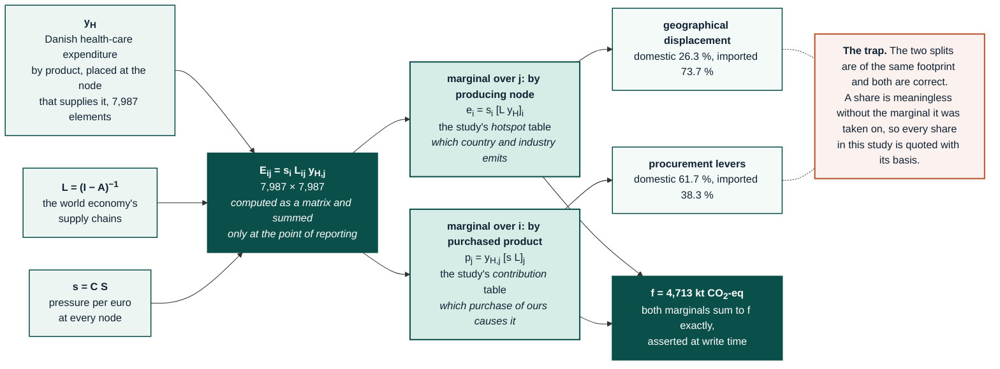

# 00 - Core footprint

**Gold folder** `data/gold/results/00_core_footprint/`
**Modules** `analysis.main_2025`, `analysis.extended_indicators`, `analysis.national_totals`
**Source** Leontief (1970); Miller & Blair (2009) ch. 2, 10; Steenmeijer et al. (2022) for the health-sector application

## Question this layer answers

What environmental pressure, anywhere in the world, is caused by Danish health-care
final expenditure, and where does it physically arise?

This layer is the one every other folder builds on. It carries no study-specific
boundary choices beyond the health-care demand definition, so its outputs can be
re-aggregated to any comparator's boundary without recomputation.

## Method

### The demand-driven identity

Danish health-care expenditure by product, $y_H$, is placed in a 7,987-element vector
at the node that supplies each product, and pushed through the world economy:

$$f = C\,S\,L\,y_H = s\,L\,y_H$$

The scalar $f$ is the footprint. What makes the result useful is that this scalar is
never computed as a scalar. It is computed as a matrix and summed only at the point of
reporting:

$$E_{ij} = s_i \, L_{ij} \, y_{H,j}, \qquad f = \sum_i \sum_j E_{ij}$$

$E_{ij}$ is the pressure arising at **producing node $i$** in supplying the
**purchased product $j$**. Marginalising it two ways gives the two dimensions the
study reports:

$$\text{by producing node:} \quad e_i = s_i \sum_j L_{ij} y_{H,j} = s_i \,[L y_H]_i$$
$$\text{by purchased product:} \quad p_j = y_{H,j} \sum_i s_i L_{ij} = y_{H,j} \,[s L]_j$$

Both marginals sum to $f$ exactly, which is asserted at write time. The full bilateral
table $E$ is 7,987 × 7,987 and is written compressed
(`footprint_bilateral_producer_x_purchase.csv.gz`) after dropping exact zeros.

The diagram below shows the two marginals and the trap of quoting a share without its
basis. A rendered copy is at `figures/diagrams/footprint_marginals.png` for readers
whose viewer does not draw Mermaid; `scripts/render_diagrams.py` produces it.

### Why the marginals matter

The *producing node* marginal answers "which country and which industry emits", which
is the geographical-displacement question. The *purchased product* marginal answers
"which purchase of ours causes it", which is the procurement-lever question. They are
different tables, and neither can be derived from the other. Reporting only the
aggregate, which the submitted manuscript did, discards both.

### Domestic and imported split

$$f_{\text{dom}} = \sum_{i \in \text{DNK}} e_i, \qquad f_{\text{imp}} = f - f_{\text{dom}}$$

taken on the **producing** index, not the purchased index. A product bought from a
Danish wholesaler but manufactured in China is imported pressure; splitting on the
purchase index would call it domestic. This distinction is why the two marginals are
both retained.

## Data requirements

| Input | Source | Note |
|---|---|---|
| $Z$, $x$, $y$ | EXIOBASE v3.8.2 `IOT_2022_ixi` | Zenodo 5589597; industry-by-industry |
| $F$ | EXIOBASE satellite `F.txt`, `F_hh.txt` | 1,113 stressor rows |
| $C$ | `characterisation_desire_version3_4_adapted.xlsx` | climate row rebuilt on AR6, see [15](15_gwp_vintage.md) |
| $y_H$ | Statistics Denmark health expenditure 2022 | mapped to EXIOBASE products; see `expenditure_vector_detail.csv` |
| Population | DST FOLK1A, 5,873,420 (2022) | per-capita denominators |

## Deviations from the source, stated

- **Basic prices.** EXIOBASE is in basic prices; Danish health expenditure is published
  at purchasers' prices. The expenditure vector is converted with the Danish
  trade-and-transport-margin and tax structure before entry, and the converted total is
  reported alongside the published total in `expenditure_summary.csv`.
- **Capital excluded.** $Z$ carries current inputs only. This exclusion matches
  Steenmeijer, Eckelman, and the NHS reports and is the comparable convention; the
  magnitude of the omission is quantified in [11](11_capital_gfcf.md), not left
  unstated.
- **Households excluded from the extension.** $F_{hh}$ is used only for national totals,
  never for the health-care footprint. Steenmeijer take the same position.

## Outputs

| File | Rows | Content |
|---|---|---|
| `footprint_by_producing_node.csv` | 66,646 | pressure by (region, industry) of origin × indicator × demand component |
| `footprint_by_purchased_product.csv` | 30,931 | pressure by purchased product |
| `footprint_bilateral_producer_x_purchase.csv.gz` | n/a | the full $E$ table, zeros dropped |
| `extended_indicators_by_producing_node.csv` | 126,403 | the same, for the non-climate indicators |
| `national_footprint_by_producing_node.csv` | 22,216 | Danish national footprint, same schema, for shares |
| `national_vs_healthcare_by_product_group.csv` | n/a | health share of each product group |
| `expenditure_vector_detail.csv` | 6,187 | $y_H$ itself, by node, with the price conversion |
| `README_data_dictionary.md` | n/a | column definitions |

## Verification

- Six IO identities are asserted at ≤ 10⁻¹⁰: $Ax + y = x$; $L(I-A) = I$;
  row/column balance of $Z$; the two marginals of $E$ summing to $f$; and the
  domestic + imported split summing to $f$.
- `_bilateral_coverage.csv` reports the fraction of $f$ retained after dropping zeros
  from the bilateral table, per indicator, so the compression is auditable.
- `analysis.audit_consistency` check C2 reconciles every detail table to its aggregate.
