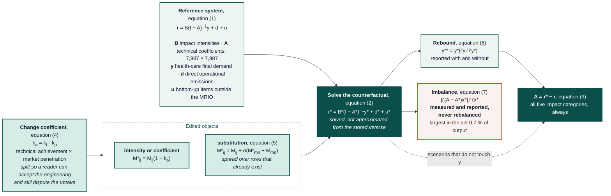

# 18 · Counterfactual scenarios

**Modules** `analysis.scenario_engine` (machinery), `analysis.mitigation_scenarios`
(the scenarios) · **Outputs** `data/gold/results/18_mitigation_scenarios/`
· **Figures** `fig8_mitigation_waterfall_2022`, `fig9_burden_shifting_2022`

This layer answers the second reviewer's request to separate identifying a
hotspot from demonstrating that acting on it works. It is written so the text
can be lifted into the manuscript's Methods and Results with light editing; every
assumption is named, every ambition level carries its evidence, and everything
the model cannot do is stated rather than left to be discovered.

---

## 1. Why the previous implementation was replaced

Scenario results were produced by scaling one term of the deterministic
footprint and reporting the difference. That is adequate for a lever acting on a
single bottom-up item and wrong for anything else:

- it could not propagate an effect through the supply chain, so no lever could
  act on a production recipe;
- it reported **climate only**, so a trade-off between impact categories was
  invisible by construction, and three of the five categories were being set to
  zero rather than computed;
- levers were combined by adding their separate answers, which double counts
  every interaction between them.

The layer now follows the counterfactual formalism the environmentally extended
input-output literature has converged on (Aguilar-Hernandez et al., 2018; Donati
et al., 2020; Wiebe et al., 2018), so that these results are comparable with
published circular-economy and future-footprint studies rather than being a
bespoke calculation.

---

## 2. The model

### 2.1 Reference and counterfactual

A scenario is a triple of edited objects and a second full solution of the
Leontief system. Writing $\mathbf{B}$ for the impact intensity matrix,
$\mathbf{A}$ for the technical coefficients, $\mathbf{y}$ for health-care final
demand, $\mathbf{d}$ for the direct (operational) vector of the Danish health
industry and $\mathbf{u}$ for the bottom-up items outside the MRIO:

$$\mathbf{r} = \mathbf{B}\,(\mathbf{I}-\mathbf{A})^{-1}\mathbf{y} + \mathbf{d} + \mathbf{u} \tag{1}$$

$$\mathbf{r}^{*} = \mathbf{B}^{*}(\mathbf{I}-\mathbf{A}^{*})^{-1}\mathbf{y}^{*} + \mathbf{d}^{*} + \mathbf{u}^{*} \tag{2}$$

$$\Delta = \mathbf{r}^{*} - \mathbf{r} \tag{3}$$

Equations (1) and (2) are Aguilar-Hernandez et al.'s (2018) equations 1 and 2
with the direct and bottom-up terms this study adds. Equation (3) follows Donati
et al. (2020, §2.3) rather than Aguilar-Hernandez's equation 3, which is the
same difference with the opposite sign: theirs is positive when the
counterfactual is an improvement. The convention here is that a reduction reads
negative, which is what a reader expects of a mitigation table, and it is used
consistently in the code and in every output column. The counterfactual is **solved**,
not approximated from the baseline inverse: `numpy.linalg.solve` on
$(\mathbf{I}-\mathbf{A}^{*})$ takes about three seconds on a 7,987 × 7,987
model, and agrees with the stored Leontief inverse to 1 × 10⁻¹¹, so there is no
reason to reuse a stale one.

### 2.2 Change coefficients

Every edit is

$$M^{*}_{ij} = M_{ij}\,(1 - k_a), \qquad k_a = k_t \, k_p \tag{4}$$

after Donati et al. (2020, §2.4), who take the split from Wood et al. (2017),
where it is first set out. $k_t$ is the **technical** change coefficient
(what the intervention achieves where it is applied), and $k_p$ the **market
penetration** coefficient (the share of the affected market that adopts it).

Splitting the two is what makes an ambition level auditable. A reader can accept
the engineering evidence for $k_t$ and still disagree about $k_p$, and can see
which is which. Both are recorded per scenario in the output table, along with
the source for each.

Where a reduction in one input is taken up by another,

$$M^{*}_{ij} = M_{ij} + \alpha\,(M^{*}_{mn} - M_{mn}) \tag{5}$$

with $\alpha$ a substitution weighting factor (Donati et al., 2020, eq. 6). The
released quantity is spread over the substitute rows **in proportion to their
existing size**, so a substitution cannot invent a supply relation that the
table does not already contain.

### 2.3 Rebound

Money not spent on one product does not vanish. Where a scenario reduces final
demand, the engine can hold total expenditure constant and redistribute the
released budget over the remaining demand in proportion to existing shares:

$$\mathbf{y}^{**} = \mathbf{y}^{*}\,\frac{\mathbf{i}'\mathbf{y}}{\mathbf{i}'\mathbf{y}^{*}} \tag{6}$$

This redistribution is Takase et al.'s (2005) closure as formalised by
Aguilar-Hernandez et al. (2018, eq. 4). It is *not* Donati et al.'s zero-cost
counterfactual, which this note previously called it: their zero-cost case
excludes investment and fiscal stimulus and, in their §4.1, excludes rebound as
well. C1 is the Donati case; C2 is the thing Donati declined to model.

The released budget is spread over the positions the scenario did **not**
reduce. Aguilar-Hernandez distributes it "proportionally to the rest of goods"
and Wood et al. (2017, eq. 9) over the products unaffected by the intervention;
rescaling the reduced rows as well, which an earlier version did, hands part of
the cut straight back.

It remains a crude rebound. A proportional rescale of the surviving basket is
equivalent to assuming unit income elasticity for every product in it, which is
the simplest closure in the taxonomy rather than the best; a
marginal-expenditure-share vector would be the full answer and is not built
here. It also ignores the price and income mechanisms that Onat et al. (2023)
show can matter more, and the circular-economy rebound that Zink and Geyer
(2017) set out. But reporting a demand-reduction scenario
*without* it silently assumes the money is destroyed, which is a stronger and
less defensible assumption. **Both are reported** (C1 and C2), and the
difference between them is the rebound.

### 2.4 The counterfactual table is not rebalanced, and this is deliberate

Editing $\mathbf{A}$ breaks the identity that column sums plus value added equal
total output, because the model is not told what an industry does with money it
stops spending on an input (Donati et al., 2020, §2.3). The engine measures the
imbalance,

$$\text{imbalance} = \frac{\sum_j \bigl|\,[\mathbf{i}'(\mathbf{A}-\mathbf{A}^{*})]_j\,x^{*}_j \bigr|}{\mathbf{i}'\mathbf{x}^{*}} \tag{7}$$

The absolute value is taken per column, before summing. Taking it after the
inner product, as an earlier version did, lets a column that gained inputs
cancel one that lost them and reports a balanced table where two equal and
opposite departures sit side by side. Every lever here edits in one direction,
so the two forms agree on every number reported; a substitution with a negative
weighting factor, which Donati et al. (2020, §4) use, would separate them.

The denominator is the output driven by health-care final demand, not
economy-wide output, because that is the system the counterfactual is solved
for. The engine reports the share per scenario in `unbalanced_pct_of_output`.
It is zero for every intensity- and demand-only scenario, zero for the waste
diversion (which substitutes fully, $\alpha = 1$), and **0.7 % of the output
driven by health-care final demand** for the
pharmaceutical resource-efficiency lever at full market penetration.

**No balancing procedure is applied to the counterfactual table.** The
literature is genuinely split on this, and the split is worth stating rather
than resolving by assertion.

Donati et al. (2020, §2.3) say plainly that they perform no automatic
rebalancing of the counterfactual, and Lenzen et al. (2010, §2.3) decline to
balance their perturbed tables because balancing would reduce the perturbation
and therefore the dispersion they set out to measure. Against that, Wiebe et
al. (2018, §3.3) rescale use and value-added coefficients so every edited
column still sums to one, crediting the procedure to Leontief's own scenario
work, and treat that as what keeps the system balanced; Schmidt and Merciai (2023, table 2.2) make maintained
mass balance the discriminator between consequential and attributional models.

The reason this study does not rebalance is narrower than "conservative", and
it is specific to what the study reports. Column imbalance in a monetary
input-output table lands on value added: rescaling a column to sum to one is
exactly the statement that money not spent on an input accrues to the
industry's own value added instead. **This study reports no value-added,
output or employment indicator.** All five reported categories are
environmental and are driven by the physical intensity vector and the solution
$\mathbf{x}^{*}$, neither of which the rebalancing operation touches. So the
choice is consequence-free for everything reported here, which is a claim a
reader can check rather than a disposition.

What rebalancing would buy is a socio-economic indicator, and a study that
added one would have to do it. The engine therefore leaves the imbalance in
place, measures it with equation (7), and reports it per scenario, so the
departure is visible rather than assumed away. The largest in the whole set is
0.7 % of the output driven by health-care final demand.

---

The whole procedure, from a stated ambition to a reported difference:

A rendered copy is at `figures/diagrams/scenario_workflow.png` for readers whose
viewer does not draw Mermaid; `scripts/render_diagrams.py` produces it.

## 3. The scenarios

The scenarios are grounded in stated Danish policy and measured Danish outcomes
wherever possible. Ambition levels that are **not** sourced are labelled
*illustrative* in the `ambition_basis` column of the output and nowhere else.

| ID | Lever | Object edited | $k_t$ and its evidence |
|---|---|---|---|
| **B1** | Grid and district-heat decarbonisation | $\mathbf{B}$, energy nodes | 122.7 → 16.9 g CO₂e/kWh (KF22) and → 32.4 (KF25) by 2030 (Danish Energy Agency, 2022, 2025) |
| **P1** | Hospital energy and transport | $\mathbf{y}$, Danish energy nodes | −75 % by 2030 against 2018, all public hospitals (Danske Regioner, 2024, as reported in Healthcare Denmark, 2024) |
| **P2** | Pharmaceutical raw-material efficiency | $\mathbf{A}$, Danish chemicals column | −15 % raw-material use 2020→2022 while production rose 18 % (Lundbeck, in Healthcare Denmark, 2024) |
| **P3** | Medical-device packaging carbon | $\mathbf{A}$, paper and plastics into medical instruments | −12 % to −23.5 % cradle-to-gate (Demant, in Healthcare Denmark, 2024) |
| **P4** | Reuse of medical equipment | $\mathbf{y}$, devices, with $\alpha=0.3$ into repair services | −10 % / −20 %, **illustrative**; the direction is the regions' stated procurement focus |
| **P5** | Patient, visitor, and staff travel | bottom-up, **all five categories** | −10 % / −20 % / −30 %, **illustrative** |
| **P6** | Inhaler propellant change | bottom-up, pMDI | −67 % (low-charge) and −93 % (HFA-152a) of propellant GWP (Jeswani & Azapagic, 2019) |
| **P7** | pMDI → dry-powder inhaler | bottom-up, pMDI | 25 / 50 / 75 % substituted; DPI GWP is 0.06 against 23.4 kg CO₂e per 100 doses (Jeswani & Azapagic, 2019) |
| **P8** | Nitrous oxide capture | bottom-up, anaesthetic | 25 / 50 / 75 %, with $k_p = 0.6$ because N₂O is 60 % of the Danish anaesthetic term |
| **P9** | Divert health-care waste to recycling | $\mathbf{A}$, incineration → recycling, $\alpha=1$ | 20 / 40 %, **illustrative** |
| **C1** | All interventions, simultaneous | all | n/a |
| **C2** | C1 with expenditure held constant | all, plus eq. (6) | n/a |
| **C3** | C1 plus the grid pathway | all | n/a |
| **X** | Demand growth to 2035 | $\mathbf{y}$, scaled | +18 %, Danske Regioner business-as-usual |

Two structural findings shaped the design, both verified on this model rather
than assumed.

**Danish electricity emissions are not on the generation technologies.** Direct
intensities are 3.21 kt CO₂e per M.EUR for *Transmission of electricity* and
18.7 for *Steam and hot water supply*, against 0.013 for coal generation and
0.020 for wind. All eleven Danish generation-by-technology industries together
contribute 0.82 kt to the health-care footprint; transmission contributes 68.2
and steam 94.0. A technology-mix reallocation in $\mathbf{A}$ is therefore
inoperative, and grid decarbonisation must act on $\mathbf{B}$ at the
transmission, distribution, and steam nodes. Two Danish nodes (solar thermal,
tide/wave) carry nowcast-artefact intensities of 13,256 and 55,322 and are
excluded from any scaling.

**The health sector buys catering, not food.** 78 % of its food-related spend is
*Hotels and restaurants*, so a dietary lever is a change to that industry's
input column, not to final demand.

---

## 4. Results

### 4.1 Climate

| | kt CO₂e | of the 2022 baseline |
|---|---|---|
| 2022 baseline | 4,712 | n/a |
| Reduction the regional target requires | −2,357 | −50 % |
| All interventions, solved simultaneously (**C1**) | **−361** | −7.7 % |
| The same levers summed separately | −361 | n/a |
| Interaction | −0.2 | n/a |
| Interventions with the grid pathway (**C3**) | **−461** | −9.8 % |
| Interventions with expenditure held constant (**C2**) | −281 | −6.0 % |
| Rebound, i.e. what respending removes | +80 | 22 % of the saving |
| Demand growth to 2035, business as usual | +848 | +18 % |
| **Net 2035 position, grid pathway included** | **+388** | **+8.2 %** |

Three things are worth saying in the paper.

**The levers are close to additive.** Summing them separately overstates the
combined effect by 0.2 kt out of 361, under 0.1 %. That is a *result*, not an
assumption: it had to be computed to be known, and it means the naive additive
presentation common in this literature happens to be defensible here. It would
not be if the levers overlapped more.

**Respending removes a fifth of the saving.** C2 is 77 kt weaker than C1. A
scenario reported without rebound is reporting the case where the money is
destroyed.

**Demand growth is larger than everything.** Every quantified lever at maximum
ambition, plus a decarbonising Danish grid, reaches 20 % of the regional target and is
then more than cancelled by projected demand growth, leaving the 2035 footprint
**above** the 2022 baseline. This outcome is the substantive finding, and it
follows directly from the hotspot analysis: the levers that dominate the
sustainable healthcare literature act on 2 % of the footprint, while
pharmaceuticals and chemical products (37 % of climate and 51 % of material
extraction) are acted on by no published scenario we could find.

### 4.2 Burden shifting

Reporting all five categories was the point of the rebuild, and it changes what
can be said.

- **P2, pharmaceutical raw-material efficiency, is a materials lever more than a
  climate lever**: −1.6 % climate against **−3.3 % material extraction**. The
  pharmaceutical hotspot is a materials hotspot, and the intervention that
  addresses it is not the one the climate framing would select.
- **C2 shifts burden.** Holding expenditure constant improves climate (−6.0 %)
  and materials (−2.6 %) but **worsens blue water (+0.63 %), land use (+0.58 %),
  and waste (+0.27 %)**. The mechanism is not that the money leaves for a
  thirstier basket: it is respent inside health care. It is that the purchases
  the levers cut, energy and devices, are *less* water- and land-intensive than
  the health-care average, so holding expenditure constant tilts the basket
  towards what remains. This burden
  shift is the clearest trade-off in the study, and it only appears once rebound
  and all five categories are modelled together.
- **P9, waste diversion, backfires slightly on climate** (+0.002 %) while
  cutting waste (−0.04 %). Recycling services have their own supply chain. The
  magnitudes are trivial because the health sector's direct purchases of
  incineration are small, but the sign is real and is reported.
- **P6, P7, and P8 are climate-only by data, not by finding.** The bottom-up
  inventory behind propellants and anaesthetic gases carries no non-climate
  columns, so those cells are marked `n.r.` in figure 9 rather than plotted as
  zero. Jeswani and Azapagic (2019) report the dry-powder inhaler as **worse**
  than the pressurised inhaler for abiotic depletion of elements,
  eutrophication, and freshwater and terrestrial ecotoxicity; that trade-off is
  real, acts on the device life cycle which this MRIO does not resolve, and is
  therefore reported directionally rather than given an invented number.

---

## 5. Stress tests

| Test | Result |
|---|---|
| Baseline reproduces the study headline | asserted in code; scenario baseline within 1 % of 4,712.418 kt, and equal to it |
| Counterfactual solve against the stored inverse | agrees to 1 × 10⁻¹¹ |
| Levers summed vs solved simultaneously | 0.2 kt apart on climate; reported, not assumed |
| Accounting imbalance from editing **A** | 0 for B- and y-only scenarios; 0.7 % of output at the largest A edit; reported per scenario, never rebalanced away |
| Two official grid-projection vintages | KF22 and KF25 differ by 1.0 pp on the same lever; both reported rather than the more flattering one |
| Market penetration | P2 reported at 25 / 50 / 100 % of Danish production, because the share achieving Lundbeck's result is unknown |
| Rebound on/off | C1 vs C2; 22 % of the saving |
| Substitution keeps balance | P9 with $\alpha = 1$ has zero imbalance, as it must |

---

## 6. What is deliberately not modelled

- **Scope 1 is out of reach of every lever.** Equation (2) writes $\mathbf{d}^{*}$
  as an editable object, and Wood et al. (2017, eq. 12) do edit the direct
  final-demand emission vector, but this engine has no target for it: `Target`
  is `A`, `B`, `y` or `bottom_up`, so $\mathbf{d}^{*} \equiv \mathbf{d}$
  throughout. The consequence is specific and it falls on P1. Danske Regioner's
  target covers on-site combustion and vehicle fuel; P1 edits purchased energy
  only, so the **118.6 kt of Scope 1** in the scope partition, which is where
  hospital boilers and the ambulance fleet sit, cannot move. At the target's
  full ambition that is of the order of 89 kt not modelled, against a combined
  intervention total of 361 kt. P1 should be read as *purchased* hospital
  energy.
- **The avoided virgin material behind waste diversion.** P9 moves the health
  industry's purchases from incineration to recycling within the same column.
  It carries no credit for the primary production that recovered material
  displaces, which in a consequential frame is most of the point of recycling,
  and no debit for the district heat that Danish incineration supplies and that
  diverted waste would stop supplying. Monetary input-output also prices
  secondary feedstock near zero, so the lever is structurally under-weighted;
  that, not only the small purchase volume, is why P9 comes out at +0.002 %.
  The counterweight is worth stating too: there is empirical work finding that
  increased recycling did not in practice displace virgin material, so the
  credit is not simply owed and should not be hard-coded. That literature has
  not been read for this study and is not cited here; it is named as an open
  question rather than as support.
- **Marginal against average electricity.** A demand reduction should arguably
  be valued at the marginal generating technology, not the average mix. That is
  the central consequential objection to attributional models, and it is not
  small in Denmark, where the marginal mix is overwhelmingly wind. Every lever
  here uses average intensities.
- **The by-product structure behind Danish district heat.** The study's own
  finding is that Danish health emissions sit disproportionately on steam and
  hot-water supply, which is combined heat and power. A consequential model
  would decide which of heat and electricity is the determining product and
  treat the other as a by-product; an attributional one allocates.

- **Price and market responses.** The model is attributional. A scenario is a
  what-if on the recipe, not a forecast of how the economy reacts. Schmidt and
  Merciai's (2023) Danish work is consequential and answers a different
  question; the comparison in layer 06 is boundary-matched precisely because the
  two cannot be compared directly.
- **"Green" versions of a product.** EXIOBASE has one *Chemicals nec* industry,
  so a hospital switching to a lower-impact supplier of the same product cannot
  be represented as a substitution, only as buying less. Green procurement is
  therefore modelled as volume reduction plus lifetime extension (P4, after
  Kagawa et al., 2009), and this
  limitation is why a procurement lever cannot be given the weight the regions'
  own strategy gives it. Resolving it needs a hybrid or physically extended
  table, which is the natural next study.
- **Capacity constraints and re-employment of released output.** Only C2 does
  anything with the released expenditure, and it does the simplest possible
  thing.
- **Behavioural response.** The intervention levels are imposed, not modelled.
  P4, P5, and P9 are illustrative ambitions and say so.
- **Dynamics.** These scenarios are comparative-static counterfactuals on a
  2022 table, not a pathway. Wiebe et al. (2018) show how exogenous scenario
  trajectories can be implemented in a global MRIO; doing so here would require
  projecting $\mathbf{A}$, which this study does not attempt.

---

## References

Full entries with DOIs are in [`docs/REFERENCES.md`](../../REFERENCES.md).

- Aguilar-Hernandez, G. A., Sigüenza-Sanchez, C. P., Donati, F., Rodrigues,
  J. F. D., & Tukker, A. (2018). Assessing circularity interventions: A review
  of EEIOA-based studies. *Journal of Economic Structures, 7*, 14.
  https://doi.org/10.1186/s40008-018-0113-3
- Danish Energy Agency. (2022). *Klimastatus og -fremskrivning 2022 (KF22)*.
  https://ens.dk
- Danish Energy Agency. (2025). *Klimastatus og -fremskrivning 2025 (KF25)*.
  https://ens.dk
- Danske Regioner. (2024). *Klimahandling i regionerne*. https://www.regioner.dk
- Donati, F., Aguilar-Hernandez, G. A., Sigüenza-Sánchez, C. P., de Koning, A.,
  Rodrigues, J. F. D., & Tukker, A. (2020). Modeling the circular economy in
  environmentally extended input-output tables: Methods, software and case
  study. *Resources, Conservation and Recycling, 152*, 104508.
  https://doi.org/10.1016/j.resconrec.2019.104508
- Healthcare Denmark. (2024). *Transitioning towards a sustainable healthcare
  sector* [White paper]. https://www.healthcaredenmark.dk
- Jeswani, H. K., & Azapagic, A. (2019). Life cycle environmental impacts of
  inhalers. *Journal of Cleaner Production, 237*, 117733.
  https://doi.org/10.1016/j.jclepro.2019.117733
- Kagawa, S., Nansai, K., & Kudoh, Y. (2009). Does product lifetime extension
  increase our income at the expense of energy consumption? *Energy Economics,
  31*(4), 597-606. https://doi.org/10.1016/j.eneco.2008.08.011
- Lenzen, M., Wood, R., & Wiedmann, T. (2010). Uncertainty analysis for
  multi-region input-output models: A case study of the UK's carbon footprint.
  *Economic Systems Research, 22*(1), 43-63.
  https://doi.org/10.1080/09535311003661226
- Onat, N. C., Mandouri, J., Kucukvar, M., Sen, B., Abbasi, S. A., Alhajyaseen,
  W., Kutty, A. A., Jabbar, R., Contreras, M. T., & Jraisat, L. (2023). Rebound
  effects undermine carbon footprint reduction potential of autonomous electric
  vehicles. *Nature Communications, 14*, 6258.
  https://doi.org/10.1038/s41467-023-41992-2
- Schmidt, J. H., & Merciai, S. (2023). *Danish consumption-based environmental
  footprints using a hybrid consequential input-output model*. 2.-0 LCA
  consultants. https://lca-net.com
- Takase, K., Kondo, Y., & Washizu, A. (2005). An analysis of sustainable
  consumption by the waste input-output model. *Journal of Industrial Ecology,
  9*(1-2), 201-219. https://doi.org/10.1162/1088198054084653
- Wiebe, K. S., Bjelle, E. L., Többen, J., & Wood, R. (2018). Implementing
  exogenous scenarios in a global MRIO model for the estimation of future
  environmental footprints. *Journal of Economic Structures, 7*, 20.
  https://doi.org/10.1186/s40008-018-0118-y
