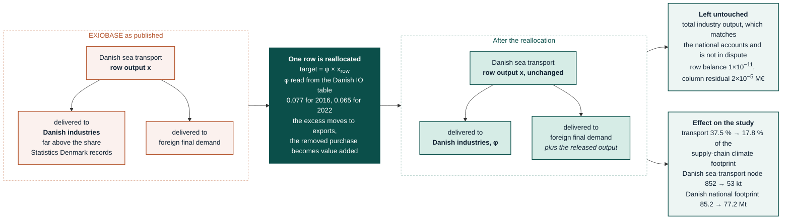

# Results: the 2022 analysis

This document is the primary analysis for Denmark 2022: the headline results,
the withdrawal of the submitted manuscript's transport finding (one of this
revision's three headline changes, so it opens the document rather than
appearing late), the bridge from the submitted numbers to the corrected ones,
the capital (GFCF) sensitivity, the bottom-up anaesthetic-gas evidence, the
mitigation-scenario answer to the reviewers, the open nowcast-year decision,
and a full assessment of the Eriksen et al. (2026) manuscript against this
re-analysis. Where two of the merged source documents quote the same figure
differently (for example the transport share, or the capital-endogenisation
effect), the current position is kept and the superseded figure is stated
alongside it with the reason, never silently dropped.

## Contents

1. [The withdrawn transport finding](#the-withdrawn-transport-finding)
2. [The 2022 primary analysis](#the-2022-primary-analysis)
3. [Results bridge: submitted vs corrected](#results-bridge-submitted-vs-corrected)
4. [Capital (GFCF) treatment](#capital-gfcf-treatment)
5. [Bottom-up anaesthetic gases](#bottom-up-anaesthetic-gases)
6. [Mitigation scenarios: the answer to the reviewer](#mitigation-scenarios-the-answer-to-the-reviewer)
7. [Decision D8: 2022 nowcast or the last observed year](#decision-d8-2022-nowcast-or-the-last-observed-year)
8. [Assessment of the Eriksen et al. (2026) manuscript](#assessment-of-the-eriksen-et-al-2026-manuscript)

---

## The withdrawn transport finding

**This is one of the three headline changes in this revision.** The submitted
manuscript's most quotable finding — that transport is the largest contributor
to the Danish health-care footprint, at 38-46 % depending on the run — is
**withdrawn**. It was a faithful computation on a Danish EXIOBASE block that
Statistics Denmark itself documents as broken. The audit subsection below
confirms the submitted number is reproducible from the uncorrected data (so
this is not a fix for an analytical error), traces exactly how the correction
moves the share from 46 % to 14.9 %, and states what the paper should say now
that pharmaceuticals, not transport, is the largest contributor.

Denmark operates one of the world's largest merchant fleets. Every
consumption-based account of Denmark has to decide what to do about it, and
the available methods disagree with each other by more than the entire
health-care footprint this study measures. This section states the problem
plainly, sets out exactly what is done about it, compares it with every other
approach found in the literature, audits that the correction is sound and
reproduces what it should, and says what is *not* claimed.

Reproduce with `PYTHONPATH=src .venv/bin/python -m analysis.dk_shipping_correction`
→ `data/gold/results/10_sea_transport_reallocation/`. The full equations,
data requirements, and verification residuals are in
[docs/methods/replications.md, section 10](../methods/replications.md#r10);
this section is the narrative version, for the layman and for the manuscript
methods.

### The problem, in plain terms

An input-output model works out who ultimately pays for each industry's output.
If a Danish shipping company earns €100, the model needs to know whether that
€100 was spent by a Danish factory shipping goods for Danish customers, or by a
foreign firm moving cargo between two other countries. In the first case the
emissions belong in Denmark's consumption footprint; in the second they do not.

**EXIOBASE gets this badly wrong for Denmark.** It records **74 % of Danish
water-transport output as being bought by other Danish industries**, when the
Danish national accounts say the true figure is **9 %** for 2019; the rest is
exported services, i.e. carrying the world's cargo. Statistics Denmark documented
this (Rørmose Jensen & Iliev, 2022, table 1), and we reproduce their diagnosis on
our own model at **73.6 %**.

Their 9 % is one published year. Since 11 September 2026 we no longer quote it for
every year: the same share is read out of the same office's domestic input-output
table for whichever background year the model runs on — **7.7 %** for the 2016
background and **6.5 %** for 2022 — and their 2019 year is used as the check that
our reading of the table reproduces what they published, which it does to 0.3
percentage points (**9.3 %** against 9 %). The 2022 share is lower because the
row's output grew from 226 to 337 bn DKK in the container-freight boom, almost
all of it exported, while sales to Danish industries barely moved.

The consequence: emissions from ships serving global trade get charged to Danish
consumers, and (because every Danish industry appears to buy a lot of shipping)
to everything those consumers buy, including health care.

Two further signs that the block is broken come from the same table. EXIOBASE
gives Danish water transport a **gross value added of −1,880 million DKK**
against +33,339 million in the national accounts (a negative value added is not
an economy), and it records the **Danish health sector itself buying 394 M€ of
sea transport**, which hospitals plainly do not.

### What we do

We reallocate one row. The Danish sea-transport row's deliveries to Danish
industries are scaled down so that its domestic intermediate share equals the
share $\phi$ that Statistics Denmark's own domestic input-output table records
for that year, and the released output is moved to exports:

$$t = \phi \, x_{\text{row}}$$
$$\mathbf{Z}[\text{row},\mathrm{DK}] \leftarrow \mathbf{Z}[\text{row},\mathrm{DK}] \cdot \frac{t}{\sum \mathbf{Z}[\text{row},\mathrm{DK}]}$$
$$\mathbf{Y}[\text{row},\text{foreign}] \leftarrow \mathbf{Y}[\text{row},\text{foreign}] + \Delta\,w, \qquad w_c \propto \textstyle\sum_i \mathbf{Y}_{ic}$$
$$\mathbf{V}[\text{last},\mathrm{DK}] \leftarrow \mathbf{V}[\text{last},\mathrm{DK}] + \bigl(\mathbf{Z}[\text{row},\mathrm{DK}] - \tilde{\mathbf{Z}}[\text{row},\mathrm{DK}]\bigr)$$

with the last line restoring column balance. $\phi$ is **read, not quoted**:
row 500000 (*Water transport*) of sheet `DIO` of Statistics Denmark's
`input_output_en_<year>.xlsx`, its deliveries to the 117 Danish industries over
its own total output. That gives **0.0774** for the 2016 background and
**0.0651** for 2022; the 2019 table gives **0.0931**, which reproduces Rørmose
Jensen & Iliev's published 0.09 to 0.3 percentage points and is asserted on every
run as the check on the parse. Because $\phi$ is a ratio inside the Danish table
it is dimensionless: the crowns cancel, the share is applied to EXIOBASE's own row
total in M€, and no exchange rate enters anywhere. `HC_SHIPPING_PHI` pins the
value by hand, which is how the published 0.09 is recovered with one variable.

**Total industry output is unchanged**: it is not in dispute; it matches the
national accounts. Only its *allocation* changes. Danish industries that stop
buying phantom shipping have that amount credited to value added instead, since
their own output comes from the national accounts and is also not in dispute.

Verified: row balance to 1×10⁻¹¹, maximum column-balance residual 2×10⁻⁵ M€.

**Effect:** transport falls from 37.5 % to **17.8 %** of the health-care climate
supply-chain footprint (the 3,906 kt MRIO component; 14.9 % of the 4,675 kt total
once the domestic bottom-up items are included); the Danish sea-transport node
falls from 852 kt to **53 kt**; the Danish national footprint falls from 85.2 Mt
to **77.2 Mt**.

The basis is stated because the two denominators differ by the bottom-up
additions, which are entirely Danish and therefore dilute every supply-chain
share. Quoting a share without its basis is how earlier drafts of these
documents came to carry figures that no longer reproduced. Counting across the
merged source documents as a whole, six such figures had drifted before this
consolidation.

What moves, and what is deliberately left alone:



A rendered copy is at `figures/diagrams/shipping_reallocation.png` for readers whose
viewer does not draw Mermaid; `scripts/render_diagrams.py` produces it. That PNG still
shows the previous fixed 0.09 target and has to be re-rendered — the renderer needs
`@mermaid-js/mermaid-cli`, which is not installed in this environment.

<a id="phi-before-after"></a>

#### What reading $\phi$ per year moved

Every headline number the change touched, old against new. The old column is the model
with $\phi = 0.09$ applied to both background years; the new column is $\phi$ read from
Statistics Denmark's table, 0.0774 for 2016 and 0.0651 for 2022. Both uncorrected variants
were re-run and are byte-identical, as they must be.

| Quantity | Old | New | Change | Change, % |
|:---|---:|---:|---:|---:|
| $\phi$, 2016 background | 0.0900 | 0.0774 | −0.0126 | −14.1 |
| $\phi$, 2022 background | 0.0900 | 0.0651 | −0.0249 | −27.7 |
| Output released, 2016 background, M€ | 9,955.9 | 10,151.0 | +195.1 | +2.0 |
| Output released, 2022 background, M€ | 11,509.8 | 11,953.9 | +444.2 | +3.9 |
| **2022 climate footprint, kt CO₂-eq** | **4,712.4** | **4,675.5** | **−37.0** | **−0.78** |
| 2022 MRIO supply-chain component, kt | 3,943.4 | 3,906.4 | −37.0 | −0.94 |
| 2022 transport, purchased product, kt | 595.8 | 566.5 | −29.3 | −4.9 |
| 2022 transport, producing node, kt | 728.2 | 695.1 | −33.1 | −4.5 |
| 2022 Danish sea transport as a producing node, kt | 74 | 53.0 | −21 | −28 |
| 2022 Danish national footprint, kt | 77,477.5 | 77,240.6 | −236.9 | −0.31 |
| 2022 health-care share of the national footprint, % | 5.09 | 5.06 | −0.03 | −0.63 |
| Monte Carlo median, 2022, kt | 4,734 | 4,697 | −37 | −0.78 |
| Monte Carlo 95 % interval, kt | 4,064–5,531 | 4,032–5,488 | −32 / −43 | −0.79 / −0.78 |
| **2019 climate footprint, corrected, kt** | **4,085.4** | **4,054.8** | **−30.6** | **−0.75** |
| 2019 transport, purchased product, kt | 813.0 | 788.9 | −24.1 | −3.0 |
| Bridge: correction step, net kt | −2,275.0 | −2,305.6 | −30.6 | +1.3 |
| Bridge: year step, net kt | +627.0 | +620.7 | −6.3 | −1.0 |
| 2019 uncorrected variant, all 28 files | — | — | **byte-identical** | 0 |
| 2022 uncorrected variant, all 28 files | — | — | **byte-identical** | 0 |

Old values are from `phi-snapshot-before.json`, taken before anything was rebuilt, except
the two producing-node rows, which are the published figures this document already
carried; the Danish sea-transport node was reported to the unit, so its change is given to
the unit too.

The direction is the same everywhere and the magnitude is small: reading the share per
year lowers the 2022 footprint by 0.8 % and the 2019 one by 0.7 %, and moves no ranking.
What it removes is an assumption — that a share published for one year holds for every
year — at the price of one extra bronze read. The full band of $\phi$ values, and what
each is worth, is in
[docs/methods/replications.md, section 10](../methods/replications.md#r10-sensitivity) and
in `10_sea_transport_reallocation/phi_sensitivity_2016.csv` and
`phi_sensitivity_2022.csv`.

### How this compares with every alternative

| Approach | What it does about Danish shipping | Cost | What it buys |
|:---|:---|:---|:---|
| **Raw EXIOBASE** | Nothing. 74 % of output charged to Danish intermediate use | none | a known-wrong Danish block |
| **Ours: targeted row reallocation** | Rescales one row to the published 9 % benchmark | ~50 lines | most of the effect, at the cost of being an approximation |
| **Rørmose Jensen & Iliev (2022), Statistics Denmark** | **Discards EXIOBASE's Danish block entirely.** The domestic block comes from the Danish national accounts; EXIOBASE is used only for imports. No shipping correction is needed because the wrong data is never used | a full coupled model | correctness by construction |
| **Palm et al. (2019), simplified SNAC** | Same idea for Sweden: national A, Y, and air-emission satellite replace the MRIO's; the rest-of-world block is left untouched and unbalanced | a full coupled model | ditto; effect size elsewhere reported at 4-15 % |
| **Danish Energy Agency (official Danish method)** | **Also reallocates.** Danish-operated shipping and aviation are excluded from the footprint *"unless they transport goods and services consumed in Denmark"*, achieved by *"a technical reallocation of import amounts linked to the shipping and aviation industries"*. The excluded bulge is reported separately: 39 Mt in 2022 | a full coupled model | the same objective as ours, reached inside a coupled model |
| **Territorial bunker sales** (DEA *Energy Statistics*; Klimarådet's proposed 2050 target) | Counts fuel *sold* in Denmark to ships of any flag | n/a | a third, different number again |

**Four incompatible Danish shipping boundaries coexist**, two of them inside
the Danish Energy Agency itself. This definitional question is not settled, and
any single figure for "Denmark's shipping emissions" is meaningless without its
boundary.

The published size of what is at stake: Usubiaga & Acosta-Fernández (2015),
bridging territorial to residence-based emissions on EXIOBASE 3, put
**Denmark at +30 %**, naming it in the large-fleet group alongside Greece
(+70 %) and Norway (+60 %).

### What our correction is, and is not

**It is** a defensible approximation of the first and largest step of the method
Statistics Denmark uses, applied to the one industry they document as broken,
using their own published benchmark.

**It is not** a coupled model. We do not replace the Danish block; we repair one
row of it. Every other Danish industry keeps EXIOBASE's structure, including the
30-40 % import understatement Rørmose also documents.

**Simplification is defensible** on published grounds: Moran et al. (2018) put
the Danish feedback effect at **0.4 %**, which is why both Rørmose and Palm use
*simplified* rather than full SNAC.

**Independent support that Denmark is a known case.** Wood et al. (2019) compare
consumption-based carbon accounts across multi-regional input-output databases
and name Denmark explicitly among the countries whose between-model variation is
driven by the handling of international transport emissions: the same defect
this note corrects, identified from outside this study and before it.

**Independent support for the direction.** Ghosh et al. (2014, Rockwool
Foundation) find Danish consumption emissions *"relatively invariant to the
inclusion of fuel bunkering"*. That near-invariance is impossible if 74 % of
Danish shipping output really were consumed domestically, so their result
predicts a correction of exactly the sign and rough size we obtain.

**It has an official precedent, which strengthens rather than weakens it.** The
Danish Energy Agency's Global Report, the statutory national consumption-based
account, performs *"a technical reallocation of import amounts linked to the
shipping and aviation industries"* so that Danish-operated transport is excluded
from the footprint unless it carries goods consumed in Denmark. Their objective
is identical to ours; they achieve it inside a coupled model, where the Danish
block comes from national accounts, whereas we achieve it by repairing one row
of EXIOBASE's Danish block.

**An earlier draft of this note claimed our reallocation was novel in the Danish
literature. That was wrong**, and reflected a search that had not reached the
Global Report's method annexes. What is novel is applying the correction to a
*sector* study on an uncoupled EXIOBASE model; the correction itself is standard
Danish practice.

### Why we corrected the transactions and not the emissions

An obvious alternative exists: leave the economic structure alone and instead
replace EXIOBASE's emission accounts with Danish national ones. **We deliberately
did not do that, and the literature is clear why.**

Melo (2019) compares top-down and bottom-up environmental extensions on the same
input-output system, so any difference is attributable to the satellite alone.
His finding for transport is emphatic: bottom-up gridded inventories
**underestimate shipping emissions roughly twelvefold** and aviation about
3.5-fold, because a gridded inventory assigns emissions to where they physically
occur, whereas an economic account must assign them to the *operator*'s country
(the residence principle). **Denmark is his worst case: 35.2 Mt of shipping
emissions under the top-down account against 1.5 Mt bottom-up, a 23-fold
spread.**

In plain terms: a Danish ship burning fuel in the Pacific belongs in Denmark's
economic account because a Danish company operates it, but a map-based inventory
puts those emissions in the Pacific, where no economy claims them. Substituting
such an inventory would silently delete most of Danish shipping.

So the fault is in **who is recorded as buying the shipping**, not in **how much
the ships emit**. We fixed the transaction side. Melo's caution applies to the
satellite side and is the reason we left it alone.

One implication we carry: Melo shows satellite errors propagate linearly and
undamped through the model, so any future substitution of Danish emission
accounts must be done per-stressor and with the residence principle preserved,
not wholesale.

#### What the official Danish method does, in full

The official Danish method is recorded because it is the benchmark our approach
should be judged against. The Danish Energy Agency's Global Report uses a
**coupled input-output model** with five components: Danish input-output tables
from Statistics Denmark; Statistics Denmark emission accounts built on DCE
coefficients; *"EE-MRIO database in the form of **EXIOBASE, version 3.9.2**"*;
Danish foreign-trade statistics; and DCE land-use data. EXIOBASE 3.9.2's own
country data are *"updated to 2020 with accounting data (supply-use tables)
from the **FIGARO** database"*.

Their domestic block is **residence-based** (territorial emissions plus
Danish-operated international transport), with 117 Danish industries mapped to
EXIOBASE's 163, and imports deflated to 2020 with 2020 emission factors because
EXIOBASE's later years are nowcast. They characterise on **AR5**, and exclude
land-use change.

They also state their own method's weakness: *"the global balance between
imports and exports, which the EE-MRIO database contains, is broken when data
for individual countries changes."*

Three implications follow for this study. Denmark's official account is **in
the same model family as ours**, which is why our national total sits with the
EXIOBASE-family results rather than with FIGARO. Their release is **newer than
ours** (3.9.2 against 3.8.2). And their practice of freezing emission factors at
the last real year rather than using the nowcast is the substance of
[Decision D8](#decision-d8-2022-nowcast-or-the-last-observed-year) below.

#### An independent validation: the hybrid EXIOBASE reaches the same place

The strongest check available on our correction does not come from a Danish
source at all. **EXIOBASE's own hybrid build already allocates Danish sea
transport almost exactly as Statistics Denmark says it should**, without anyone
correcting it by hand.

Measured directly on `HIOT_2011.mat` (hybrid v3.3.18), Danish
*Sea and coastal water transport*:

| Model | Output | Domestic intermediate share |
|:---|:---|:---|
| Monetary EXIOBASE v3.8.2, 2016 | 15,432 M€ | 73.5 % |
| Monetary EXIOBASE v3.8.2, 2022 | 17,805 M€ | **73.6 %** |
| **Hybrid EXIOBASE v3.3.18, 2011** | 7,616 M€ | **7.83 %** |
| Statistics Denmark benchmark | n/a | **9 %** |

The monetary share is 73.5 % in 2016 and 73.6 % in 2022, so it is structural
rather than a year effect.

**Where the difference comes from, stated carefully.** It is tempting to say the
hybrid "fixes" shipping. It does not, and the documentation is explicit that it
does not even try. The hybrid takes transport services **straight from the
monetary supply-use tables** (its methodological report lists `MSUTs` as the
sole source for both supply and trade of sea transport) and states that *"only
international transportation follows a residency approach (Stadler et al.
2015)"*, i.e. the bunker allocation is inherited unchanged. Transport is one of
the sectors the hybridisation deliberately leaves in money; the hybrid trade
module contains no tonne-kilometre layer, no transport margin block, and no
per-tonne shipping requirement.

The divergence therefore arises **not in the source data but in the
supply-use-to-input-output construct**. Merciai & Schmidt note that *"a strict
correspondence between official monetary and hybrid SUTs is lost in the EXIOBASE
v3 database, because the monetary tables follow another approach linked to the
establishment."* Both builds start from the same monetary shipping values; the
monetary industry-by-industry table resolves them onto establishment-based
units, the hybrid onto homogeneous activity units, and only the latter keeps
Danish shipping revenue out of Danish intermediate use.

That is a weaker and more accurate claim than "the hybrid fixes it". What the
comparison establishes is that **the monetary allocation is construct-dependent
rather than an observation**: two builds over the same source data disagree by
a factor of nine, and the one that agrees with the national accounts is not the
one we use.

Two qualifications, both material:

**The allocation of *emissions* is unchanged.** The hybrid inherits monetary
EXIOBASE's residence-principle bunker allocation verbatim; the correlation
between the two allocations across countries is **0.95**. Measured on the
hybrid, the Danish sea-transport activity buys about 6.0 Mt of refined petroleum
and carries **18.4 Mt CO₂, 34.5 % of Denmark's entire activity-side fossil
CO₂** (Greece 46.2 %, Norway 38.6 %). Our correction addresses the same half of
the problem the hybrid's construct does: who is recorded as buying the service,
not whose account the emissions land in.

A detail worth knowing: **Malta carries only 16 kt** in the hybrid despite being
a major flag state, so whatever the underlying allocation tracks, it is not flag
registry.

**Years do not match.** The hybrid is 2011, and our model is 2022, and the output
levels differ roughly twofold. The comparison establishes that the monetary
build's allocation is the outlier, not that 7.83 % is the right 2022 number.

**What this means for the correction.** It moves from "a defensible
approximation with no precedent" to "a manual reconstruction of an allocation
that an alternative construct over the same source data produces natively, and
that Denmark's statistical office publishes." Three independent routes (the
national accounts, the hybrid construct, and the Danish Energy Agency's own
reallocation in the statutory Global Report) agree that the monetary Danish
figure is wrong in the direction and roughly the magnitude we correct.

**No publication claims the hybrid corrects shipping.** Across the whole hybrid
corpus (the 90-page methodological report, the version guide, the v4 report, and
the journal article) the word "bunker" appears exactly once, in a sentence
explaining why EXIOBASE differs from EDGAR. The inference that the
construct produces a better Danish allocation is ours, drawn from the data, and
is presented as such.

**Where a genuine structural fix is being built.** The BONSAI successor adds an
explicit trade-and-transport margin block and a route-based freight account
computing port-to-port distances and per-tonne-kilometre fuel intensities by
mode. That would replace the monetary-service treatment altogether. Its own
documentation warns the methods apply *"only partly to EXIOBASE v4"*, so it is a
direction of travel rather than an available alternative.

### Auditing the withdrawal: reproducibility, decomposition, and what the paper should now say

The submitted manuscript reports transport as the largest contributor to the
Danish health-care climate footprint, at **46 %** of sector contributions. That
finding leads the abstract, the *Research in context* panel, and the cover
letter. This subsection is the audit of it.

The headline conclusion is favourable to the authors: **the 46 % is
reproducible.** It is not an analytical error. It is a faithful report of what
an uncorrected EXIOBASE Danish block says. The number has to be withdrawn
because the underlying data are wrong, not because the analysis was.

#### Is the transport group correctly defined?

**Yes, with one classification question worth stating.**

The group contains six transport *service* industries and no manufacturing:

| Code | Industry |
|:---|:---|
| `TRAI` | Transport via railways |
| `TLND` | Other land transport |
| `TPIP` | Transport via pipelines |
| `TWAS` | Sea and coastal water transport |
| `TWAI` | Inland water transport |
| `TAIR` | Air transport (62) |

`MOTO` and `OTRE` (motor vehicle and other transport-equipment *manufacturing*) sit in a
separate *Transport Equipment* group, correctly.

**The open question.** `TAUX`, *Supporting and auxiliary transport activities; activities of
travel agencies (63)*, sits in the **Services** group, not Transport. The manuscript states
that "transport is represented as a service sector (NACE H), capturing freight, logistics,
and service-related transport". NACE H does include warehousing and support activities for
transportation, so on the manuscript's own definition `TAUX` arguably belongs in the
transport group.

It is worth **1.07 percentage points**: transport is 15.45 % without it and 16.52 % with it.
We keep the inherited classification so the figures stay comparable with the submitted
ones, and state the alternative rather than switching silently.

#### Was the substring bug material?

**It was real but immaterial, and an earlier draft of this audit overstated it.**

The submitted figure code matched transport by substring, which also caught *Transport
Equipment*. That is a genuine defect (it is wrong by construction), but on this footprint
vehicle manufacturing barely appears:

| | Transport only | + Transport Equipment | Difference |
|:---|:---|:---|:---|
| 2019, uncorrected | 47.28 % | 47.33 % | **+0.05 pp** |
| 2022, corrected | 15.45 % | 15.52 % | **+0.07 pp** |

The figure code is fixed in `analysis.manuscript_figure_tables` by matching exactly. It
changes no conclusion.

#### Does our pipeline reproduce the 46 %?

**Yes, to 1.3 percentage points.** Running our corrected pipeline on the manuscript's own
background (EXIOBASE v3.7, 2016, no shipping correction) and its own reference year:

| | Transport share of the MRIO supply chain |
|:---|:---|
| Manuscript, as reported | 46 % |
| **Ours, same background and year** | **47.28 %** |

The residual 1.3 pp is the demand-vector difference (finding F1 in the
[Eriksen manuscript assessment](#assessment-of-the-eriksen-et-al-2026-manuscript)
below), not a modelling disagreement. This agreement is the strongest possible
evidence that the finding was correctly computed from the data available.

#### Where does 46 % go?

A four-step decomposition, each step measured rather than inferred:

| Step | Transport share | Change |
|:---|:---|:---|
| 2019, v3.7/2016 background, uncorrected | **47.3 %** | n/a |
| 2022 demand and v3.8.2 background, still uncorrected | 37.5 % | −9.8 pp |
| **Danish sea-transport reallocation applied** | 17.8 % | **−19.7 pp** |
| Bottom-up items included in the denominator | **14.9 %** | −2.9 pp |

**The reallocation is the whole story.** Year, release, and demand vector together move the
share by less than half of what the data correction does.

<a id="transport-results-paragraph"></a>

#### Results paragraph, for the manuscript

Journal register, paste-ready. It is the answer to the question a co-author and a reviewer
will both ask: how can a share fall from 46 % to 15 % and the study still be the same
study?

> **Transport.** The submitted analysis reported transport as the largest single
> contributor to the Danish health-care climate footprint, at 46 % of sector contributions.
> On the corrected model it is 17.8 % of the 3,906 kt multi-regional supply-chain
> component and 14.9 % of the 4,675 kt total that additionally carries the bottom-up
> Danish items, measured on the producing-node perspective in both cases. The fall of
> roughly 32 percentage points has three distinct sources, and only one of them is a
> change of data.
>
> The first source is the reference year, the background release and the demand vector
> moving together, and it accounts for 9.8 of the 32 points. The submitted figure was
> computed for 2019 Danish health expenditure on a 2016 EXIOBASE background; the present
> analysis uses 2022 expenditure on the 2022 table of the same release family, so that
> expenditure year and model year coincide and no deflation is required. Re-running the
> present pipeline on the submitted configuration returns 47.3 % against the manuscript's
> 46 %, a 1.3-point residual attributable to the demand vector rather than to any
> modelling disagreement; the submitted number is therefore reproducible, and the
> withdrawal is not a correction of an analytical error. Moving to 2022 expenditure and
> the 2022 background, with no other change, brings the share to 37.5 %: Danish health
> expenditure grew faster than its transport content, and the health-care footprint as a
> whole falls from 6,361 kt to 4,675 kt across the two configurations.
>
> The second source is the correction to the Danish sea-transport allocation described in
> the methods, and it accounts for 19.7 of the 32 points — more than the year, the release
> and the demand vector combined. Rescaling one row of the Danish block from EXIOBASE's
> 73.65 % domestic-intermediate share to the 6.51 % that Statistics Denmark's own domestic
> input-output table records for 2022 releases 11,954 M€ of output from Danish
> intermediate use. That target share is read from the Danish table for each background
> year rather than quoted from the single published year: it is 6.51 % for 2022 and 7.74 %
> for 2016, and reading the 2019 table returns 9.31 % against the 9 % Statistics Denmark
> report, which is how the reading is validated. Danish sea transport as a producing node
> falls from 852 kt to 53 kt of the health-care footprint, a reduction of 94 %, because the
> great majority of what the uncorrected model recorded as Danish industries buying Danish
> shipping was the freight of world trade rather than of Danish production. The Danish
> health-and-social-work industry alone loses 409 M€ of sea-transport input, which no
> hospital system buys.
>
> The third source is the denominator, and it accounts for the remaining 3.0 points.
> Including the bottom-up Danish items — anaesthetic gases, the direct fuel and waste
> accounts, patient and visitor travel — adds 769 kt of entirely domestic emissions to the
> total, which dilutes every supply-chain share proportionately. This step changes no
> emission estimate; it changes what the share is a share of, which is why the basis is
> stated wherever a transport figure appears.
>
> What survives the correction is substantial and should not be understated. Transport
> remains the largest producing-node group in the footprint at 695 kt, and sea and coastal
> water transport across all regions remains 443 kt, or 9.5 % of the total — genuine
> international shipping in Danish health supply chains, now carried overwhelmingly by
> foreign rather than Danish operators, since no Danish source licenses a correction to
> another country's block. What changes is the headline: measured by purchased product,
> the chemical and pharmaceutical group is the largest contributor at 1,737 kt, or 37.2 %,
> against transport's 567 kt, or 12.1 %. The claim that transport dominates the Danish
> health-care footprint does not survive; the claim that it is one of its three largest
> components does.

**The decomposition now has a gold table for every step.** The gold layer holds
all four (reference year x correction state) combinations at
`01_eriksen_replication/`: `2019_uncorrected/`, `2019_shipping_corrected/`,
`2022_uncorrected/` and `2022_shipping_corrected/` (see
[section 01](../methods/replications.md#r01)). The 2022 uncorrected run behind
the 37.5 % intermediate figure above is now published at `2022_uncorrected/`
rather than existing only as a documented, unpublished figure; measured from it
directly, the climate footprint is 6,087.3 kt CO2eq and transport is 32.2 % of
the total (36.8 % of the MRIO supply-chain component alone). The new
`2019_shipping_corrected/` folder completes the other missing corner: applying
the correction alone, holding the 2019 expenditure and 2016 background fixed,
moves transport from 47.3 % of the total to 21.5 % (26.7 % of the MRIO
component) — by itself a larger share of the full 2019-to-2022 movement than
the reference-year change contributes on its own, which moves the corrected
share from 21.5 % to 14.9 %. `analysis.year_comparison.two_step_bridge`
computes this two-step decomposition group by group. A reviewer asking for the
decomposition can now be pointed at the gold layer directly, for every step.

#### What survives, and what should the paper now say?

Transport is **still the third largest** contributor at 14.9 % of the total climate
footprint, and **sea and coastal water transport alone is 9.5 %**, the single largest
transport component even after correction, reflecting genuine international shipping in
Danish health supply chains.

What changes is the ranking. **Pharmaceuticals and chemical products is the largest
contributor at 37.2 %**, not transport. The paper's central claim has to move accordingly,
in the abstract, the *Research in context* panel, and the cover letter.

#### What a reviewer will ask, and the answer

*Why should we believe the correction rather than the published database?*
Because the correction reconstructs a figure that Danish national accounts publish, that
EXIOBASE's own hybrid construct produces natively without any correction, and that the
Danish Energy Agency already applies in statutory reporting (see above). We are not
proposing a new method; we are reconciling one construct to three independent sources.

*Is the rest of the Danish block trustworthy?*
Only one row has a published benchmark and a first-order effect, and only that row is
corrected. Danish sectoral detail should be read as indicative; the aggregate is
benchmarked. Full national-accounts coupling (SNAC) would remove the remainder and is
scoped in [docs/methods/methods.md, "Danish SNAC"](../methods/methods.md#danish-snac-what-statistics-denmark-does-what-we-patch-and-the-feasibility-of-a-full-build).

### Limitations of the transport correction

- **One row, not a model.** The other Danish industries retain EXIOBASE's
  structure, including its documented 30-40 % understatement of Danish imports.
- **Foreign shipping is untouched.** Rest-of-world Asia, Germany, and
  rest-of-world Middle East sea transport still contribute to the Danish
  footprint, and no Danish source can correct another country's allocation.
  This omission is a large part of why our national total remains above the
  official one.
- **The benchmark is now read per year, which removes the constancy assumption
  but not every question about the target.** Rørmose report 9 % for 2019 only and
  assert no stability, so until 11 September 2026 that one figure was applied to
  every background year. The target is now read from the same office's domestic
  input-output table for the year the background belongs to — 7.74 % for 2016 and
  6.51 % for 2022, with the 2019 table returning 9.31 % as the check that the
  reading reproduces what they published. What remains assumed is that the Danish
  national-accounts allocation is the right target for a model whose row total is
  EXIOBASE's, not the national accounts': the share is correct, the level it is
  applied to is not reconciled. The EXIOBASE side is separately verified across
  years — measured on v3.8.2 the Danish intermediate share is 73.51 % in 2016 and
  73.65 % in 2022 against their 74 % for 2019, and the domestic final-demand and
  export shares track their 2019 values equally closely — so the defect is
  demonstrably structural.
- **The 2022 target is lower than the 2019 one, and a reader should know why.**
  Danish water-transport output rose from 226 to 337 bn DKK between the two
  tables, almost all of it exported, so the domestic share falls even though
  deliveries to Danish industries barely moved. Reading the share per year
  therefore carries the freight boom into the correction rather than freezing a
  pre-boom ratio. What the choice is worth is measured, not asserted: the band in
  `10_sea_transport_reallocation/phi_sensitivity_2022.csv` puts it at 37 kt,
  0.8 % of the 2022 total, against applying the published 0.09.
- **The correction has now been applied to the 2016 background too.**
  `mrio2016_snacship.pkl` exists alongside `mrio2022_snacship.pkl`
  (`analysis.dk_shipping_correction`, run once per background year); the 2019
  comparison run at `01_eriksen_replication/2019_shipping_corrected/` uses it.
  `01_eriksen_replication/2019_uncorrected/` remains on the uncorrected 2016
  background, which is correct for THAT run's purpose — it is the reproduction
  of the submitted finding. A corrected-2016 result now exists; a formal
  comparison against Schmidt and Merciai (2023), whose base year is 2016, is
  not built here and remains a follow-on.
- **The released output is distributed across foreign final demand in proportion
  to existing demand.** That is a neutral assumption, not a measured trade
  pattern.
- **The `TAUX` classification question** is inherited from the
  submitted manuscript rather than re-derived; switching it would move the
  transport share by a further 1.07 percentage points.

### References for this section

Full entries, with DOIs, are in [`docs/references.md`](../references.md), which
is generated from `docs/references.csv`. Cited here:

- Ghosh, B., Jensen, J. V., & Munch-Petersen, N. (2014). *Measuring Denmark's
  CO₂ emissions 1996-2009*. Rockwool Foundation Research Unit.
- Melo, D. (2019). *Bottom-up and top-down environmental extensions for the
  EUREGIO MRIO* [Master's thesis]. Leiden University and TNO.
- Moran, D., Wood, R., & Rodrigues, J. F. D. (2018). A note on the magnitude of
  the feedback effect in environmentally extended multi-region input-output
  tables. *Journal of Industrial Ecology, 22*(3), 532-539.
  https://doi.org/10.1111/jiec.12658
- Palm, V., Wood, R., Berglund, M., Dawkins, E., Finnveden, G., Schmidt, S., &
  Steinbach, N. (2019). Environmental pressures from Swedish consumption - A
  hybrid multi-regional input-output approach. *Journal of Cleaner Production,
  228*, 634-644. https://doi.org/10.1016/j.jclepro.2019.04.181
- Rørmose Jensen, P., & Iliev, V. (2022). *Consumption-based greenhouse gas
  account for Denmark using coupled models*. Statistics Denmark, Eurostat grant
  101022790, work package 4. https://www.dst.dk
- Stadler, K., Wood, R., Simas, M., Bulavskaya, T., de Koning, A., Kuenen, J.,
  Acosta-Fernández, J., Usubiaga, A., Merciai, S., Schmidt, J., Theurl, M.,
  Kastner, T., Eisenmenger, N., Giljum, S., Lutter, S., Bruckner, M., & Tukker,
  A. (2015). *Integrated report on EXIOBASE 3* (DESIRE deliverable 5.3).
  European Commission FP7. https://cordis.europa.eu/project/id/308552
- Usubiaga, A., & Acosta-Fernández, J. (2015). Carbon emission accounting in
  MRIO models: The territory vs. the residence principle. *Economic Systems
  Research, 27*(4), 458-477. https://doi.org/10.1080/09535314.2015.1049126
- Wood, R., Moran, D. D., Rodrigues, J. F. D., & Stadler, K. (2019). Variation
  in trends of consumption based carbon accounts. *Scientific Data, 6*, 99.
  https://doi.org/10.1038/s41597-019-0102-x

---

## The 2022 primary analysis

**Model changed, 2026-09-07.** The background is now **EXIOBASE v3.8.2
`IOT_2022_ixi`**, with the Danish sea-transport reallocation applied (see
[above](#the-withdrawn-transport-finding)). v3.10.2 was withdrawn: its 2022
nowcast misallocates the Danish block (health output 2.8× too low, education
4.8× too high, financial intermediation and machinery near-zero), and it
empties industry 33 across Europe in every year. See
[`../methods/exiobase_release_and_classification.md`](../methods/exiobase_release_and_classification.md).
Every headline number below has been regenerated; the numbers in "Headline
results" below supersede all earlier versions.

**Model:** EXIOBASE v3.8.2 `IOT_2022_ixi` (Zenodo 5589597) with the Danish
sea-transport reallocation of Rørmose Jensen & Iliev (2022)
with climate characterised on **IPCC AR6** GWP100
× Danish 2022 expenditure (health + eldercare) × DRIVHUS/AFFALD direct accounts ×
Danish-primary bottom-up items. Run:

```
HC_BACKGROUND_YEAR=2022 python -m pipelines.prep_background_2025.load
HC_BACKGROUND_YEAR=2022 python -m pipelines.prep_background_2025.leontief
HC_BACKGROUND_YEAR=2022 python -m pipelines.prep_background_2025.process
python -m analysis.dk_shipping_correction
HC_ANALYSIS_YEAR=2022 HC_BACKGROUND_TAG=_snacship python -m analysis.main_2025
```

### Inputs (all public, API-reproducible)

- **Expenditure, basic prices:** built from the published 117-industry IO workbook
  (`input_output_en_2022.xlsx`, StatBank): household consumption from the CP sheet's
  COICOP columns, NPISH + marketed/non-market individual government from the IO sheet's
  purpose columns; only industry-coded (basic-price) rows summed. COICOP-2018 codes:
  06112 pharma; 06134 appliances; 06200 out-patient; 06300/06340/06400 hospital;
  13302 eldercare (13301 childcare excluded, flag available). Totals: pharma
  DKK 14.51 bn, appliances 8.14 bn, services 279.37 bn → **DKK 302.0 bn = €40,597 M**
  at 7.4396 DKK/EUR (DNB 2022 average). Cross-check: SHA1 CHE 2022 = 271.9 bn + social
  LTC 30.0 bn. Unlike 2019, no confidential SUT extract is needed: the 2022 vector is
  fully reproducible from public tables. Provenance: `dk_expenditure_breakdown_2022.csv`.
- **Direct emissions:** DRIVHUS 2022, QA 92 + 870000 19 + α×880000 60 − hospital
  medical N₂O 11 = **118.6 kt CO₂e**. The eldercare share α = **0.3092** is now read
  from the analysis year's own IO table (industry 880000's deliveries to eldercare
  13302 vs childcare 13301: 15.54 vs 34.72 bn DKK), replacing the 0.4914 carried
  forward from the 2019 detailed SUT, a documented open item now closed.
- **Direct waste:** AFFALD01 2022 (excl. soil), same boundary and same α = **42.8 kt**.
- **Bottom-up:** anaesthetics 11.6 kt (N₂O 11.3 from NID 2.G.3.a, volatiles 1.2
  from medstat.dk ATC N01AB sales, no longer a proxy; see
  ["Bottom-up anaesthetic gases"](#bottom-up-anaesthetic-gases) below);
  pMDI **11.6 kt** (Danish EPA F-gas inventory 2022 actual, GWP100); commuting factor
  0.6343 (NABB69 2022 employment 556,999; TU 2022 distance 9.3 km/p/d); visitor 0.6762.

### Background build: EXIOBASE v3.8.2, with the Danish shipping correction

The background for every number in this document is **EXIOBASE v3.8.2**
`IOT_2022_ixi` (49 regions × 163 industries, industry-by-industry, basic
prices), built by `pipelines.prep_background_2025` (`load`, `leontief`,
`process`) and corrected for Danish sea transport by
`analysis.dk_shipping_correction`. (The withdrawn v3.10.2 build this section
used to describe — a different archive layout, an outlier screen it needed
and v3.8.2 does not, and the validation numbers that came out of it — is kept,
in the past tense and as the evidence for the rejection, in
[`exiobase_release_and_classification.md`](../methods/exiobase_release_and_classification.md)
§2.4.)

**Load** (`pipelines.prep_background_2025.load`). Reads the archive as
EXIOBASE ships it: $\mathbf{A}$ (`A.txt`) and $\mathbf{Y}$ (`Y.txt`) at the
archive root, the satellite extension $\mathbf{F}$ (`satellite/F.txt`, 1,113
stressor rows), and the final-demand extension $\mathbf{F}_{hh}$
(`satellite/F_Y.txt`, or `F_hh.txt` for v3.7-era archives). Builds a 6-row
characterisation matrix from the DESIRE workbook
(`characterisation_desire_version3_4_adapted.xlsx`): GWP100, abiotic material
extraction, water use, land use, value added, and employment. The GWP100 row
is then restated stressor by stressor from the workbook's shipped IPCC AR4
factors to **AR6** (`analysis.constants.ar6_gwp_factor`); HFC and PFC, which
EXIOBASE already reports pre-aggregated in CO₂-equivalent, keep their existing
factor because their revision cannot be recovered. No outlier screening runs
on this release: v3.8.2 has no near-zero-output row in the industries this
study depends on, so there is nothing for a screen to catch (the release that
did need one is §2.4 of the release document, cross-referenced above).

**Leontief inverse** (`pipelines.prep_background_2025.leontief`). $\mathbf{A}$
is used exactly as EXIOBASE ships it, and $\mathbf{L} = (\mathbf{I} -
\mathbf{A})^{-1}$ is computed directly; this release's technology matrix needs
no reconstruction.

**Process** (`pipelines.prep_background_2025.process`). Total output is
recovered as $x = \mathbf{L}\,y$, summing $\mathbf{Y}$ across every
final-demand column, and the transaction matrix is rebuilt as $\mathbf{Z} =
\mathbf{A}\,\hat{x}$. The result is written as `mrio2022.pkl` and
`leontief2022.pkl`.

**Danish sea-transport reallocation** (`analysis.dk_shipping_correction`).
Applied after the three stages above, on the model actually in use: see
["The withdrawn transport finding"](#the-withdrawn-transport-finding) above
for the full method. $\mathbf{A}$ and $\mathbf{L}$ are rebuilt on the
corrected $\mathbf{Z}$ and written as `mrio2022_snacship.pkl` and
`leontief2022_snacship.pkl`, the background this document's run commands
select with `HC_BACKGROUND_TAG=_snacship`.

**Waste extension.** This build still runs on the 2011 hybrid-EXIOBASE
waste-supply account divided by 2022 monetary output (the Steenmeijer
precedent), with the direct entry replaced by Denmark's own AFFALD01 account
and a correspondingly wide Monte Carlo band; a 2022-compatible rebuild is
planned per the waste protocol
([docs/methods/replications.md, section 05](../methods/replications.md#r05)).

### Headline results, Denmark 2022

| Indicator | Health-care footprint | Danish national footprint | Share, full footprint | Share, supply-chain component |
|:---|:---|:---|:---|:---|
| Climate change | **4,675.5 kt CO₂e** (796 kg per person) | 77,240.6 kt | 6.1 % | 5.1 % |
| Material extraction | 4,257.2 kt | 53,925.1 kt | 7.9 % | 7.8 % |
| Blue water | 95.4 Mm³ | 1,276.1 Mm³ | 7.5 % | 7.5 % |
| Land use | 4,851.8 km² | 99,442.9 km² | 4.9 % | 4.9 % |
| Waste generation | 259.3 kt | 10,586.4 kt | 2.4 % | 2.0 % |

*Two bases are given because they answer different questions and the study's own
rule is that a share is meaningless without one. The full footprint adds the
Danish bottom-up items to the supply-chain component; those items are almost
entirely climate, which is why the two shares differ materially for climate and
waste and barely at all for the other three. Source:
`00_core_footprint/national_totals_summary.csv` and the tables of record.*

**Scopes (GHG Protocol, `analysis.scopes_detail`):**
**S1 130.1 / S2 75.0 / S3 4,206.8 / outside-protocol 263.6 kt CO₂e.**
Partition asserted exact; producing-node detail reconciles. All six IO
identities pass at ≤10⁻¹⁰ (`analysis.validate_io_identities`).

**By producing sector group (climate, share of the 4,675 kt total):**
transport 14.9 %, coal and petroleum 13.5 %, private travel 13.4 %, food and
catering 13.0 %, chemicals 9.5 %, electricity 9.0 %, steam and hot water 6.4 %,
waste management 4.8 %, services 3.3 %.

These figures are producing-node shares, taken from `hotspot_by_sector_group.csv`
($\mathbf{B}\,\mathrm{diag}(\mathbf{L}\,y)$). The purchased-product view of the same footprint is a different
table (`contribution_by_purchased_product.csv`, $\mathbf{B}\,\mathbf{L}\,\mathrm{diag}(y)$) and gives a
different ranking; the two must not be quoted interchangeably.

**Monte Carlo** (100,000 draws, `analysis.uncertainty_2025`): median
**4,697 kt**, 95 % interval **4,032 to 5,488 kt**, CV **7.87 %**, alongside
Lenzen et al.'s published 8.35 % for Denmark. First-order variance shares: MRIO
parameters 78.4 %, the covariance between commuting and visitor travel 9.4 %,
visitor travel 6.8 %, commuting 5.2 %; every other bottom-up item below 0.1 %.
Full derivation in [docs/revision/uncertainty.md](uncertainty.md).

**Capital boundary.** Capital is excluded in the headline, for comparability with
Steenmeijer, Eckelman, Lenzen, and Pichler. Including it adds **13.2 %**
(exogenous CFC from Danish national accounts) or **19.4 %** (endogenised on the
published Södersten et al. 2018 capital matrices; our own simplified
endogenisation gave 21.0 %, which the published route reproduces to within 1.6
percentage points). See ["Capital (GFCF) treatment"](#capital-gfcf-treatment) below.

Scope 2 is 1.6 % of the total, against Arup's 8.3 % for Denmark in 2014. The
direction is right (the Danish grid fell from roughly 300 to 120 g CO₂/kWh over
that period), but 2022 was also an energy-price spike year, so a given euro of
electricity spend buys far less power, and a monetary model understates physical
consumption. Both effects push the same way, and neither is separately identified
here; the gap is flagged as an open item, not claimed as a finding.

**Climate characterisation: IPCC AR6.** The workbook shipped with the
background carries AR4 factors (CH₄ = 25, N₂O = 298) under a "CML 1999" label.
The climate row is rebuilt on AR6 (`analysis.constants.ar6_gwp_factor`), which
also distinguishes fossil from non-fossil methane (29.8 against 27.0) as AR4 did
not. Revision sensitivity, healthcare supply chain: SAR 3,740 · TAR 3,791 ·
AR4 3,855 · AR5 3,956 · **AR6 3,945 kt**. **3.9 % (155 kt) cannot be restated at
all**: EXIOBASE supplies HFC and PFC already aggregated in CO₂-equivalent, so
their revision is fixed inside the data. See
[docs/methods/replications.md, section 15](../methods/replications.md#r15).

#### Bottom-up items now on Danish primary data

| Item | Value | Source |
|:---|:---|:---|
| Anaesthetic gases | **11.6 kt** (N₂O 11.3 + volatiles 1.2) | medstat.dk ATC N01AB sales (sevoflurane 2,400 L, desflurane 181 L, isoflurane 15 L), densities from Laster et al. 1994, GWP₁₀₀ from Sulbaek Andersen et al. 2023; N₂O from NID 2.G.3.a |
| Patient + visitor travel | **263.6 kt** (patient 213.2 + visitor 50.3) | TU (DTU) Tabel 15, purpose 33 "Social/sundhed", 0.8 km/person/day; visitor uplift 0.236 from NHS England |
| pMDI propellants | 11.6 kt | Danish EPA F-gas inventory 2022 |
| Direct operational | 118.6 kt CO₂e, 42.8 kt waste | DRIVHUS, AFFALD01 |

The travel item previously scaled a **whole-population** Dutch quantity by an
employment ratio and by weekly working hours, a unit error, since those belong
to commuting alone. It is now built from Danish measurement instead of the
England → Netherlands → Denmark double transplant. The anaesthetics item is no
longer a population-scaled Dutch proxy and now shows the Danish desflurane
phase-out (400 L in 2019 → 181 L in 2022), which a fixed proxy could not.

### Scope-boundary sensitivity (all five indicators)

| boundary | expenditure (M€) | GWP (kt) | share | t/capita | materials | water | land | waste |
|:---|:---|:---|:---|:---|:---|:---|:---|:---|
| health only (no eldercare) | 31,079 | 4,405 | 6.81 % | 0.750 | 5,123 | 38.9 | 3,414 | 1,354 |
| **health + eldercare (default)** | **40,597** | **4,875** | **7.53 %** | **0.830** | **5,595** | **43.0** | **3,833** | **1,482** |
| + childcare ("zorg en welzijn", Steenmeijer-comparable) | 49,709 | 5,325 | 8.23 % | 0.907 | 6,047 | 47.0 | 4,234 | 1,604 |

SHA-based studies (Pichler, Arup/Karliner, OECD) include long-term health care
but not childcare; Steenmeijer's Dutch boundary does include childcare and youth
care, which is why the third row is the like-for-like comparison with the
template. Malik et al. exclude aged care entirely; Lenzen's Danish boundary
excludes residential care but includes veterinary. Our default sits with the SHA
mainstream, and the spread across the three boundaries is only ±10 %.

### Benchmarks

DST AFTRYK 2022: national 62.9 Mt; household "G Medical products, health services"
686 kt (out-of-pocket slice only); government consumption (all functions) 6.82 Mt.
Arup/HCWH 2014: 4.4 Mt, 6.3%, 0.78 t/cap, S2 8.3%, 39.1% domestic. Pichler 2014:
4.0 Mt CO₂ (CO₂-only), 6.4%. Our 4.88 Mt / 7.5% / 0.82 t per capita sits coherently
against all three; the per-capita stability 2014→2022 despite expenditure growth
mirrors the intensity-decline mechanism in Lenzen et al. (2020).

### Waste boundary: what the filter does and does not establish

The hybrid extension's 19 fractions were previously summed in full. Manure,
sewage, mining waste, and unused mining material are not waste under Regulation
(EC) 2150/2002 or in Statistics Denmark's AFFALD01 (the account that supplies
the domestic tier), so the unfiltered sum was not comparable with the Danish
entry it sits beside. Construction and demolition waste and ashes are in scope
and are retained.

Effect: world industry waste 13.17 → 2.01 Gt; the Danish national
consumption-based waste footprint 22.7 → 10.6 Mt; the healthcare footprint
829 → 257 kt.

**This filter is a boundary correction, not a validation.** DST's AFFALD01 total
for all Danish industries in 2022 is 18.9 Mt, but that is production-based and
includes soil, so it cannot be compared directly with a 10.6 Mt
consumption-based figure. What can be said is that the unfiltered model exceeded
the national production total, and the filtered one no longer does. The
underlying extension is still the 2011 hybrid extrapolated over 2022 output,
which remains the largest single uncertainty in the waste indicator, and no
consumption-based waste account exists anywhere against which to test it:
not in Eurostat, FIGARO, OECD, GLORIA, or UNEP.

### Remaining gaps (carried into the response letter)

Volatile anaesthetics proxy (see ["Bottom-up anaesthetic gases"](#bottom-up-anaesthetic-gases));
no Danish patient/visitor-travel source (verified: TU microdata named as route);
waste extension reference year (rebuild per
[docs/methods/danish_data_acquisition.md, section 5](../methods/danish_data_acquisition.md#5-waste-benchmarking-protocol));
α eldercare share from 2019 SUT; capital excluded (Steenmeijer-consistent);
pharma mapping as Scenario B; EXIOBASE recipe biases quantified in
`recipe_validation_2022.csv` → motivate the Danish-SNAC phase (see
[docs/methods/methods.md, "Danish SNAC"](../methods/methods.md#danish-snac-what-statistics-denmark-does-what-we-patch-and-the-feasibility-of-a-full-build)).

---

## Results bridge: submitted vs corrected

GWP, kt CO₂e; 2019 expenditure on EXIOBASE 3.8.2-2016. This bridge is kept as
a distinct, earlier reconciliation from the [2022 primary analysis](#the-2022-primary-analysis)
above: it walks the submitted 2019 numbers forward to a corrected 2019 basis,
one ledger entry at a time, before the separate move to a 2022 reference year.

| Step | Component | Submitted | Corrected | Δ | Cause (ledger entry) |
|:---|:---|:---|:---|:---|:---|
| 1 | Healthcare services, MRIO part | 3,292.5 | 4,628.1 | **+1,335.6** | E1: eldercare (3142×12401) + NPISH hospital columns added (+40.9%); currency 7.4661 vs 7.45 (−0.2%) |
| 2 | Direct operational (B_HEAL) | 1.4 | 150.9 | **+149.5** | E2: DRIVHUS national accounts replace the MRIO-internal artifact |
| 3 | Pharmaceuticals component | 755.7 | 754.1 | −1.6 | currency only |
| 4 | Medical appliances component | 180.9 | 180.5 | −0.4 | currency only |
| 5 | Anaesthetic gases | 9.5 | 12.7 | +3.2 | Danish national inventory (38 t N₂O × 298) + volatiles proxy |
| 6 | pMDI propellants | 34.6 | 12.8 | **−21.8** | GWP20→GWP100 correction; Danish dispensing data (Vestbo & Press-Kristensen 2023) |
| 7 | Private travel | 540.0 | 553.9 | +13.9 | commute factor 0.544→0.5719 (NABB69 employment, TU 2019 distance); visitor 0.636→0.630 |
| | **Total** | **4,814.7** | **6,293.1** | **+1,478.4 (+30.7%)** | |

**Shares of the national consumption footprint** (denominator unchanged at 85,752 kt CO₂e,
an internal consistency check, since the corrected pipeline rebuilt the same EXIOBASE 3.8.2
background): GWP **5.61% → 7.34%**; materials 5.51→6.63%; blue water 4.35→5.37%; land
3.59→4.58%; waste 3.61→4.58%. Per-capita GWP ≈ 1.08 t CO₂e (2019 population 5.815 M).

**Scopes (GHG Protocol, corrected construction):** Scope 1 = 163.6 (direct 150.9 + anaesthetics
12.7); Scope 2 = 23.9 (generation of purchased energy, structurally low because the
EXIOBASE-estimated input recipe of DK Health & social work carries little direct energy
purchasing; see the limitation noted in [uncertainty.md](uncertainty.md) and the SUT-integration
discussion in [methods.md](../methods/methods.md)); Scope 3 = 5,879.7
(supply chain + pMDI + commuting); outside protocol (patient/visitor travel) = 225.9.

**Monte Carlo (10,000 draws; seven `uncertainty_*.csv` files in
`data/gold/results/04_uncertainty_lenzen_ieooc/`):** the MC median embodies the
2019→2016 deflation correction (×0.966), answering Reviewer 2's price-mismatch point:
Scenario A (pharma as Chemicals nec) GWP median 6,122 (95% interval 5,842-6,452, −4.6/+5.4%);
Scenario B (pharma-specific intensity) 5,648 (5,335-6,056). Materials drop 31% under
Scenario B (3,025→2,093), the upper-bound character of the pharma mapping, as Reviewer 1
suspected. Waste carries −42/+94% (extension reference year), and its rankings are reported as
low-confidence. Transport remains the largest MRIO contribution group with P(rank 1)
reported in `uncertainty_ranking_probabilities.csv`.

Figures/tables in `data/gold/results/` are regenerated by the corrected pipeline; the
submitted-version outputs remain available in the git index (staged blobs) and in the
audit snapshot.

---

## Capital (GFCF) treatment

**Question addressed:** *"Do we need to include capital/GFCF? We don't even
address endogenising capital. How do other studies address this?"*

Reproduce with `PYTHONPATH=src .venv/bin/python -m analysis.capital_gfcf`
→ `data/gold/results/11_capital_gfcf/`. The equations and verification are
also summarised in [docs/methods/replications.md, section 11](../methods/replications.md#r11).

### Why capital is normally missing

An input-output model's intermediate matrix $\mathbf{Z}$ records **current** inputs only.
Gross fixed capital formation sits in final demand, so in the standard Leontief
construction $f = \mathbf{C}\,\mathbf{S}\,\mathbf{L}\,y$ a hospital's building, its MRI scanner, and its
patient-record system are never in the health sector's supply chain; they are
somebody else's final demand. For manufacturing this matters little; for
services, whose capital stock is large relative to annual purchases, it is the
single largest boundary omission (Wood & Hertwich 2018; Södersten et al. 2018).

### What the comparable studies do

| Study | Capital | Effect reported |
|:---|:---|:---|
| **Steenmeijer et al. 2022** (NL, the template) | **Excluded** | not quantified |
| **Eckelman & Sherman 2016; Eckelman et al. 2020** (US) | **Excluded** (US EEIO, no capital closure) | not quantified |
| **Tennison et al. 2021 / NHS England** | **Included** for the built estate via a separate capital-spend line, outside the EEIO | capital ≈ 4 % of the NHS footprint |
| **Malik et al. 2018** (Australia) | **Included**: the Australian IELab table is capital-endogenised | one reason their 7.2 % national share exceeds most others |
| **Malik et al. 2021** (NSW) | **Excluded** | stated as a limitation |
| **Lenzen et al. 2020** (global, 189 countries) | **Excluded** | stated as a limitation |
| **Pichler et al. 2019; Weisz et al. 2020** (AT, EU) | **Excluded** | n/a |
| **Arup/HCWH 2019** | **Excluded** | n/a |
| **Södersten et al. 2018** (method paper, EXIOBASE) | **Endogenised** | raises global consumption footprints ~10-15 %, and more for services |

So the field is split, and (importantly for comparability) **the studies this
one is benchmarked against mostly exclude capital**. Any headline that included
capital would not be comparable to Steenmeijer, Eckelman, Lenzen, or Pichler.

### Two data problems specific to Denmark

**(a) EXIOBASE understates Danish health capital.** Its consumption of fixed
capital for the Danish health-and-social-work industry is **1,269 M€**, against
**2,274 M€** in Statistics Denmark's own capital accounts (NABK69, P.51c,
V86000 + V87880, 2022), understated **1.79×**. Any capital scenario built on
EXIOBASE's own CFC row would therefore understate the effect by nearly half.
Scenario A below is grounded in the national accounts instead.

**(b) An earlier claim in this repository was wrong and is withdrawn.** A note in
`double_counting_audit.py` and in the response letter attributed the *zero*
intermediate purchases of medical instruments by Danish providers to the capital
boundary (equipment sitting in GFCF rather than in `Z`). That was incorrect. The
zero is a data defect: EXIOBASE v3.10.2 carries ~zero output for industry 33 in
every European region in every year tested. See
[`../methods/exiobase_release_and_classification.md`](../methods/exiobase_release_and_classification.md).
Both places are corrected.

### What we compute

All three treatments run on the same background, so they are strictly
comparable. Danish health capital is 36.6 % buildings, 44.7 % ICT/machinery/
equipment, 16.4 % intellectual property products, 1.7 % transport equipment
(NABK69 by asset; `capital_asset_mix.csv`).

**Baseline: capital excluded.** $f = \mathbf{C}\,\mathbf{S}\,\mathbf{L}\,y_H$. It is the Steenmeijer-comparable
number, and the study's headline.

**Scenario A: exogenous capital service flow.**

$$f_A = f + \mathbf{C}\,\mathbf{S}\,\mathbf{L}\,y_{\text{cap}}, \qquad \sum y_{\text{cap}} = \text{CFC}_{\text{health}} = 2{,}274\text{ M€}$$

CFC, not GFCF, is the correct flow for an annual account: it is the capital
actually consumed during the year, so no asset is charged more than once over
its life. Using GFCF (3,200 M€) instead would overstate by 41 % in a year of
above-trend hospital investment. $y_{\text{cap}}$ is spread over EXIOBASE products by the
Danish asset mix, and within each asset class by Denmark's own GFCF column, so
the import geography comes from the model rather than from an assumption.

**Scenario D: full endogenisation** (Södersten, Wood & Hertwich 2018;
Lenzen-Treloar augmentation):

$$\mathbf{K}(:,j) = g_r(j) \cdot \frac{\text{cfc}_j}{x_j}, \qquad \mathbf{A}' = \mathbf{A} + \mathbf{K}, \qquad \mathbf{L}' = (\mathbf{I} - \mathbf{A}')^{-1}$$

for every industry in every region, $g_r$ being region *r*'s normalised GFCF
commodity vector. This construction propagates capital through **every** tier of
the chain, not just the first, and is an upper bound.

### Results (Denmark 2022, shipping-corrected model)

| Indicator | Baseline (excluded) | A (exogenous CFC) | D (endogenised, simplified construction) |
|:---|:---|:---|:---|
| Climate change (kt CO₂e) | **4,062** | 4,598 (**+13.2 %**) | 4,914 (**+21.0 %**) |
| Material extraction (kt) | **4,234** | 5,028 (**+18.8 %**) | 5,547 (**+31.0 %**) |
| Blue water (Mm³) | **95.3** | 102.4 (**+7.4 %**) | 105.4 (**+10.6 %**) |
| Land use (km²) | **4,854** | 5,362 (**+10.5 %**) | 5,767 (**+18.8 %**) |
| Waste generation (kt) | **259.4** | 283.2 (**+9.2 %**) | 301.0 (**+16.0 %**) |

*MRIO components; the bottom-up items are unaffected by the capital boundary.
Source: `11_capital_gfcf/capital_scenarios_by_indicator.csv`. The waste row
previously read 377, 400 and 418 kt, from the accounts before the hybrid-waste
boundary was corrected; column D here is this study's own construction, and the
published Södersten matrices are in the table further down.*

Capital adds **13-21 %** to the climate footprint and more to materials, which
is what one expects: buildings and equipment are material-intensive. The spread
between A and D is the honest measure of how much the answer depends on the
method rather than on the data.

### Independent evidence that capital is not negligible

Eurostat's own FIGARO-based footprint for Denmark 2022 (`env_ac_ghgfp`,
reproduced in `06_benchmarks_validation/figaro_dk_footprint_by_final_demand.csv`)
splits the national consumption-based total by final-demand category:

| Final demand category | kt CO₂e | share |
|:---|:---|:---|
| Household final consumption | 30,172 | 52.6 % |
| **Gross fixed capital formation** | **17,676** | **30.8 %** |
| General government final consumption | 6,374 | 11.1 % |
| Changes in inventories and valuables | 2,845 | 5.0 % |
| NPISH final consumption | 335 | 0.6 % |
| **Total** | **57,402** | 100 % |

Capital formation carries **31 % of Denmark's entire consumption-based
footprint**, three times the whole of general-government consumption. A
health-sector study that excludes capital is therefore excluding a category that
is large in the national accounts, not a rounding term. This share is an argument
for reporting the capital sensitivity prominently, not for changing the headline:
the exclusion remains the comparable choice, but it must be stated as a boundary
decision with a quantified consequence rather than as a technical detail.

### The published framing of the choice

Hertwich (2011, *Economic Systems Research* 23(1):27-47, §3.4) treats
endogenisation explicitly as a modelling **choice** rather than a correctness
question, and sizes what is at stake:

> *"Some input-output studies endogenize gross fixed capital expenditure: they
> treat investment as a prerequisite for production and hence assign the
> emissions connected to the building of factories and machines to the products
> that are produced in these factories and machines… **When investments are kept
> separate, they turn out to be more important than government consumption. On a
> global level, they account for 18 % of greenhouse gas emissions**, with the
> highest shares observed in emerging economies."*

He also gives the argument for the opposite choice:

> *"Other authors, however, prefer to keep capital expenditure as a separate
> final demand category. This can be very sensible in the case of rapidly
> developing countries where the current rate of capital expenditure is much
> larger than required to sustain a steady level of output (Peters et al.,
> 2007)."*

Composition: construction about 10 %, with most of the remainder machinery, and
transport also material.

**Why this matters here specifically.** Hospital estate, imaging equipment, and
vehicle fleets sit in gross fixed capital formation. With capital exogenous
(which is what both Rørmose Jensen & Iliev and Palm et al. do), a health-care
footprint defined over government and household health consumption **excludes
them**, and the excluded pool is globally about 18 % of greenhouse-gas
emissions, larger than all government consumption at about 10 %. That is the
strongest available argument for reporting the capital sensitivity prominently
rather than as a footnote.

The canonical method reference Hertwich points to, Lenzen & Treloar (2004)
*Journal of Applied Input-Output Analysis* 10:1-11, is not held locally and
would need fetching if the endogenisation algebra is to be cited at source
rather than through Södersten et al. (2018).

### Södersten et al. (2018): the method, and how ours differs

The paper is now held locally (`docs/references/sodersten_et_al_2018_endogenizing_capital_mrio.pdf`
and its SI), obtained from the author's NTNU doctoral thesis, which reprints it
under an ACS AuthorChoice licence permitting non-commercial redistribution.

**Their method.** $\mathbf{A} = \mathbf{Z}\,\hat{x}^{-1}$, $\mathbf{K} = \bar{K}\,\hat{x}^{-1}$, and capital enters the *same*
inverse rather than being bordered on:

$$\mathbf{L}^K = (\mathbf{I} - (\mathbf{A} + \mathbf{K}))^{-1}$$

The double-counting fix is that **gross fixed capital formation is removed from
final demand**. A residual $y_r^K = \text{GFCF} - \text{CFC}$ is added back only to keep
same-year global totals comparable, and they describe it themselves as *"only a
workaround"*; it can go negative.

**They endogenise consumption of fixed capital, not gross formation**, breaking
with Lenzen & Treloar. Their reasons: GFCF charges this year's investment to
this year's consumption, is hypersensitive to shocks (investment fell from 26 %
to 22 % of global final demand after 2008), and inverts the life-cycle logic.
**This study makes the same choice**, and Statistics Denmark's NABK69 publishes
both flows so the choice is ours to make rather than imposed by data.

**Their effect sizes.** Final-consumption footprints rise **7 % (Poland) to 48 %
(Brazil)**, up to 57 %; global traded emissions rise 11 %; 45 of 49 regions
widen their consumption-minus-production gap. The result that matters here:
**service multipliers rise most in relative terms**, post and telecommunications
by more than 200 %, real estate by about 200 %, other services 23-110 %. Health
care is a service sector, which is why our +21 % endogenised figure is at the
lower end rather than an outlier. The paper reports no Danish or Nordic values
and does not mention health care.

**How our implementation differs, precisely.** We construct $\mathbf{K}(:,j) = g_r(j) \cdot
\text{cfc}_j / x_j$, using each region's own normalised GFCF vector as the commodity
mix. Södersten build $\bar{K}$ from a KLEMS 8-asset × 32-industry base with
proxy-weighted concordances, a generic NACE-average matrix for uncovered
countries, and regionalisation by GFCF import origin. Ours is a coarser
commodity mix applied to the same CFC level; it captures the magnitude but not
the asset composition.

**The published capital matrices are now used.** Zenodo record 7073276,
*Capital use matrices*, CC BY 4.0, ships
`Kbar_exio_v3_8_2_{1995..2020}_cfc_{pxp,pxi}.mat`. The `pxi` file is
(9800, 7987): its columns match our industry dimension, its rows are products.

An earlier draft of this note said adopting it would require running the whole
analysis in product space because the `ixi` distribution ships no supply table.
**That was wrong on both counts.** EXIOBASE v3.8.2 publishes `MRSUT_<year>`
supply-use tables alongside the input-output tables, and Södersten's own SI
describes the required operation: they convert their 9800 × 7987 capital
transaction matrix using *"the industry technology construct … to conform with
the way the A matrix is constructed"*. Applying that construct to the rows
rather than the columns gives the industry-by-industry form directly:

$$q_p = \sum_i V_{p,i} \qquad \text{total output of product } p$$
$$\mathbf{D} = \mathbf{V}^{\mathsf{T}}\,\hat{q}^{-1} \qquad \text{industry × product market shares}$$
$$\bar{K}_{\text{ixi}} = \mathbf{D}\,\bar{K}_{\text{pxi}} \qquad \text{9,800 product rows} \rightarrow \text{7,987 industry rows}$$
$$\mathbf{K} = \bar{K}_{\text{ixi}}\,\hat{x}^{-1}$$
$$\mathbf{L}^K = (\mathbf{I} - (\mathbf{A} + \mathbf{K}))^{-1} \qquad \text{their eq. 13}$$

$\mathbf{D}$ is block diagonal by region by construction, and each of its columns sums to
one, so total capital use by industry is conserved by the mapping, asserted in
code at 1.2×10⁻¹⁴. The augmented inverse verifies at 1.6×10⁻¹⁴.

**Result on the published matrices** (`analysis.capital_endogenised_sodersten`):

| Indicator | Baseline | Endogenised | Change |
|:---|:---|:---|:---|
| Climate change (kt CO₂e) | 4,062 | **4,849** | **+19.4 %** |
| Material extraction (kt) | 4,234 | 5,639 | +33.2 % |
| Blue water (Mm³) | 95.3 | 105.1 | +10.2 % |
| Land use (km²) | 4,854 | 5,823 | +20.0 % |
| Waste generation (kt) | 259.4 | 304.3 | +17.3 % |

This result **validates the simplified construction** reported above, which gave
+21.0 % on climate against the published method's +19.4 %. The two agree to
1.6 percentage points, so the simplified version was adequate for the magnitude
while the published matrices give the asset composition.

One reference-year assumption is recorded in the output: the published matrices stop at
2020 and the study year is 2022, so the 2020 capital *structure* is applied to
2022 *levels*. Capital composition moves slowly; the level comes from the model's
own consumption of fixed capital.

A newer record (20762989, 1995-2022 on EXIOBASE v3.10.2) exists but is access-
restricted.

### A Danish capital anomaly worth reporting

Danish national accounts show that **water transport is the one major Danish
industry where depreciation exceeds investment**: consumption of fixed capital
16,444 m DKK against gross fixed capital formation 11,894 m DKK in 2022. Health
is the reverse (13,125 against 18,888). One would therefore expect capital
endogenisation to load heavily onto Danish shipping, amplifying the
misallocation documented in [the withdrawn transport finding](#the-withdrawn-transport-finding) above.

**In our model it does the opposite.** EXIOBASE records **zero consumption of
fixed capital for Danish sea and coastal water transport**, against 1,269 M€ for
Danish health. Ships plainly depreciate, so this zero is another symptom of the
broken Danish water-transport block, the same block that carries a negative
value added in EXIOBASE. The practical consequence is that our capital
scenarios **under**-capitalise Danish shipping rather than over-capitalising it,
which is the conservative direction but should be stated.

### Why the Schmidt & Merciai route was not taken

Their capital treatment is the mirror image of Södersten's: they fix the *level*
at gross fixed capital formation and use consumption of fixed capital as the
distribution *key*, then rebalance iteratively. It is cheaper (no KLEMS) and
conserves yearly global totals exactly, but models no asset composition. Their
Danish 2016 effect is **−1.1 Mt CO₂-eq, −1.6 %** of a 69.2 Mt baseline: a
between-country reallocation, because Denmark exports more capital-intensive
goods than it imports, not a contradiction of Södersten's +7-48 %.

It is not reproducible: the EXIOBASE-hybrid v4 database is not public, the code
repository their documentation cites has been deleted, and the base year is
2016. The capital method itself is a single documented paragraph.

### Recommendation

**Keep the baseline (capital excluded) as the headline**, because that is what
makes the result comparable with Steenmeijer, Eckelman, Lenzen, Pichler, and
Arup, the studies the paper is positioned against. **Report Scenario A as the
headline sensitivity** (it is grounded in Danish national accounts and uses the
correct annual flow) and **Scenario D as the bound**. State explicitly that
Malik et al. 2018's higher Australian share (7.2 %) is partly a capital-boundary
difference, not only a real difference, which materially changes how that
comparison should be read.

### Verification and honest limits

- $(\mathbf{I} - \mathbf{A}')\mathbf{L}' = \mathbf{I}$ verified to $2\times10^{-14}$ on sampled columns; $\mathbf{L}' \ge 0$.
- The spectral radius moves only from 0.97289056 to 0.97289057. This stability is
  **not** evidence that capital is negligible: EXIOBASE's dominant eigenvector is
  concentrated (|v| = 0.997) on *Cultivation of paddy rice*, a near-unit-column
  industry with no capital coefficient. ρ is uninformative here; the inverse
  verification is the meaningful check. Recorded in `capital_diagnostics.csv`.
- The asset→product bridge is coarse and fully stated in `capital_asset_mix.csv`.
  Only the *group* weights come from the Danish asset mix; the split within a
  group comes from the region's GFCF column.
- Scenario D uses EXIOBASE's own CFC for all regions, which for Denmark is
  understated 1.79×; the Danish correction is applied in Scenario A only. D is
  therefore conservative for Denmark.
- Neither scenario endogenises capital in the *bottom-up* items.

### References for this section

- Södersten C-J, Wood R, Hertwich EG (2018) Endogenizing capital in MRIO models:
  the implications for consumption-based accounting. *Environ Sci Technol*
  52(22):13250-13259.
- Wood R, Hertwich EG (2018) *Environ Res Lett* 13:104013.
- Malik A, Lenzen M, McAlister S, McGain F (2018) The carbon footprint of
  Australian health care. *Lancet Planet Health* 2:e27-e35.
- Lenzen M, Malik A, Li M, et al. (2020) The environmental footprint of health
  care. *Lancet Planet Health* 4:e271-e279.
- Statistics Denmark, NABK69, accumulation account and balance sheets.

---

## Bottom-up anaesthetic gases

How far the evidence on volatile anaesthetic gases goes, and where the 11.6 kt
anaesthetic-gas item used in the [2022 headline](#the-2022-primary-analysis) above comes from.

### Where the number comes from now

Our anaesthetic-gas item (11.6 kt CO₂e) has two parts:

| part | value | basis | strength |
|:---|:---|:---|:---|
| **N₂O** | 10.4 kt | Denmark's National Inventory Document 2024 (DCE report 622), category 2.G.3.a: 38 t N₂O/yr × 298 | **strong**: official national inventory, though the 2013-2022 series is a constant extrapolated from 2005-2012 sales, and it includes non-hospital uses (dental, veterinary) |
| **volatile agents** (sevoflurane, desflurane, isoflurane) | 1.2 kt | medstat.dk register, ATC N01AB, actual Danish sales for the year: sevoflurane 2,400 L, desflurane 181 L, isoflurane 15 L; densities from Laster et al. (1994); GWP₁₀₀ from Sulbaek Andersen et al. (2023) | **strong**: a Danish measurement, not a transfer |

Volatile halogenated agents are **not** in UNFCCC inventories at all (they are
outside the Kyoto basket), so no national figure exists for any country by
default. This absence is a structural gap, not a Danish one.

### How far we can go: the method now exists

**Talbot A, Holländer HC, Bentzer P (2025), "Greenhouse gas impact from medical
emissions of halogenated anaesthetic agents: a sales-based estimate",
*Lancet Planetary Health* (PMID 40120629)** establishes the defensible method:
take medical **sales** of sevoflurane, desflurane, isoflurane, halothane, and
methoxyflurane, and apply GWP100 factors. Their dataset (IQVIA MIDAS, 91
countries, 80 % of world population, 2014-2023) gives a global impact falling
27 % from 2,754 kt CO₂e (2014) to **2,005 kt CO₂e (2023)**, with high-income
desflurane down 52 % to 1,053 kt. Country-level values sit in the appendix,
which is not open access.

**The Danish route is therefore identical in principle and available:**
volatile anaesthetics are dispensed through hospital pharmacies and are
recorded in the Danish medicines statistics under **ATC N01AB** (N01AB06
isoflurane, N01AB07 desflurane, N01AB08 sevoflurane). medstat.dk publishes
hospital-sector sales openly, and the Danish EPA already uses medstat for the
official pMDI F-gas inventory, the same institutional precedent. Converting
sold volume → mass → CO₂e with GWP100 factors reproduces the Talbot method for
Denmark exactly.

### What the current results use, and what it replaced

The volatile component is now **1.2 kt**, computed from the Danish sales
register rather than transferred from the Netherlands. Each agent's volume is
converted to mass with its published density and characterised with its own
GWP₁₀₀, so the figure carries no cross-country scaling assumption at all, and
the desflurane phase-out is visible in the series.

The interim position it replaced was a Dutch-anchored **1.4 kt**, obtained by
scaling Venema et al.'s (2022) 4.19 kt volatile component by population
(5.87/17.28). It is recorded here because the two agree to within 15 per cent,
which is the only external check the register figure has: no national inventory
carries volatile agents, so there is nothing else to compare against.

The uncertainty parameter for the whole anaesthetic item (GSD 1.30, a 95 %
factor range of 0.60 to 1.67) was set when the component was a transfer. It is
left unchanged, which is now conservative rather than merely convenient.

**Materiality:** the entire anaesthetic item is 11.6 kt of a 4,675 kt footprint
(0.25 %), and its exact first-order variance share is **0.007 %**. Even a
factor-of-three error in the volatile component moves the headline by under
0.06 %.
This materiality is worth stating plainly in the response letter: the reviewers
were right to ask for the uncertainty, and the answer is that this item cannot
change any conclusion.

### Double-counting check (performed)

Denmark's DRIVHUS accounts report fluorinated gases for hospital activities
(9 kt CO₂e in 2022, down from 25 kt in 2016). Halogenated anaesthetics are not
Kyoto-basket gases and are not part of that F-gas account (it is refrigeration
and cooling), so adding volatile anaesthetics bottom-up does not double count
against it. Hospital N₂O (11 kt CO₂e, constant across 2016-2023 in DRIVHUS) *is*
inside the accounts and is netted out of the Scope 1 figure before the
bottom-up anaesthetic item is added.

### Recommendation

Obtain the medstat ATC N01AB hospital series for 2019 and 2022 and compute the
Danish estimate directly, citing Talbot et al. (2025) for the method. Until
then, report the volatile component explicitly as a transferred proxy with the
stated range, and cite the materiality above.

---

## Mitigation scenarios: the answer to the reviewer

**For Ofir.** The short version: we model scenarios properly now (fourteen
lever families across **all five impact categories**, each a full counterfactual
solve rather than a scaled term), and the result is a finding worth leading on
rather than a limitation to concede.

Method, equations, and every assumption:
[docs/methods/replications.md, section 18](../methods/replications.md#r18).
Figures: `fig8_mitigation_waterfall_2022` and `fig9_burden_shifting_2022`.

### What changed, and a correction to an earlier number

An earlier version of this note reported that "every lever at maximum ambition
reaches 31 % of the target". That figure came from summing the separate answers
of levers that had only been computed for climate, and it included the grid
pathway inside the total without saying so. Both are now fixed, and the
comparable numbers are:

| | kt CO₂e | share of the target |
|:---|:---|:---|
| All interventions, solved simultaneously (C1) | −361 | **15 %** |
| Interventions **plus** the Danish grid pathway (C3) | −461 | **20 %** |

The 20 % is the like-for-like replacement for the old 31 %. Three things
separate them: a tighter, better-sourced lever set; an old sum that double
counted where levers overlap; and the grid pathway now being restricted to the
Danish grid, which is what the Danish Energy Agency's projection covers.
Applying that trajectory to every region's grid, which an earlier version did,
would give −321 kt from the pathway instead of −145 and would put the combined
figure back at 27 %. That variant is still computed and reported as **B1G**, an
upper bound rather than an evidenced trajectory.

Three things also changed in kind, not just in value:

1. **All five impact categories** are now computed for every scenario. Three of
   the five were previously being set to zero rather than calculated, so burden
   shifting was invisible by construction.
2. **Levers act on the right object.** A lever that changes a production recipe
   now edits the technical coefficient matrix, and the system is re-solved, so
   the effect propagates through the supply chain. Previously nothing could.
3. **Combination is a simultaneous solve**, not a sum.

### The scenario set

The scenario set is grounded in stated Danish policy and measured Danish
outcomes. Anything not sourced is labelled *illustrative* in the output and
nowhere else.

**Background pathway** (happens regardless of what the health system does):
grid and district-heat decarbonisation from 122.7 to 16.9 g CO₂e/kWh on the
Danish Energy Agency's KF22 projection, and to 32.4 on KF25. Both releases are
reported rather than the more flattering one; they differ by a percentage point
on the same lever.

**Interventions** (the health system acts):

| | Lever | Evidence |
|:---|:---|:---|
| P1 | Hospital energy and transport | Danske Regioner's own target: −75 % by 2030 against 2018 |
| P2 | Pharmaceutical raw-material efficiency | Lundbeck: −15 % raw material 2020→2022 while production rose 18 % |
| P3 | Medical-device packaging carbon | Demant: −12 % to −23.5 % cradle-to-gate |
| P4 | Reuse of medical equipment | the regions' stated procurement focus; the level is illustrative |
| P5 | Patient, visitor, and staff travel | Danish travel survey; the level is illustrative |
| P6 | Inhaler **propellant** change | Jeswani & Azapagic: −67 % low-charge, −93 % HFA-152a |
| P7 | pMDI → dry-powder inhaler | Jeswani & Azapagic: 380× lower GWP per 100 doses |
| P8 | Nitrous oxide capture | Denmark's national inventory, 38 t N₂O/year |
| P9 | Waste diverted from incineration to recycling | Circular Industrial Plastic partnership; the level is illustrative |

**Counterfactual**: +18 % demand growth to 2035, Danske Regioner's own
business-as-usual trajectory.

### The result to lead on

| | kt CO₂e |
|:---|:---|
| 2022 baseline | 4,675 |
| Reduction the regional target requires | −2,338 |
| Every intervention at maximum ambition, solved together | −361 |
| …with the Danish grid decarbonising too | −460 |
| …with the money saved actually being respent | −281 |
| Demand growth to 2035 | +842 |
| **2035 position, grid pathway included** | **5,057, above the 2022 baseline** |

*In words:* pull every lever we can quantify, as hard as the evidence supports,
let the Danish grid decarbonise on the government's own projection, and the
Danish health-care climate footprint in 2035 is still **higher than it is
today**, because demand grows faster than the levers bite.

That is a publishable finding, and it is the honest answer to the reviewer's
point. Identifying a hotspot is not the same as showing that acting on it
works, and when you do the work, the named clinical levers turn out to be worth
0.1-4 % each while demand growth is worth +18 %.

Two further results are worth their own sentences:

**The levers are near-additive.** Summing them separately overstates the
combined effect by 0.2 kt out of 361, under 0.1 %. That had to be computed to be
known, and it means the additive presentation common in this literature is
defensible *here*; it would not be if the levers overlapped more.

**Rebound removes a fifth of the saving.** Holding total expenditure constant
(the money not spent on devices is spent on something else) takes the combined
saving from −361 to −285 kt. Reporting a demand-reduction scenario without
rebound assumes the money is destroyed.

### Burden shifting: the reason all five categories matter

- **Pharmaceutical raw-material efficiency is a materials lever, not a climate
  lever**: −1.6 % climate against **−3.3 % material extraction**. The
  pharmaceutical hotspot is a materials hotspot, and a climate framing would
  not have selected the intervention that addresses it.
- **Rebound shifts burden.** Holding expenditure constant improves climate and
  materials but **worsens blue water (+0.63 %), land use (+0.58 %), and waste
  (+0.27 %)**. The money is respent inside health care, not on a thirstier
  basket: the purchases the levers cut, energy and devices, are less water-
  and land-intensive than the health-care average, so holding expenditure
  constant tilts the basket towards what remains. This burden shift is the
  clearest trade-off in the study and only appears when rebound and all five
  categories are modelled together.
- **Waste diversion backfires slightly on climate** while cutting waste.
  Recycling services have their own supply chain.
- **Dry-powder inhalers trade climate for other pressures.** Jeswani and
  Azapagic report them as worse than pressurised inhalers for abiotic
  depletion, eutrophication, and ecotoxicity. Those act on the device life
  cycle, which this model does not resolve, so figure 9 marks those cells
  `n.r.` rather than plotting a zero, and the direction is stated in the text.
  This device-level trade-off is also why P6 (changing the propellant, not the
  device) is the better lever: it carries no therapeutic trade-off, since
  medicine and delivery route are unchanged.

### What must change in the submitted response

Two passages in [response_to_reviewers.md](response_to_reviewers.md) were
written before this layer existed. Both are corrected in this revision:

1. **R2-7** said "the paper identifies hotspots; it does not model mitigation".
   It now reports what the scenarios show.
2. The **"What we have not done"** bullet said mitigation scenarios are not
   modelled. It now states the real limitations: no behavioural or economic
   model behind the intervention levels, no price response, and interaction
   between levers computed but not driven by any market mechanism.

**We do not rebalance the table.** When a scenario changes a production recipe,
the edited table no longer satisfies the identity that column sums plus value
added equal total output, because the model is not told what the industry does
with the money it stops spending. We leave that imbalance in place, measure it,
and report it per scenario rather than forcing the table back onto its totals.
Rebalancing would partly undo the intervention and return a smaller effect than
it implies, and would require an assumption we do not have; Lenzen et al. (2010)
decline to rebalance for the same reason. The largest departure across the whole
scenario set is 0.7 % of total output, on the pharmaceutical lever at full
market penetration. Every intensity-only and demand-only scenario is exactly
balanced, and so is the waste diversion, because it substitutes fully.

What we still do not claim, and should say plainly:

- The model is **attributional**. A scenario is a what-if on the recipe, not a
  forecast of how the economy reacts. Schmidt and Merciai's Danish work is
  consequential and answers a different question.
- **"Green" versions of a product cannot be represented.** EXIOBASE has one
  *Chemicals nec* industry, so a hospital switching to a lower-impact supplier
  of the same product appears only as buying less. This aggregation is the
  single biggest limitation on a procurement lever, and it is why green
  procurement, which the regions say is where most of their emissions sit,
  cannot be given the weight their own strategy gives it. A hybrid or
  physically extended table is the fix, and the natural next study.
- Ambition levels for P4, P5, and P9 are **illustrative**, not policy targets.

### Where it is

| | |
|:---|:---|
| Engine | `analysis.scenario_engine` |
| Scenarios | `analysis.mitigation_scenarios` |
| Tables | `18_mitigation_scenarios/mitigation_scenarios.csv`, `target_consistency.csv`, `burden_shifting.csv` |
| Figures | `figures/manuscript/2022_shipping_corrected/fig8_mitigation_waterfall_2022.tiff`, `fig9_burden_shifting_2022.tiff` |
| Method note | [docs/methods/replications.md, section 18](../methods/replications.md#r18) |

```bash
HC_ANALYSIS_YEAR=2022 HC_BACKGROUND_TAG=_snacship PYTHONPATH=src python -m analysis.mitigation_scenarios
HC_ANALYSIS_YEAR=2022 Rscript r/plot_scenarios.r
```

### References for this section

Full entries with DOIs in [`docs/references.md`](../references.md).

- Aguilar-Hernandez, G. A., Sigüenza-Sanchez, C. P., Donati, F., Rodrigues,
  J. F. D., & Tukker, A. (2018). Assessing circularity interventions: A review
  of EEIOA-based studies. *Journal of Economic Structures, 7*, 14.
  https://doi.org/10.1186/s40008-018-0113-3
- Donati, F., Aguilar-Hernandez, G. A., Sigüenza-Sánchez, C. P., de Koning, A.,
  Rodrigues, J. F. D., & Tukker, A. (2020). Modeling the circular economy in
  environmentally extended input-output tables: Methods, software and case
  study. *Resources, Conservation and Recycling, 152*, 104508.
  https://doi.org/10.1016/j.resconrec.2019.104508
- Healthcare Denmark. (2024). *Transitioning towards a sustainable healthcare
  sector* [White paper]. https://www.healthcaredenmark.dk
- Jeswani, H. K., & Azapagic, A. (2019). Life cycle environmental impacts of
  inhalers. *Journal of Cleaner Production, 237*, 117733.
  https://doi.org/10.1016/j.jclepro.2019.117733
- Lenzen, M., Wood, R., & Wiedmann, T. (2010). Uncertainty analysis for
  multi-region input-output models: A case study of the UK's carbon footprint.
  *Economic Systems Research, 22*(1), 43-63.
  https://doi.org/10.1080/09535311003661226
- Onat, N. C., Mandouri, J., Kucukvar, M., Sen, B., Abbasi, S. A., Alhajyaseen,
  W., Kutty, A. A., Jabbar, R., Contreras, M. T., & Jraisat, L. (2023). Rebound
  effects undermine carbon footprint reduction potential of autonomous electric
  vehicles. *Nature Communications, 14*, 6258.
  https://doi.org/10.1038/s41467-023-41992-2
- Takase, K., Kondo, Y., & Washizu, A. (2005). An analysis of sustainable
  consumption by the waste input-output model. *Journal of Industrial Ecology,
  9*(1-2), 201-219. https://doi.org/10.1162/1088198054084653
- Wiebe, K. S., Bjelle, E. L., Többen, J., & Wood, R. (2018). Implementing
  exogenous scenarios in a global MRIO model for the estimation of future
  environmental footprints. *Journal of Economic Structures, 7*, 20.
  https://doi.org/10.1186/s40008-018-0118-y

---

## Decision D8: 2022 nowcast or the last observed year

**Status: open. This choice is the author's call.** The analysis supports either, and
the code supports both.

### The choice

| | Option A (as implemented) | Option B (Statistics Denmark's practice) |
|:---|:---|:---|
| Model year | EXIOBASE 2022 | EXIOBASE **2019**, the last year backed by real emission data |
| Demand vector | Danish 2022 expenditure | Danish 2022 expenditure **deflated to 2019 prices** |
| Economic block | validated against Danish 2022 national accounts, passes | validated against 2019 |
| Emission accounts | **extrapolated**: CO₂ ends 2019, other GHGs end 2017 | real |
| Answers R2-4 / R2-10 | **yes**: expenditure year and model year coincide | no: reintroduces the mismatch the reviewers objected to |

### The case for A (current)

Reviewer 2 objected specifically to *"2019 expenditure applied to a 2016
structure without deflation"* and asked us to explain the year mismatch.
Option A dissolves that objection: no mismatch and no deflation step remain.
The Danish **economic** block of EXIOBASE v3.8.2 2022 was tested against
Statistics Denmark's published 117-industry table and passes on every checkable
industry group (health 0.96, education 0.88, financial 1.11, real estate 0.97).

#### A qualification the case for A has to carry

The v3.8.2 2022 table is **itself a projection**. Its own `metadata.json`
records the file as written on 8 September 2021, so a 2022 table produced in
2021 is a nowcast, not an observation. This study rejected v3.10.2 partly
because its 2022 nowcast fails against the Danish national accounts; the
background it kept has a 2022 nowcast too, with a different and milder failure
profile rather than none.

Measured on the full 163-to-117 concordance rather than on the twelve
unambiguous groups the release audit uses, Danish total output in the model is
**1.01 times the national-accounts total in 2016 and 0.80 in 2022**. Twenty per
cent of the Danish economy is missing from the 2022 projection, and where it is
missing is the useful part:

| group | model | national accounts | ratio |
|:---|:---|:---|:---|
| Sea and coastal water transport | 19,714 | 78,950 | 0.25 |
| Chemicals and pharmaceuticals | 5,915 | 35,742 | 0.17 |
| Wholesale trade | 28,962 | 53,501 | 0.54 |
| Electricity | 2,540 | 10,789 | 0.24 |
| **Health and social work** | **43,955** | **45,854** | **0.96** |

None of the four largest gaps is new to this study and none is unaddressed.
The shipping row is the one [this study reallocates](#the-withdrawn-transport-finding),
and the reallocation is calibrated to the national accounts rather than to the
model. The pharmaceutical gap is the proxy problem the paper already reports as
its largest single limitation. Wholesale and electricity are a 2021 projection
failing to see 2022 prices, and neither carries much of the health-care supply
chain. **The industry the study models is at 0.96**, which is why the release
audit passes on the groups it tests.

The qualification stands even so, and belongs in the limitations: the choice is
between two nowcasts, not between a nowcast and an observation.

### The case for B (Statistics Denmark's)

Rørmose Jensen & Iliev freeze EXIOBASE at 2019 and deflate demand back to 2019
prices for their 2019, 2020, and 2021 footprints. Their stated reason is that the
nowcast years are internally out of sync: a flat nowcast keeps the satellite and
characterisation flat while current-price imports inflate, so **inflation
mechanically inflates the footprint**. 2022 was a high-inflation year in
Denmark, which makes this concern live rather than theoretical.

Our emission side has no validation equivalent to the economic side's. EXIOBASE
v3.8.2 was built in September 2021; its CO₂ accounts end in 2019 and its other
greenhouse gases in 2017. We are extrapolating up to five years on the side that
carries the physics.

### What the difference would be

The difference is not yet computed. It is a bounded piece of work: build the 2019
background, deflate the 2022 Danish expenditure vector to 2019 prices with the
Danish national-accounts deflators, and rerun. The environment already supports it
(`HC_BACKGROUND_YEAR=2019`), so the marginal cost is the background build plus
one analysis pass.

### Recommendation

**Keep A as the headline and add B as a reported sensitivity.** That satisfies
Reviewer 2's original objection, matches Denmark's own statistical office on the
axis they care about, and turns a methodological disagreement into a quantified
range rather than a defended position. If the two agree closely, the concern is
retired; if they diverge, that divergence is itself a finding worth reporting,
and it would bear directly on how much weight the 2022 headline can carry.

**What would change the recommendation:** if the deflation step proves
ill-conditioned (Danish 2022 inflation was concentrated in energy, so a
uniform deflator would misstate the health-care basket), then B becomes a weaker
comparator and should be reported with that caveat rather than as an equal
alternative.

---

## Assessment of the Eriksen et al. (2026) manuscript

We read the full submission package in `docs/eriksen_et_al_2026/`: revised manuscript,
appendices A and B, reviewer responses, SI figures, and cover letter.

Findings are ordered by how much they change the paper. Each carries the test that
produced it, so none has to be taken on trust. Where the manuscript is right and our
pipeline was wrong, that is stated too.

### F1: The demand vector omits roughly a third of health-care services expenditure

**Severity: critical. It changes every reported number.**

Appendix A enumerates the Danish SUT cells by hand, as (transaction × purpose) pairs.
Running the same extraction over the 2019 table, our components reproduce the manuscript
almost exactly for two of three categories, which is what makes the third one decisive:

| Component | Manuscript 2019 | Our extraction, 2019 | Agreement |
|:---|:---|:---|:---|
| Pharmaceuticals | 1,735 M€ | 1,771 M€ | **2 %** |
| Medical appliances | 901 M€ | 911 M€ | **1 %** |
| **Health care services** | **23,221 M€** | **32,617 M€** | **−29 %** |

Pharmaceuticals and appliances agreeing to within 2 % rules out a price base, exchange
rate, or boundary explanation. The services gap is ~70 bn DKK, and it is concentrated in
individual-consumption cells the hand-enumerated list does not reach: above all
**non-market government consumption of residential care**, 57.9 bn DKK in 2019 alone,
plus other individual health consumption and NPISH hospital cells.

The paper defines its own scope as *"Health and social care services (including
residential & elder care)"*. On the demand vector actually used, publicly provided
eldercare, which in Denmark is nearly all eldercare, is largely absent.

**Consequence.** Table 1's services row, and therefore the headline for all five impact
categories, is understated. This omission is not a modelling choice to be defended in a
limitations paragraph; it is a missing block of the final-demand vector.

**Already fixed here.** `analysis.extra_functions` sums *all* individual-consumption
transaction columns (3110, 3130, 3141, 3142) for each purpose rather than enumerating
pairs, so a purpose cannot be silently half-covered. Recorded in
[docs/revision/defects_and_fixes.md](defects_and_fixes.md).

### F2: pMDI emissions are overstated about threefold

**Severity: high.** Appendix A scales the Dutch pMDI footprint by defined daily doses:
(28 / 62) × 76.9 kt = **34.6 kt CO₂e**.

Test it as a mass balance. At the ReCiPe GWP100 factor Steenmeijer use for HFC-134a
(1,549 kg CO₂e/kg), 34.6 kt implies **22.4 t of HFC propellant dispensed in Denmark**.
Vestbo & Press-Kristensen (2023), from Danish pharmacy dispensing data, measure **7.2 t**.

The implied intensities make the problem plain:

| | HFC per DDD |
|:---|:---|
| Netherlands, implied by Steenmeijer | 0.801 g |
| Denmark, measured | 0.257 g |

The gap is a factor of 3.1. The appendix itself notes that *"Denmark [has] a substantially
higher dry-powder inhaler (DPI) uptake than the Netherlands"* and then scales by pMDI DDD anyway,
which only works if HFC per pMDI DDD is equal in the two countries. It is not.

**The corroboration is spurious.** The appendix reports agreement with Vestbo &
Press-Kristensen's ~31 kt and calls it *"convergence… supports the robustness of the
dose-based scaling approach"*, while acknowledging in the same paragraph that the two use
different GWP time horizons. If 31 kt is a GWP20 figure, its GWP100 equivalent is
≈ 10.9 kt. That is not corroboration of 34.6 kt; it is contradiction of it. **Two
estimates on different time horizons cannot be compared, and their agreement cannot be
evidence of anything.**

Our 2022 value, 11.6 kt, is the Danish EPA F-gas inventory's actual reported MDI emission
on GWP100 (a national measurement, not a scaled proxy), and it sits almost exactly where
the GWP100 conversion of Vestbo lands.

**Recommendation.** Replace the DDD scaling with Danish primary data and delete the
convergence claim.

### F3: Volatile anaesthetics are missing entirely

**Severity: moderate.** The bottom-up covers N₂O and pMDIs. Sevoflurane, desflurane, and
isoflurane, the agents that dominate anaesthetic climate impact in most health systems,
appear nowhere in the submitted manuscript. See
["Bottom-up anaesthetic gases"](#bottom-up-anaesthetic-gases) above for what this
revision does instead.

Denmark has a mandatory national register for these agents: Medstat ATC N01AB, all sectors.
Our 2022 figure is 1.20 kt CO₂e on the Sulbaek Andersen et al. (2023) GWP100 set with a 5 %
metabolised correction. The item is small, but it is a named omission rather than an
uncertainty.

### F4: N₂O is scaled from one region by birth counts when a national measurement exists

**Severity: moderate.** Appendix A eq. A4-A7 scales the Region of Southern Denmark's N₂O
purchases to the country by the ratio of births (5.267), giving 31.9 t N₂O and 9.52 kt CO₂e.

Two assumptions are load-bearing, and neither is tested: that N₂O use per birth is uniform
across regions, and that obstetric use dominates national consumption.

Denmark's National Inventory Document 2024 (DCE report 622) reports category 2.G.3.a
directly: **38 t N₂O per year**. That is a national measurement, 19 % above the scaled
estimate, and it removes both assumptions.

### F5: The characterisation is described inconsistently, and partly incorrectly

**Severity: moderate; a reviewer will catch it.**

The main text states ReCiPe 2016 (H) for climate, land use, and blue water, and DESIRE FP7
for material extraction and waste. Appendix A instead describes `Q` as *"characterization
matrices assembled to quantify five impact categories (GWP100, abiotic material extraction,
water use, land use, and waste flows)"*, i.e. EXIOBASE's own characterisation, which is
the DESIRE workbook. The two descriptions are not the same method.

Separately, **blue water in Mm³ and land use in km² are not ReCiPe midpoints.** ReCiPe's
water midpoint is water scarcity in m³ world-equivalent, and its land midpoint is annual
crop-equivalent area; both are weighted. Quantities reported in physical m³ and km² are
*inventory* aggregations of the satellite account. Calling them ReCiPe 2016 (H) midpoints
misdescribes them.

**Recommendation.** State plainly: climate on GWP100 with the revision named; material
extraction, blue water, and land use as physical inventory aggregations of the EXIOBASE
satellite accounts; waste from the DESIRE extension.

### F6: N₂O is characterised on GWP 298 while citing AR6

**Severity: low, but trivially fixable.** Eq. A7 uses GWP100 = 298 (AR4/AR5) and cites the
IPCC AR6 synthesis report. AR6's N₂O GWP100 is **273**. Using 298 overstates the N₂O term
by 9 %. This study reports AR6 throughout.

### F7: Patient and visitor travel is scaled by a proxy when Denmark measures it

**Severity: moderate.** Appendix B derives the distance factor as the unweighted mean of
three ratios (commuting, 1.079; errands, 1.402; and all-purpose travel, 1.293), giving
1.258. The appendix is candid that *"none of these categories are perfectly aligned with
patient and visitor travel"*.

Denmark's National Travel Survey has a purpose code that is aligned: TU Table 15, purpose
33 *Social/sundhed* (travel to doctors and hospitals), at 0.9 km/person/day in 2019 and
0.8 in 2022. Using it removes the heuristic entirely.

**Where the manuscript is right and we were wrong.** Appendix B applies the weekly-hours
ratio to commuting (0.5057 activity scaling) but **not** to patient and visitor travel
(0.4292). That is correct (hours worked scale how often staff commute, not how far
patients travel), and our module had the hours ratio in both. We corrected it on
8 September 2026.
No reported number moves, because that item's GWP column is already taken from Danish TU
data, but the derivation now matches the appendix.

### F8: The Netherlands is a top-level world region in a Danish study

**Severity: low, but it distorts Figure 3.** Appendix A: *"The original codebase also keeps
the Netherlands explicit, which was deemed safest to leave un-altered."* That is
understandable as a conservative choice, but the consequence is that Figure 3's Europe bar
excludes the Netherlands, and NL appears alongside continents. Denmark is the home region
here.

We fold NL into Europe and single out Denmark. **This change is a deliberate deviation
from the submitted figure and must be declared** if Figure 3 is regenerated.

### F9: The transport finding does not survive

**Severity: critical for framing.** The abstract, the Research-in-context panel, and the
cover letter all lead on transport (46 % of GHG in the sector view).

EXIOBASE routes 73.6 % of Danish sea-transport output to Danish intermediate use against
9 % in the national accounts, a defect Statistics Denmark published (Rørmose Jensen &
Iliev 2022) and which EXIOBASE's own hybrid build does not reproduce (7.8 % natively).
Correcting it takes transport from 37.5 % to 17.8 % of the supply-chain footprint. See
["The withdrawn transport finding"](#the-withdrawn-transport-finding) above for the full
audit.

**The cover letter states this transport share as the key finding.** It will need rewriting
alongside the abstract.

### F10: Known pharmaceutical bias is acknowledged but neither bounded nor carried

**Severity: moderate.** Appendix A cites Hagenaars: mapping pharmaceuticals to Chemicals
n.e.c. overstates material extraction by **61 %** and greenhouse gases by **11 %**. The
appendix concludes that no correction factor was applied and results are *"indicative of
chemically intensive supply chains"*.

That is honest, but it leaves the single largest known bias in the study unquantified while
Table 1 attributes 43.5 % of material extraction to that category. At minimum the
Hagenaars adjustment should be carried as a sensitivity so the reader can see the range.
We run it as a structural scenario in the Monte Carlo rather than as a distribution,
because it is a modelling choice and not measurement error.

### F11: Venue and format are inconsistent

**Severity: editorial, but it will be noticed on submission.**

The cover letter submits to **Cell Reports Sustainability**, noting the paper was
*"encouraged by the editors"* to move there after The Lancet Planetary Health. But the
manuscript is still in Lancet format: a Background / Methods / Findings / Interpretation
abstract, a *Research in context* panel, and Lancet numbered referencing. Cell Reports
Sustainability uses a different structure.

The titles also differ: the manuscript and cover letter use *"The environmental impacts of
the Danish health care system: supply-chain origins and geographical displacement of
impacts"*; Appendix A is headed *"The Geographical Displacement of Healthcare's
Environmental impacts: A Danish Input-Output Study"*.

### What this means for the 2022 re-analysis

The 2022 results are **not** a like-for-like update of Table 1. Three things changed at
once: the reference year (2019 → 2022), the background model (v3.7/2016 → v3.8.2/2022 with
the Danish sea-transport correction), and the demand vector (F1). The last is the largest.

| | Manuscript 2019 | This study 2022 |
|:---|:---|:---|
| Expenditure | 25,857 M€ | 40,597 M€ |
| Climate change | 4,815 kt (5.6 %) | 4,675 kt (6.1 %) |
| Material extraction | 2,601 kt (5.5 %) | 4,257 kt (7.9 %) |
| Blue water | 47 Mm³ (4.3 %) | 95.4 Mm³ (7.5 %) |
| Land use | 2,753 km² (3.6 %) | 4,852 km² (4.9 %) |
| Waste generation | 840 kt (3.6 %) | 259 kt (2.4 %) |

Climate is nearly flat because two large changes offset: a 57 % larger demand vector
against the withdrawal of the phantom shipping emissions. The other four rise roughly with
the demand vector. Waste falls because the 2011 hybrid waste extension was replaced with
Denmark's own SEEA waste accounts, which are 4.6× lower at the health sector, a change of
concept, not a correction of arithmetic.

**The decisive outstanding test** is to run our corrected pipeline on **2019** and compare
with Table 1 directly. That isolates the method change from the year change and would let
the paper state exactly how much of the revision is each. It needs year-aware output
routing first, so that a 2019 run cannot overwrite the 2022 headline, the same guard the
scope scenarios already have. The test is recorded in
[docs/revision/defects_and_fixes.md](defects_and_fixes.md) as the next task.
