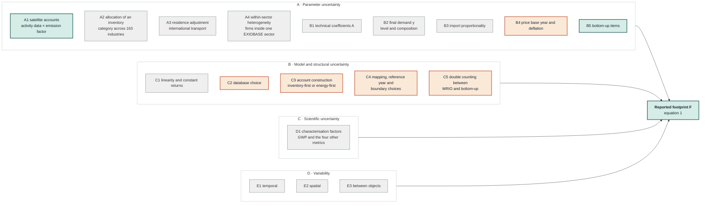

# Uncertainty

This document is the full uncertainty account for the Danish health-care
footprint: every source of uncertainty that bears on the results, whether it
is quantified, and the reason in each case (sections 1-4); the Monte Carlo
explained from first principles for a non-specialist referee, with a complete
worked draw (section 2); the response to Reviewer 1's request to propagate
proxy assumptions across plausible ranges (section 5); manuscript and
Supplementary Information text ready to paste (section 6); and a reader's
guide to every EXIOBASE-specific limitation this study is exposed to, and how
to read the results in light of them (section 7). Sections 1-4 and 7 answer
overlapping questions from different angles — "what is uncertain" versus "how
should a reader interpret a number given what the database itself cannot do"
— and are kept as separate sections for that reason, with cross-references
rather than repetition where they would otherwise restate the same fact.

## Contents

1. [Sources of uncertainty: the full taxonomy](#1-sources-of-uncertainty-the-full-taxonomy)
2. [The Monte Carlo, explained from first principles](#2-the-monte-carlo-explained-from-first-principles)
3. [Two tiers, convergence, and publishing the uncertainty](#3-two-tiers-convergence-and-publishing-the-uncertainty)
4. [What is not quantified, and what that means](#4-what-is-not-quantified-and-what-that-means)
5. [The response to Reviewer 1: proxies eliminated, not bounded](#5-the-response-to-reviewer-1-proxies-eliminated-not-bounded)
6. [Manuscript and SI text, ready to paste](#6-manuscript-and-si-text-ready-to-paste)
7. [How to read the results, given every EXIOBASE limitation](#7-how-to-read-the-results-given-every-exiobase-limitation)
8. [Where the numbers come from](#8-where-the-numbers-come-from)

---

## 1. Sources of uncertainty: the full taxonomy

**Purpose.** This section identifies every source of uncertainty that bears on
the results of this study, states which sources are quantified and which are
not, and gives the reason in each case. It is written to be read by a
non-specialist and to survive a methods referee. This section and section 2
can be lifted into the manuscript's Methods and Limitations with light
editing; section 4 is the honest ledger of what remains unquantified.

**Why a document of this kind is necessary.** A single reported interval invites
the reader to treat it as the total uncertainty of the estimate. It is not, and
saying so requires naming what the interval excludes. The Greenhouse Gas
Protocol states the obligation directly: inventories should always include a
detailed qualitative discussion of the likely causes of uncertainty, and the
direction and relative magnitude of any systematic bias should be discussed even
where it cannot be quantified (GHG Protocol, n.d., sections 2.2 and 9).

### 1.1 What the study computes, and where uncertainty can enter

The health-care footprint is

$$
F \;=\; \mathbf{c}\,(\mathbf{I}-\mathbf{A})^{-1}\,\mathbf{y} \;+\; \mathbf{d} \;+\; \sum_{c} B_{c}
\tag{1}
$$

where

| symbol | meaning | unit |
|:---|:---|:---|
| $F$ | the reported footprint for one impact category | kt CO₂-eq, kt, Mm³, or km² |
| $\mathbf{c}$ | impact intensity of each producing node | impact per M.EUR of output |
| $\mathbf{A}$ | technical coefficients: input required per unit of output | dimensionless |
| $(\mathbf{I}-\mathbf{A})^{-1}$ | Leontief inverse: total output pulled by one unit of demand | dimensionless |
| $\mathbf{y}$ | Danish health-care final demand, by product and origin | M.EUR |
| $\mathbf{d}$ | direct operational impact of the Danish health industry | as $F$ |
| $B_{c}$ | bottom-up items outside the input-output model | as $F$ |

Every term in equation (1) is an estimate, and so is the procedure that
assembled it. The taxonomy below follows that structure.



**Reading the diagram.** Green sources are propagated in the Monte Carlo. Orange
sources are reported as discrete scenarios, because they are decisions rather
than measurement error. Grey sources are named, and where possible bounded by
citation, but not quantified in this study; section 4 states why in each case,
together with the direction of the likely bias. A rendered copy of the diagram
is at `figures/diagrams/uncertainty_taxonomy.png` for readers whose viewer does
not draw Mermaid; `scripts/render_diagrams.py` produces it.

Two of the grey boxes deserve emphasis, because they are the largest omissions
rather than the smallest: the allocation of inventory categories across
industries (A2), and the level and composition of final demand (B2).

### 1.2 The taxonomy

The classification follows the Greenhouse Gas Protocol's division into
scientific and estimation uncertainty, with estimation split into model and
parameter uncertainty (GHG Protocol, n.d., section 2), and adds the
uncertainty-versus-variability distinction that Huijbregts (1998) introduced and
that Schulte et al. (2024) adopt for multi-regional input-output analysis. Their
own assessment is worth quoting, because it explains why no single scheme is
canonical: to the best of their knowledge, no proper framework exists for
distinguishing types of uncertainty in this setting.

#### Parameter uncertainty in the satellite accounts

**A1. Raw inventory uncertainty.** The national emission account is itself an
estimate, being an activity level multiplied by an emission factor. Schulte et
al. (2024) propagate this using the confidence intervals countries report to the
UNFCCC and the element-level uncertainties of Solazzo et al. (2021) for EDGAR.
*Captured here only implicitly*, inside the single joint factor described in
section 2.4.

**A2. Allocation of an inventory category across industries.** A national total
for, say, road transport must be split across the 163 EXIOBASE industries using
proxies. This allocation is the specific problem Schulte et al. (2026) solve,
and the consequences of ignoring it are large: neglecting the correlations that
the accounting identity forces on the shares changed individual sector
multiplier standard deviations by between minus 34 and plus 130 per cent in
their German case study, and overstated the national footprint's uncertainty by
46 per cent. *Not captured.* See section 4.

**A3. Residence adjustment.** Moving from a territorial to a residence basis
requires reallocating international transport emissions. Schulte et al. (2024)
find this the dominant source of carbon-account uncertainty for small open
economies and name Denmark among the countries where methane from international
water transport is a significant contributor. This transport-allocation problem
is the same structural weakness that
[the sea-transport correction](results_2022.md#the-withdrawn-transport-finding)
addresses on the transaction side. *Not captured as a distribution*; addressed
as a correction, documented in full there.

**A4. Within-sector heterogeneity.** EXIOBASE assumes every firm in an industry
shares one impact intensity. Rodrigues et al. (2018) report that the
within-sector coefficient of variation of carbon per unit output exceeded one
for 17 of 23 Japanese manufacturing sectors. Schulte et al. (2024) state the
consequence precisely: their uncertainty estimates are on the *mean* emissions
of a sector, and within-sector variability may be substantially larger. This
heterogeneity matters most for pharmaceuticals and medical devices, which sit
inside broad sectors. *Not captured.*

#### Parameter uncertainty in the economic core

**B1. Technical coefficients.** Lenzen et al. (2010) perturb the transaction
matrix, gross output, and direct intensities together, deriving standard
deviations by regressing raw-data dispersion on flow size. Schulte et al.
(2024) exclude the technical coefficients from their own assessment and say so.
*Captured here only implicitly.*

**B2. Final demand.** Wood et al. (2019) rank the total and composition of final
demand third among the drivers of variation between databases, above the
technical coefficients. Given that this study has already found and corrected a
demand-vector omission of roughly a third of health-care services expenditure
(finding F1 in
[the Eriksen manuscript assessment](results_2022.md#f1-the-demand-vector-omits-roughly-a-third-of-health-care-services-expenditure)),
this is not a hypothetical concern. *Not captured as a distribution.* See section
4.

**B3. Import proportionality.** Imported commodities are distributed over
purchasing industries pro rata because destination data do not exist. Schulte
et al. (2021) randomised this assumption on EXIOBASE at the same resolution
used here and found national footprint coefficients of variation generally
below 4 per cent, but a quarter of industry-level footprints above 10 per cent
for carbon and above 30 per cent for land, material, and water. *Not captured*,
but bounded by citation. Section 7.8 below reads across this finding to what it
means for this study's contribution-group ranking specifically.

**B4. Price base year and deflation.** The question is which price year converts
expenditure to basic prices. Jakobs et al. (2021) show price variance alone
moves hybrid footprint intensities by a median of minus 2 to plus 4 per cent,
with a strongly skewed study-level interval. *Run as a discrete scenario.*

**B5. Bottom-up items.** These items are anaesthetic gases, inhaler
propellants, staff commuting, patient and visitor travel, and direct
operational impacts. *Captured*, each with its own spread, in section 2.

#### Model and structural uncertainty

**C1. Linearity and constant returns to scale.** The Leontief model assumes
impacts scale proportionally with demand. Schulte et al. (2024) list this as the
canonical example of model uncertainty in this field; no study in the literature
quantifies it. *Not captured, and not quantifiable within the same model.*

**C2. Database choice.** Wood et al. (2019) compare five global databases and
report an unweighted mean relative standard deviation of 8.3 per cent for
production-based and 11.9 per cent for consumption-based accounts. For Denmark
specifically their Table 1 gives 19.3 per cent and 8.8 per cent respectively.
*Not captured as a distribution*, but this study's own comparison of five
published Danish national footprints spans 9.77 to 13.15 t CO₂-eq per capita, a
coefficient of variation of 12.7 per cent, which is wider than the parametric
interval reported here.

**C3. Account construction.** EXIOBASE builds its greenhouse-gas accounts from
energy balances and emission factors; national inventories are an alternative
starting point. Schulte et al. (2024) show that for methane the choice between
EDGAR and UNFCCC can change a country's emissions by as much as 300 per cent.
*Not captured.* Their published accounts at exactly this study's resolution make
this the most valuable structural scenario still available.

**C4. Mapping, reference year, and boundary choices.** These choices are the
pharmaceutical sector mapping, the waste-account reference year, the sector boundary,
and the capital treatment. *Run as discrete scenarios*, which is what Schulte
et al. (2024) recommend and what the IPCC (2000, section 6.5.6) sanctions.
Their finding that uncertainty due to choices outweighs parametric uncertainty
for most sectors means these scenarios are likely the larger term. See
[docs/revision/defects_and_fixes.md, section D](defects_and_fixes.md#d-open-decisions)
for the specific decisions and their current status.

**C5. Double counting between the input-output model and the bottom-up items.**
Jakobs et al. (2021) measure the difference between two accepted correction
methods at a factor of almost two. *Not captured.*

#### Scientific uncertainty

**D1. Characterisation factors.** This source is the uncertainty of the metric
that converts gases to a common unit, and of the equivalent factors for the
other four categories. Both the IPCC (2000, section 6.1) and the GHG Protocol
place this outside a standard uncertainty assessment, the IPCC explicitly
excluding global-warming-potential uncertainty from its own chapter while
noting that a complete assessment would have to consider it. *Excluded, with
that warrant.* The study does report a separate global-warming-potential
revision sensitivity ([docs/methods/replications.md, section 15](../methods/replications.md#r15)).

#### Variability

**E1. Temporal.** The study is a single-year snapshot. **E2. Spatial.**
Regional differences within Denmark are not resolved. **E3. Between objects.**
The issue is the same as in A4. *None captured.*

---

## 2. The Monte Carlo, explained from first principles

**Who this is for.** Anyone who has to defend this analysis to a referee, an
editor, or a co-author without having done the maths themselves. Every equation
below is stated twice: once in symbols, once in a sentence of ordinary English.
Nothing is assumed beyond multiplication and the idea of an average. Section 6
below carries the same material restated as manuscript and Supplementary
Information prose, ready to paste with light editing; this section is why that
prose is true.

**What it corresponds to in the code.** `src/analysis/uncertainty_2025.py`.
Outputs are in `data/gold/results/04_uncertainty_lenzen_ieooc/`. Numbers quoted
here are the 2022 climate result, 100,000 draws, seed 42.

### 2.1 The question, and why a single number cannot answer it

The first-round review asked us to propagate the study's proxy assumptions across
plausible ranges and report what that does to the headline estimates, and
questioned whether a ±20-50 % band on the scaling factors was the right one.

The underlying worry is fair. Our headline is

$$F = 4{,}675 \text{ kt CO}_2\text{e}$$

and it is built from quantities that are not all measured with the same
confidence. Danish direct emissions come from a national account. Patient travel
comes from a national travel survey combined with an English visitor-to-patient
ratio. Those two do not deserve the same trust, and a single number hides that.

A Monte Carlo answers the question *"if each ingredient is allowed to wobble by
as much as we actually believe it might, how much does the answer wobble?"*

### 2.2 The idea in one paragraph, no symbols

Take the recipe that produced 4,675 kt. Instead of running it once, run it a
hundred thousand times. On each run, multiply each uncertain ingredient by a
random number close to 1 (sometimes 0.9, sometimes 1.15), drawn from a spread
that reflects how well we know that ingredient. Each run gives a slightly
different total. Collect all hundred thousand totals and look at the histogram:
the middle of it is the central estimate, and the range that contains 95 % of
them is the uncertainty interval. Then ask which ingredient's wobble did most to
widen the histogram. That last question turns out to be the important one.

### 2.3 The model being perturbed

#### Why the input-output algebra does not have to be re-run

The footprint is

$$F = \mathbf{c}\,\mathbf{L}\,\mathbf{y} + \sum_{c} B_c$$

*In words:* the footprint is the impact intensity vector $\mathbf{c}$ multiplied
by the Leontief inverse $\mathbf{L}=(\mathbf{I}-\mathbf{A})^{-1}$ multiplied by
the health-care final-demand vector $\mathbf{y}$, plus the bottom-up items $B_c$
that the input-output model cannot see (anaesthetic gases, inhaler propellants,
staff commuting, patient and visitor travel, and the providers' own direct
emissions).

This expression is **linear** in $\mathbf{y}$ and **additive** in the $B_c$. So
if we split the supply-chain part into contribution groups $g$,

$$F = \sum_{g} M_g + \sum_{c} B_c$$

*In words:* the total is the sum of the nine contribution-group amounts $M_g$
(pharmaceuticals, food, transport, …) plus the five bottom-up amounts.

For 2022, climate:

| Part | Amount (kt CO₂e) |
|:---|:---|
| $\sum_g M_g$, MRIO supply chain | 3,906.446 |
| $B_{\text{HEAL}}$, direct operations | 118.554 |
| $B_{\text{COMM}}$, employee commuting | 363.727 |
| $B_{\text{VISI}}$, patient and visitor travel | 263.568 |
| $B_{\text{ANAE}}$, anaesthetic gases | 11.572 |
| $B_{\text{PMDI}}$, inhaler propellants | 11.600 |
| **Total** | **4,675.467** |

Because the model is linear and additive, a draw only has to **recombine these
fourteen numbers with random multipliers**. The 7,987 × 7,987 matrix
$(\mathbf{I}-\mathbf{A})^{-1}$ is never inverted again. That is why 100,000
draws take seconds rather than weeks, and it is stated in the Methods because it
also means $\mathbf{A}$ and $\mathbf{L}$ are held fixed: uncertainty in the
*technology structure* is carried by the single MRIO factor of section 2.4, not by
resampling the matrix.

### 2.4 What is allowed to wobble, and by how much

#### The shape of the wobble: a median-1 lognormal

Every uncertain quantity enters as a **multiplier** $h$, not as an additive
error. Multipliers are the right choice because impacts are products of
non-negative quantities (a price times a quantity times an intensity), so their
errors compound rather than add, and the result is right-skewed: it can be
twice too big far more easily than it can be minus-100 % too small.

The multiplier is drawn from a lognormal distribution:

$$h = e^{\sigma z}, \qquad z \sim \mathcal{N}(0,1)$$

*In words:* draw a standard bell-curve number $z$ (mean 0, standard deviation
1), multiply it by a spread parameter $\sigma$, and raise $e$ to that power.

Two properties matter, and both are deliberate:

**(a) The median is exactly 1.** When $z=0$, $h=e^0=1$. So half the draws scale
the ingredient up and half scale it down, and the median of the simulation
reproduces the deterministic estimate. The uncertainty analysis adds dispersion;
it does not move the answer.

**(b) The mean is slightly above 1.** For a lognormal,

$$\mathbb{E}[h] = e^{\sigma^{2}/2} > 1$$

*In words:* because the distribution has a long right tail, its average sits a
little above its middle. For our MRIO factor $\sigma = 0.0834$, so the mean is
$e^{0.0834^2/2} = 1.00348$, i.e. **+0.35 %**. This upward shift is why the simulated mean
(4,712.9 kt) sits marginally above the deterministic value (4,675 kt). It is
arithmetic, not a modelling error, and both are reported.

#### Reading a GSD

The spread is quoted as a **geometric standard deviation**,
$\mathrm{GSD} = e^{\sigma}$, because it can be read directly:

$$\text{95 \% factor range} = \left[\mathrm{GSD}^{-1.96},\ \mathrm{GSD}^{+1.96}\right]$$

*In words:* 95 % of the draws lie between "divide by GSD to the power 1.96" and
"multiply by GSD to the power 1.96".

So a GSD of 1.25 means *"I am 95 % sure the true value is between 0.65 and 1.55
times what I have used"*, a −35 %/+55 % range. **This range is exactly the
±20-50 % band the reviewer questioned, expressed properly.** The band is not a
guess imposed on the analysis; it is what these GSDs imply.

| Parameter | GSD | $\sigma=\ln(\mathrm{GSD})$ | 95 % factor range | Which is |
|:---|:---|:---|:---|:---|
| MRIO model | 1.087 | 0.0834 | 0.85 - 1.18 | −15 % / +18 % |
| Direct operations | 1.10 | 0.0953 | 0.83 - 1.21 | −17 % / +21 % |
| Inhaler propellants | 1.15 | 0.1398 | 0.76 - 1.32 | −24 % / +32 % |
| Employee commuting | 1.25 | 0.2231 | 0.65 - 1.55 | −35 % / +55 % |
| Anaesthetic gases | 1.30 | 0.2624 | 0.60 - 1.67 | −40 % / +67 % |
| Patient and visitor travel | 1.40 | 0.3365 | 0.52 - 1.93 | −48 % / +93 % |

The ordering is the argument. The two items taken from a Danish national account
are the tightest. The item with no Danish source at all (visitor travel, where
we import an English ratio) is the loosest, at roughly a factor of two either
way. **No parameter was given a range because it looked reasonable; each range
follows from what the source is.**

#### The MRIO factor, and where 8.35 % comes from

EXIOBASE publishes no standard errors for its cells, so we cannot resample them.
Instead the whole supply-chain part carries one factor calibrated to the only
published Monte Carlo estimate of *this exact quantity*: Lenzen et al. (2020),
SI table 7.1, report the Danish health-care greenhouse-gas
footprint as $2.84 \pm 0.24$ Mt CO₂e with a relative standard deviation of
**8.35 %**, obtained by propagating uncertainty through Eora's transaction,
satellite, and final-demand matrices. The 8.35 % is the value printed in their
table, computed from unrounded figures; dividing the two rounded numbers gives
$0.24 / 2.84 = 8.45\ \%$, so the calibration uses the published relative
standard deviation, not that quotient:

$$\mathrm{CV} = 8.35\ \%$$

Converting a CV to the lognormal spread:

$$\sigma_M = \sqrt{\ln\left(1 + \mathrm{CV}^{2}\right)} = \sqrt{\ln(1+0.0835^{2})} = 0.08335$$

*In words:* for a lognormal, the relative standard deviation and the log-scale
spread are related by that formula; for small CVs the two are almost equal, and
here 8.35 % maps to $\sigma_M = 0.0834$.

**Corroboration.** Wood et al. (2019) compare five global input-output databases
and give, in their Table 1, a **Denmark consumption-based relative standard
deviation of 8.8 %** (4.2 % after normalising to a common base year), against an
unweighted mean across all regions of 11.9 %. Denmark's *production*-based figure
is higher still at 19.3 %, and the paper names Denmark explicitly among the
countries whose variation is driven by how international transport emissions are
handled: independent support, from outside this study, for the sea-transport
correction.

That the between-model dispersion for Denmark (8.8 %) and the within-model
calibration used here (8.35 %) land within half a percentage point of each other
is a useful check, and it is not a coincidence of definition: the two are
measured by completely different exercises. It is not proof either. Wood et al.
caution that no real measure of uncertainty can be calculated from five
databases that share much of their source data.

The same point is visible in this repository without leaving it. Five published
Danish national footprints span 9.77 to 13.15 t CO₂e per capita: a coefficient
of variation of **12.7 %**, and a factor of 1.35 between lowest and highest.
That spread is wider than the parametric interval, which is the argument of
section 4: model choice moves the answer more than the parameters do.

#### Correlated ingredients

Commuting and patient travel are not independent errors. Both are built by the
same ratio method on the same kind of survey data; if that method is biased, it
is biased for both. Treating them as independent would understate the spread of
their sum.

They are therefore drawn from a shared random number plus one of their own:

$$\ln h_{C} = \sigma_{C}\left(\sqrt{\rho}\,z_{0} + \sqrt{1-\rho}\,z_{C}\right),
\qquad
\ln h_{V} = \sigma_{V}\left(\sqrt{\rho}\,z_{0} + \sqrt{1-\rho}\,z_{V}\right)$$

*In words:* both factors share one draw $z_0$ representing "the method is off in
this direction", weighted by $\sqrt{\rho}$, and each adds an independent draw of
its own weighted by $\sqrt{1-\rho}$.

Two things are true of this construction, and both matter:

- each factor keeps **exactly** the GSD declared above, because $\sigma_C$ and
  $\sigma_V$ multiply the whole bracket, whose variance is
  $\rho + (1-\rho) = 1$;
- the correlation between $\ln h_C$ and $\ln h_V$ is **exactly** $\rho$.

We use $\rho = 0.8$ and report $\rho \in \{0,\,0.5,\,0.8\}$.

> **A defect corrected on 8 September 2026.** The first implementation built the
> pair differently: it drew one shared factor with
> $\sigma_m = \sqrt{\rho\,\sigma_C\,\sigma_V}$ and topped each item up by
> $\sqrt{\sigma^2 - \sigma_m^2}$. At $\rho = 0.8$ that inner root is negative
> for commuting ($\sigma_m = 0.2451$ against $\sigma_C = 0.2231$); clamping it
> to zero silently raised commuting's realised GSD from the declared 1.25 to
> 1.278, and the simulation then no longer matched the closed-form moments it
> was supposed to be checked against. The construction above preserves both
> marginals exactly. The effect on the reported interval is small (the climate
> CV moves from 7.91 % to 7.87 %), but the check is now a real check.

#### The same reasoning applied across contribution groups

The MRIO factor is applied to all nine contribution groups at once:

$$f_g = \exp\!\left[\sigma_M\left(\sqrt{\rho_M}\,z_{0} + \sqrt{1-\rho_M}\,z_{g}\right)\right]$$

with $\rho_M = 1$ by default, i.e. one shared factor for every group. This setting is a
choice, and it is the conservative one: Rodrigues et al. (2018) measure
correlations of $0.63 \pm 0.36$ (median 0.76) between country consumption-based
accounts and show that assuming independence understates uncertainty by about
half. All three cases are reported:

| $\rho_M$ | $\sigma$ required | Total CV | Median group CV |
|:---|:---|:---|:---|
| 1.00, the study default | 0.083 | 7.86 % | 8.4 % |
| 0.76, Rodrigues et al.'s measured median | 0.092 | 7.83 % | 9.2 % |
| 0.00, independence | 0.160 | 7.72 % | 16.1 % |

The three rows come from a sensitivity sweep run separately from the headline
estimate, at 40,000 draws with an independent seed against the headline's
100,000 at seed 42. The default row therefore reads 7.86 % where the headline
reads 7.87 %; the gap is Monte Carlo noise of the expected size, not a
disagreement between the two.

**The spread is re-solved at every correlation so that the calibrated total is
held.** This re-solving corrects a defect found on 8 September 2026. Holding $\sigma$ fixed
while varying $\rho_M$ left each group's own spread unchanged, so the total's
spread fell as the correlation fell and the independence case reported a
supply-chain coefficient of variation of 4.27 % against the calibrated 8.35 %.
The sensitivity was silently abandoning the calibration it was meant to test,
and understating the interval by roughly half, the same error Rodrigues et al.
(2018) measure between dependent and independent sampling of country accounts.
Rodrigues (2016) proves the two assumptions cannot both hold: uncorrelated
disaggregates and a known aggregate uncertainty are mutually exclusive. This
theorem is also the reason section 7.11 below states that no reported EXIOBASE
interval can be simultaneously calibrated and independence-based.

With the total held, $\rho_M$ becomes a sensitivity on how the variance is
**distributed**, which is what a reader wants it to be. The informative column
is the last one: at independence each contribution group carries twice the
uncertainty it does under perfect correlation, while the total is unchanged.

#### What is deliberately **not** given a distribution

Three things are modelling **choices**, not noisy measurements, and are run as
discrete scenarios instead:

| Structural choice | Why it is a scenario, not a distribution |
|:---|:---|
| Mapping pharmaceuticals to *Chemicals nec* | No "true value with measurement error" exists here. Either you accept the proxy or you apply Hagenaars' correction. Both are run; the answer differs by a third. |
| Price base year | A convention about which year's prices to use. |
| Waste-account reference year | The 2011 hybrid extension against Denmark's own SEEA account: a change of *concept*, 4.6× at the health sector. |

Dressing a decision up as measurement error would tell the reader that the truth
lies somewhere in between. It does not; it lies at one of them.

### 2.5 One complete draw, worked through

This walkthrough is the whole algorithm on a single draw. Suppose the random
number generator produces $z_0 = +0.50$ for the shared MRIO factor and, for the
bottom-up items, $z_{\text{HEAL}} = -0.30$, $z_0^{\text{travel}} = +0.80$,
$z_C = -0.20$, $z_V = +0.10$, $z_{\text{ANAE}} = +1.10$,
$z_{\text{PMDI}} = -0.60$.

**Step 1: the supply chain.**
$f = e^{0.08335 \times 0.50} = e^{0.04168} = 1.04256$
$3{,}906.446 \times 1.04256 = 4{,}072.70$ kt

**Step 2: direct operations.** $\sigma = 0.09531$.
$h = e^{0.09531 \times (-0.30)} = 0.9718$
$118.554 \times 0.9718 = 115.21$ kt

**Step 3: commuting.** $\sigma_C = 0.22314$, $\rho = 0.8$, so
$\sqrt{\rho} = 0.8944$ and $\sqrt{1-\rho} = 0.4472$.
$\ln h_C = 0.22314\,(0.8944 \times 0.80 + 0.4472 \times (-0.20)) = 0.1397$
$h_C = 1.1499$, and $363.727 \times 1.1499 = 418.26$ kt

**Step 4: patient and visitor travel.** $\sigma_V = 0.33647$, **same**
$z_0^{\text{travel}} = 0.80$, which is where the correlation acts.
$\ln h_V = 0.33647\,(0.8944 \times 0.80 + 0.4472 \times 0.10) = 0.2558$
$h_V = 1.2915$, and $263.568 \times 1.2915 = 340.40$ kt

**Step 5: anaesthetics and inhalers.**
$12.522 \times e^{0.26236 \times 1.10} = 12.522 \times 1.3346 = 16.71$ kt
$11.600 \times e^{0.13976 \times (-0.60)} = 11.600 \times 0.9196 = 10.67$ kt

**Step 6: add up.**

$$4{,}072.70 + 115.21 + 418.26 + 340.40 + 16.71 + 10.67 = 4{,}973.9 \text{ kt}$$

That total is **one** draw: 4,974 kt against a deterministic 4,675 kt. Repeat
100,000 times with fresh random numbers and sort the results. Notice in step 4
that because commuting drew high, travel drew high too; that is the correlation
doing its work, and it is why the pair together widens the interval more than
either would alone.

### 2.6 Reading the output

#### The interval

| Quantity | Symbol | 2022 climate |
|:---|:---|:---|
| Deterministic estimate | $F$ | 4,675.5 kt |
| Simulation median | $\tilde{F}$ | 4,696.5 kt |
| Simulation mean | $\bar{F}$ | 4,712.9 kt |
| Standard deviation | $s$ | 371.0 kt |
| Coefficient of variation | $s/\bar{F}$ | 7.87 % |
| 95 % interval | 2.5th to 97.5th percentile | **4,032 to 5,488 kt** |

The median reproduces the deterministic estimate to 0.5 %, as designed. The CV
of 7.87 % is close to the 8.35 % Lenzen et al. report for the same quantity by a
completely different route: a useful external check, not a coincidence, since
the MRIO factor dominates.

#### The variance decomposition: the part that actually answers the reviewer

The interval alone does not say *which* assumption to worry about. For an
additive model the variance splits exactly:

$$\operatorname{Var}(F) \;=\; \underbrace{\sum_{j} a_j^{2}\left(e^{\sigma_j^{2}}-1\right)e^{\sigma_j^{2}}}_{\text{each ingredient on its own}} \;+\; \underbrace{2\,a_C a_V\,e^{(\sigma_C^{2}+\sigma_V^{2})/2}\left(e^{\rho\sigma_C\sigma_V}-1\right)}_{\text{the correlated travel pair}}$$

*In words:* every ingredient contributes its own amount squared times a spread
term, and the two correlated travel items contribute an extra amount because
they move together. The share each contributes is its term divided by the total.

Because this decomposition is closed-form, it is computed exactly rather than
estimated from the draws, and the shares sum to 100 % by construction:

| Contributor | Share of variance |
|:---|:---|
| **MRIO model** | **78.4 %** |
| Patient and visitor travel | 6.8 % |
| Employee commuting | 5.2 % |
| Covariance of the travel pair | 9.4 % |
| Direct operations | 0.09 % |
| Anaesthetic gases | 0.007 % |
| Inhaler propellants | 0.002 % |

**This decomposition is the answer to the reviewers.** The proxy assumptions
that worried them (anaesthetics, inhalers, the scaled bottom-up items) together
account for less than 0.11 % of the variance. Travel, taken as a block including
its covariance, accounts for 21.5 %. Everything else is the input-output model.

Two consequences follow, and both should be stated in the paper:

1. Tightening the bottom-up proxies further would not narrow the interval. The
   effort would be wasted.
2. The one change that would narrow it is a nationally consistent input-output
   model, which is precisely what SNAC coupling would deliver (see
   [docs/methods/methods.md, "Danish SNAC"](../methods/methods.md#danish-snac-what-statistics-denmark-does-what-we-patch-and-the-feasibility-of-a-full-build)).

#### Verification

Two independent checks run on every execution:

- **Closed-form moments.** For the additive lognormal sum, the mean is
  $\sum_j a_j e^{\sigma_j^{2}/2}$ and the variance is the expression above.
  The simulation is asserted against both; the run reports
  *"MC means match closed-form moments within 5 MCSE (n = 100,000)"*.
- **Monte Carlo standard error.** The uncertainty of the *simulation itself*
  (i.e. from having drawn 100,000 rather than infinitely many samples) is
  reported per indicator; for the climate median it is **0.035 %**, so the
  reported digits are stable.

### 2.7 Answers to the five questions a referee will ask

**"Why 100,000 draws?"** Because the Monte Carlo standard error at that size is
0.035 % of the median, two orders of magnitude smaller than the quantity being
reported. More draws would change no reported digit.

**"Why lognormal rather than normal?"** A normal distribution puts positive
probability on negative emissions. A lognormal cannot go below zero and is
right-skewed, which is how multiplicative errors actually behave. This
distribution is the standard choice in input-output uncertainty analysis (Lenzen
et al., 2010).

**"Where do the ±20-50 % ranges come from?"** They are not assumed; they are
what the GSDs above imply, and each GSD follows from the type of source. Two
of the six ranges are *narrower* than 20-50 % precisely because those quantities
come from a national account, and one is *wider* because it has no Danish source
at all.

**"Isn't one shared MRIO factor too crude?"** Yes, and it is the conservative
crudeness. The correlation-sensitivity table above reports the alternatives; the
default gives the widest interval, so it cannot be accused of understating
uncertainty.

**"Does the interval mean the true value is 95 % likely to be in it?"** No, and
the paper says so. See section 3 and the limitation paragraph in section 6.4.

---

## 3. Two tiers, convergence, and publishing the uncertainty

The IPCC (2000) distinguishes Tier 1, which combines uncertainties by an
error-propagation formula, from Tier 2, which simulates. Sections 6.3.1 and 6.4.2
require a Tier 1 result to be reported alongside a Tier 2 one, noting that it
costs hardly any additional effort. Both are now reported.

| | Climate change |
|:---|:---|
| Deterministic estimate | 4,675 kt CO₂-eq |
| Simulation median | 4,697 kt CO₂-eq |
| Simulation mean | 4,712.9 kt CO₂-eq |
| Coefficient of variation, Tier 2 | 7.87 % |
| Coefficient of variation, Tier 1 | 7.84 % |
| 95 % interval | 4,032 to 5,488 kt CO₂-eq |

The two tiers agreeing to 0.03 percentage points is expected rather than
fortunate: the model is additive, and every spread is well below the 30 per
cent limit at which the Tier 1 formula degrades (IPCC, 2000, section 6.3).

**Convergence.** The IPCC (2000, section 6.4, step 5) criterion is that the 95
per cent range is determined to within 1 per cent. Measured across the two halves
of the simulation, the largest relative difference in the interval endpoints is
**0.21 per cent**, so the criterion is met at 100,000 draws.

**Publishing the uncertainty, not only summarising it.** Schulte et al. (2026,
section 4) rank the ways of communicating correlated results. Sharing the full
simulated sample preserves all information; sharing the covariance matrix with
the medians is second best; sharing only the mean and standard deviation, with
no information on correlation, is the option they identify as capable of
seriously misestimating uncertainty.

The nine contribution groups here are correlated by construction, so this study
publishes both the full sample of group draws and the covariance matrix:

- `04_uncertainty_lenzen_ieooc/uncertainty_group_draws_gwp.npy`
- `04_uncertainty_lenzen_ieooc/uncertainty_group_covariance_gwp.csv`

---

## 4. What is not quantified, and what that means

Each entry names the source, states what it changes about the conclusion, and
states what would reduce it.

**The interval is parametric uncertainty conditional on one model.** It does
not capture the effect of using a different database, a different construct, or
a nationally consistent table. Schulte et al. (2024) find median coefficients
of variation of 3 per cent for country-level carbon footprints but 18 per cent
at the sector level, a factor of six; a health-care footprint aggregates many
sectors and therefore sits between the two, nearer the country end, but nothing
in the present design places it precisely. This imprecision constrains any
claim that the reported interval bounds the true value. A study using the
published inventory-first accounts of Schulte et al. (2024), which exist at
exactly this resolution and carry element-level uncertainties and correlations,
would resolve it.

**The calibration target may be too narrow.** The 8.35 per cent is derived from
a propagation that treats disaggregates as uncorrelated, and Rodrigues (2016)
shows that assumption is incompatible with a known aggregate uncertainty.
Rodrigues et al. (2018) measure the penalty in a comparable setting: assuming
independence between country accounts understated the world account's
uncertainty by half. This independence assumption biases the reported interval
**downward**, plausibly substantially. Recalibrating against a dependence-aware
benchmark would reduce it; the candidates are Rodrigues et al.'s median country
coefficient of variation of 7.5 per cent and Wood et al.'s (2019) Denmark
figure of 8.8 per cent, both of which are close to the value used, which is
mildly reassuring but not decisive.

**The calibration is a carbon statistic applied to five impact categories.**
Schulte et al. (2021), on this database and this resolution, find
industry-level footprint coefficients of variation above 10 per cent for carbon
but above 30 per cent for land, material, and water. The four non-carbon
categories are therefore reported with an interval that is too narrow, and the
degree is unknown. A bounding run at three times the carbon spread is reported
alongside the default, and gives coefficients of variation of 21 to 25 per cent
rather than 7 to 8 per cent. That bound is not an estimate, and is labelled as
such.

**Within-sector heterogeneity is not represented.** Pharmaceuticals and medical
devices sit inside broad sectors whose internal intensity spread is large. This
omission biases the reported interval downward for precisely the contribution
group that dominates the footprint. Resolving it requires product-level or
firm-level data that the model does not contain.

**Final demand carries no distribution.** Wood et al. (2019) rank it above the
technical coefficients as a driver of between-database variation, and this study
has already found and corrected a demand-vector omission. The direction of the
residual bias is unknown. A distribution on the expenditure vector, or at
minimum a scenario, would address it.

**Allocation of inventory categories to industries is not represented.** This
allocation is the source Schulte et al. (2026) show can change sector-level
standard deviations by minus 34 to plus 130 per cent. Their published software
makes it tractable in principle; it requires per-category proxy uncertainties
this study does not hold.

**Double counting between the input-output model and the bottom-up items is not
varied.** Jakobs et al. (2021) measure a factor of almost two between two
accepted correction methods. The direction here is likely **upward** on the
footprint if the correction is too weak, and this is the omitted term most
likely to rival the input-output factor in size.

**Characterisation-factor uncertainty is excluded**, on the explicit warrant of
the IPCC (2000, section 6.1) and the GHG Protocol.

**Uncertainty due to choices is likely the larger term.** Schulte et al. (2024)
find that at sector level, uncertainty due to choices outweighs parametric
uncertainty for most sectors. This study's own structural scenarios bear that
out: the alternative pharmaceutical mapping moves the median to 3,568 kt, which
lies outside the parametric 95 per cent interval of 4,032 to 5,488 kt entirely.
That divergence is the strongest single argument for reporting the scenarios
beside the interval rather than in an appendix.

**Therefore the interval should be read as the precision of this model, not the
accuracy of the estimate.** It should be reported together with that sentence,
or not at all.

---

## 5. The response to Reviewer 1: proxies eliminated, not bounded

The first-round review asked us to propagate the study's proxy assumptions across
plausible ranges and report what that does to the headline estimates, suggesting
±20-50 % for the scaling factors, and to identify which assumptions drive the result.
This section sets out what was done and why the ranges are what they are; sections
1-4 above carry the full derivation, and are not repeated here.

### 5.1 The strongest part of the answer is not the Monte Carlo

Three of the four proxies the reviewer names have been **eliminated, not bounded**. Where a
Danish measurement exists, a transplanted proxy has been replaced by it:

| Proxy the reviewer questioned | Submitted | Now |
|:---|:---|:---|
| Nitrous oxide scaled from one region by births | 9.52 kt, from Region of Southern Denmark × birth ratio | **11.32 kt** from Denmark's National Inventory Document 2024 (DCE 622), category 2.G.3.a, a national measurement |
| pMDI scaled from Dutch defined daily doses | 34.6 kt | **11.6 kt** from the Danish EPA F-gas inventory's reported MDI emission |
| Patient and visitor travel scaled from Dutch totals | Dutch value × 0.54 | **Danish National Travel Survey**, Table 15, purpose 33 *Social/sundhed*, the category that actually measures travel to doctors and hospitals |
| Employee commuting | scaled on Dutch commuting | still scaled, but on national-accounts employment (DST NABB69) and the TU distance table |

**Answering a proxy objection by removing the proxy is stronger than quantifying its
uncertainty.** That argument should lead the response; the Monte Carlo supports it rather
than substituting for it. The full current values and sourcing are in
[docs/revision/results_2022.md, "Bottom-up items now on Danish primary data"](results_2022.md#bottom-up-items-now-on-danish-primary-data)
and, for the anaesthetics item specifically,
[docs/revision/results_2022.md, "Bottom-up anaesthetic gases"](results_2022.md#bottom-up-anaesthetic-gases).

### 5.2 Why the ranges are not a flat ±20-50 %

The reviewer's ±20-50 % is a reasonable prompt, not a specification, and applying it
uniformly would be **wrong**. It would assign the same uncertainty to a reading from a
mandatory national register as to a figure transplanted from an English travel survey via
the Netherlands. Each parameter's range is therefore derived from its own evidence, as set
out in section 2.4 above: every cross-country scaling factor spans at least the ±20-50 %
range the reviewer proposed, and the widest spans twice it; the two narrower ranges are not
scaling factors at all (one is a national-accounts measurement, the other is the only
published Monte Carlo estimate of this exact quantity). Widening either to ±50 % would be
inventing uncertainty rather than estimating it.

### 5.3 What the Monte Carlo found, and mitigation scenarios

The Monte Carlo results and variance decomposition are given in full in
[section 2.6](#26-reading-the-output) above, and are the most useful single answer to the
reviewer's second question ("which assumptions dominate"): the proxies the reviewer was
worried about are not what the estimate rests on. The related question of mitigation
scenarios — Reviewer 2's R2-7, "the paper identifies hotspots; it does not model
mitigation" — is answered in full in
[docs/revision/results_2022.md, "Mitigation scenarios: the answer to the reviewer"](results_2022.md#mitigation-scenarios-the-answer-to-the-reviewer),
including the honest headline that full Danish grid decarbonisation alone removes under
7 % of the footprint, because 73.7 % of impacts arise abroad.

### 5.4 What the interval does *not* establish

The following qualification must be stated in the paper, not omitted, and is
repeated in full as the pasteable limitation paragraph in section 6.4 below:

> The reported interval is parametric uncertainty **conditional on one model**. It is not a
> confidence interval on the Danish health-care footprint. Tukker et al. warn that national
> error statistics do not transfer to sector studies, and Schulte et al. (2024, table 2)
> report median footprint coefficients of variation of 3 % at country level against 18 %
> at sector level. This study's own change of EXIOBASE release
> moved the result by more than this interval spans.

Reporting 7.9 % without that sentence would over-claim, and a referee who knows the
literature will say so.

---

## 6. Manuscript and SI text, ready to paste

**For Ofir.** Everything below is written so it can be lifted into the Methods,
Results, and Supplementary Information with light editing. It restates sections
1-5 above as publication prose rather than derivation; nothing here introduces a
number that is not already justified above. Everything is reproducible from
`analysis.uncertainty_2025`; the tables are in
`data/gold/results/04_uncertainty_lenzen_ieooc/`. It answers the first-round
review's central request (propagate the proxy assumptions and report what that
does to the headline estimates) and the second reviewer's related request for
uncertainty on the bottom-up parameters.

### 6.1 Methods text (draft)

> **Uncertainty analysis.** Parameter uncertainty was propagated by Monte Carlo
> simulation with 100,000 draws. Each uncertain quantity enters as a
> multiplicative factor drawn from a lognormal distribution with **median 1**, so
> that the simulation median reproduces the deterministic estimate and the
> analysis adds dispersion without shifting the central value. Lognormal
> multipliers are the standard choice for input-output uncertainty propagation
> (Lenzen et al., 2010) because impact estimates are products of non-negative
> quantities and are consequently right-skewed.
>
> Six parameters were treated as stochastic (Table X). Five are bottom-up items,
> assigned geometric standard deviations reflecting the quality of their
> underlying source: direct operational emissions and waste from national
> accounts (GSD 1.10), pMDI propellants (1.15), employee commuting (1.25),
> anaesthetic gases (1.30), and patient and visitor travel (1.40). The sixth
> represents uncertainty in the multi-regional input-output model itself,
> calibrated to a relative standard deviation of **8.35 %**, the value Lenzen
> et al. (2020, SI table 7.1) obtain for the Danish health-care
> greenhouse-gas footprint from a full Monte Carlo over the transaction,
> satellite, and final-demand matrices, and the only published uncertainty
> estimate for this exact quantity.
>
> Employee commuting and patient and visitor travel share a common method and
> are therefore drawn with correlation ρ = 0.8; results for ρ ∈ {0, 0.5, 0.8}
> are reported.
>
> **Structural choices are not treated as parameter uncertainty.** The
> pharmaceutical sector mapping, the price base year, and the waste-account
> reference year are modelling decisions, not noisy measurements, and are reported as
> discrete scenarios. Representing a structural choice as a distribution would
> misrepresent a decision as measurement error.
>
> First-order Sobol indices were computed in closed form to attribute output
> variance to individual parameters, and simulation moments were verified
> against the analytic moments of the lognormal sum.

### 6.2 Results text (draft)

> The Monte Carlo median for the Danish health-care climate footprint is
> **4,697 kt CO₂e** with a 95 % interval of **4,032 to 5,488 kt** and a
> coefficient of variation of **7.87 %**, closely consistent with the 8.35 % that Lenzen et
> al. (2020) report for the same quantity.
>
> Variance attribution is more informative than the interval alone. **The
> multi-regional input-output model contributes 78.4 % of the output variance**;
> patient and visitor travel 6.8 %; employee commuting 5.2 %; the covariance of
> those two, which share a method, a further 9.4 %; and every remaining
> bottom-up item **less than 0.1 %**. The proxy assumptions that
> motivated the reviewers' concern are therefore not what the estimate rests on:
> the estimate rests on the input-output model. This attribution also means that
> improving the bottom-up items further would not materially narrow the
> interval, whereas a nationally consistent input-output model would.
>
> Under the alternative pharmaceutical mapping the median falls to **3,568 kt**
> with a wider coefficient of variation of 10.7 %, and the identity of the
> largest contributing group changes (§ pharmaceutical mapping).

### 6.3 Three properties stated explicitly

A referee may otherwise raise these, and each is now reported. (a) and the
correlation table restate section 2.4 above; (b) restates the mean-inflation
point in section 2.4; (c) restates section 2.6. They are repeated here as
self-contained prose because that is what makes them pasteable.

**(a) The input-output factor is perfectly correlated across contribution
groups.** Applying one shared multiplier is the ρ = 1 case. Rodrigues et al.
(2018) measure correlations of 0.63 ± 0.36 (median 0.76) between country
consumption-based accounts, and show that assuming *independence* understates
uncertainty by roughly half. We report all three:

| Correlation across groups | CV | 95 % interval (kt) |
|:---|:---|:---|
| ρ = 1.00, perfect (reported default) | **7.86 %** | 4,035 to 5,484 |
| ρ = 0.76, Rodrigues et al.'s measured median | 7.83 % | 4,038 to 5,482 |
| ρ = 0.00, independence | 7.72 % | 4,090 to 5,522 |

Rodrigues (2016) shows that uncorrelated components and a known aggregate
uncertainty are mutually exclusive. Holding $\sigma$ fixed while lowering
$\rho$ therefore abandons the calibration: the supply-chain coefficient of
variation collapses to 4.29 % against the 8.35 % the calibration asserts. We
instead re-solve $\sigma$ at each $\rho$ so that the calibrated total is
preserved, which is what the table reports. The correlation assumption is then
a statement about how the variance is *distributed* rather than how much of it
there is: the three totals differ by 0.14 percentage points, while the median
coefficient of variation of a single contribution group runs from 8.4 % at
$\rho = 1$ to 16.1 % at $\rho = 0$. The reported default remains the widest
total, so it cannot understate the interval. The three rows come from a
sensitivity sweep run separately from the headline estimate, at 40,000 draws
with an independent seed against the headline's 100,000 at seed 42, so the
default row reads 7.86 % where the headline reads 7.87 %.

**(b) Median-1 lognormal multipliers have mean exp(σ²/2) > 1.** The simulated
mean sits marginally above the deterministic estimate by construction. The
inflation is **+0.35 %**, immaterial here but stated.

**(c) The variance decomposition is exact, and the correlated pair is shown as
its own term.** The model is additive, so the variance splits in closed form
into each parameter's own contribution plus one covariance term for commuting
and patient travel, which share a method (ρ = 0.8). Reporting the six own-terms
alone would not be a decomposition: they would sum to 90.6 %, not 100 %. With
the covariance row the shares sum to **100.0 %** exactly and nothing is hidden.
Read as a block, travel accounts for **21.5 %** of the variance.

### 6.4 The limitation to paste alongside the interval

> **Scope of the uncertainty estimate.** The interval reported here is
> *parametric* uncertainty conditional on one input-output model. It does not
> capture structural or model-choice uncertainty: the effect of using a
> different global database, a different construct, or a nationally consistent
> table. Tukker et al. (2020) caution that *"analyses at the national level are
> much more forgiving than comparative analyses on product group level, since
> aggregation to the national level tends to iron out negative and positive
> differences at product group level"*, so published national error statistics,
> including the 8.35 % used to calibrate our input-output factor, should not be
> assumed to transfer unchanged to a single sector. Schulte et al. (2024,
> table 2) report median coefficients of variation of 4 % at country level and
> 94 % at sector level for CO₂ emission *accounts*, and 3 % and **18 %** for the
> *footprints* derived from them; a sector footprint therefore carries about six
> times the spread of a national one, even after supply-chain propagation has
> cancelled most of the account-level uncertainty. They also show that the
> *choice* of emission-account source can place a value more than three times
> outside the parametric 95 % interval. Our own release comparison is a direct demonstration: replacing the
> background release changed the Danish health-care climate footprint by far
> more than the parametric interval spans. The interval should therefore be read
> as the precision of this model, not as the accuracy of the estimate.

### 6.5 Parameter table for the supplementary information

| Parameter | Distribution | GSD / CV | 95 % factor range | Source and residual risk |
|:---|:---|:---|:---|:---|
| Input-output model | lognormal, median 1 | CV 8.35 % | 0.85-1.18 | Lenzen et al. (2020) SI table 7.1, Danish health-care GHG footprint; applied jointly to all MRIO components |
| Direct operational | lognormal, median 1 | GSD 1.10 | 0.83-1.21 | Statistics Denmark DRIVHUS and AFFALD01; residual risk is the eldercare proration and the medical-N₂O netting |
| pMDI propellants | lognormal, median 1 | GSD 1.15 | 0.76-1.32 | Danish EPA F-gas inventory; register dispensing × producer HFC content |
| Employee commuting | lognormal, median 1 | GSD 1.25 | 0.65-1.55 | Ratio method on Danish employment (DST) and travel-survey distances |
| Anaesthetic gases | lognormal, median 1 | GSD 1.30 | 0.60-1.67 | Danish NID 2.G.3.a activity ±25 %, emission factor ±20 % |
| Patient and visitor travel | lognormal, median 1 | GSD 1.40 | 0.52-1.93 | Danish national travel survey; the visitor component has no Danish source |

### 6.6 Supplementary Information: section S*n*, ready to paste

The section is self-contained: it repeats the few sentences it needs from the
Methods so it can be read on its own, as an SI section should be. Equations are
numbered S1-S7; the plain-English derivation of each is in sections 2.3-2.4 above.

> ### S*n*. Uncertainty propagation
>
> #### S*n*.1 Model
>
> The health-care footprint is
>
> $$F=\mathbf{c}\,(\mathbf{I}-\mathbf{A})^{-1}\mathbf{y}+\sum_{c}B_{c}\tag{S1}$$
>
> where $\mathbf{c}$ is the impact-intensity vector, $\mathbf{A}$ the technical
> coefficient matrix, $\mathbf{y}$ the health-care final-demand vector, and
> $B_c$ the five bottom-up items. Equation (S1) is linear in $\mathbf{y}$ and
> additive in $B_c$, so writing the supply-chain term as a sum over the nine
> contribution groups $g$,
>
> $$F=\sum_{g}M_{g}+\sum_{c}B_{c}\tag{S2}$$
>
> uncertainty can be propagated by resampling the fourteen deterministic
> amounts $\{M_g, B_c\}$ without re-inverting $(\mathbf{I}-\mathbf{A})$.
> $\mathbf{A}$ and $\mathbf{L}$ are consequently held fixed; uncertainty in the
> technical structure is carried by the single multiplier of (S5).
>
> #### S*n*.2 Distributions
>
> Each uncertain quantity enters as a multiplicative factor
>
> $$h=e^{\sigma z},\qquad z\sim\mathcal{N}(0,1)\tag{S3}$$
>
> lognormal with median 1, so that the simulation median reproduces the
> deterministic estimate. Lognormal multipliers are standard for input-output
> uncertainty propagation (Lenzen et al., 2010) because impacts are products of
> non-negative quantities. The spread is reported as a geometric standard
> deviation $\mathrm{GSD}=e^{\sigma}$, whose 95 % factor range is
> $[\mathrm{GSD}^{-1.96},\mathrm{GSD}^{1.96}]$. For a factor specified by a
> coefficient of variation instead,
>
> $$\sigma=\sqrt{\ln\!\left(1+\mathrm{CV}^{2}\right)}\tag{S4}$$
>
> Note that a median-1 lognormal has mean $e^{\sigma^{2}/2}>1$; for the
> input-output factor this is +0.35 %, and both the simulation mean and median
> are reported.
>
> #### S*n*.3 The input-output factor
>
> EXIOBASE publishes no element-level standard deviations. The supply-chain
> term therefore carries one factor per contribution group,
>
> $$f_{g}=\exp\!\left[\sigma_{M}\left(\sqrt{\rho_{M}}\,z_{0}+\sqrt{1-\rho_{M}}\,z_{g}\right)\right]\tag{S5}$$
>
> with $\sigma_M$ from (S4) on $\mathrm{CV}=8.35\ \%$, the relative standard
> deviation Lenzen et al. (2020, SI table 7.1) obtain for the Danish
> health-care greenhouse-gas footprint by propagating Eora's transaction,
> satellite, and final-demand matrices, the only published Monte Carlo of this
> quantity. The default $\rho_M=1$ applies one
> shared factor to every group. Because uncorrelated components and a known
> aggregate uncertainty are mutually exclusive (Rodrigues, 2016), $\sigma_M$ is
> re-solved at each $\rho_M$ so that (S4) continues to hold;
> $\rho_M\in\{0,0.76,1\}$ are reported. The default gives the widest total
> interval, and the sensitivity varies how the variance is distributed across
> contribution groups rather than how much of it there is.
>
> #### S*n*.4 Correlated bottom-up items
>
> Employee commuting and patient and visitor travel share a derivation method,
> so their factors share a random component:
>
> $$\ln h_{C}=\sigma_{C}\!\left(\sqrt{\rho}\,z_{0}+\sqrt{1-\rho}\,z_{C}\right),\qquad
> \ln h_{V}=\sigma_{V}\!\left(\sqrt{\rho}\,z_{0}+\sqrt{1-\rho}\,z_{V}\right)\tag{S6}$$
>
> This construction preserves each marginal GSD exactly while giving the
> log-factors correlation $\rho$; $\rho=0.8$ is used, and $\rho\in\{0,0.5,0.8\}$
> reported.
>
> #### S*n*.5 Variance decomposition
>
> Because (S2) is additive the output variance is available in closed form:
>
> $$\operatorname{Var}(F)=\sum_{j}a_{j}^{2}\!\left(e^{\sigma_{j}^{2}}-1\right)e^{\sigma_{j}^{2}}
> +2a_{C}a_{V}e^{(\sigma_{C}^{2}+\sigma_{V}^{2})/2}\!\left(e^{\rho\sigma_{C}\sigma_{V}}-1\right)\tag{S7}$$
>
> where $a_j$ is the deterministic amount carried by parameter $j$. Variance
> shares are computed from (S7) rather than estimated from the draws, and sum to
> 100 % exactly once the covariance term is reported as its own contribution.
> The simulation was verified against the closed-form mean
> $\sum_j a_j e^{\sigma_j^{2}/2}$ and against (S7); agreement is within five
> Monte Carlo standard errors at $N=10^{5}$ draws, and the Monte Carlo standard
> error of the reported median is 0.035 %.
>
> #### S*n*.6 Structural choices
>
> The pharmaceutical sector mapping, the price base year, and the waste-account
> reference year are modelling decisions rather than noisy measurements and are
> reported as discrete scenarios (Table S*m*), not as distributions.
>
> #### S*n*.7 Results
>
> | | Climate change |
> |:---|:---|
> | Deterministic estimate | 4,675 kt CO₂e |
> | Simulation median | 4,697 kt CO₂e |
> | Simulation mean | 4,712.9 kt CO₂e |
> | Coefficient of variation | 7.9 % |
> | 95 % interval | 4,032 to 5,488 kt CO₂e |
>
> | Variance contributor | Share |
> |:---|:---|
> | Input-output model | 78.4 % |
> | Covariance, commuting × patient travel | 9.4 % |
> | Patient and visitor travel | 6.8 % |
> | Employee commuting | 5.2 % |
> | Direct operations | 0.09 % |
> | Anaesthetic gases | 0.007 % |
> | Inhaler propellants | 0.002 % |
>
> Travel as a block, covariance included, accounts for 21.5 % of the variance;
> every other bottom-up item accounts for less than 0.1 %.

---

## 7. How to read the results, given every EXIOBASE limitation

This section is written to be lifted into the manuscript's *Data*, *Methods*,
and *Limitations* sections. Each entry follows the same three-part structure
the discipline requires of a limitation: **what it is**, **what it changes
about the conclusion**, and **what study design would reduce it**. A
limitation named without its consequence is not a limitation; it is a
disclaimer.

Every weakness below was tested on this model rather than inherited from a
reading of the literature. Where a number is given, the test that produced it
is named. Where a weakness is known from the literature but not measured
here, that is stated in those words. Several of these limitations are
covered in full technical detail elsewhere in this document or in
[docs/revision/defects_and_fixes.md](defects_and_fixes.md) and
[docs/revision/results_2022.md](results_2022.md); this section cross-refers
to that detail rather than repeating it, and adds only the "how to read the
results" framing that those documents do not themselves carry.

The honest summary is two-sided, and both halves matter. **EXIOBASE is the
right model for this study, and it has defects that change results.** A
limitations section that says only the first is promotional; one that says
only the second invites the reader to discard the work.

### 7.1 The Danish block is not the Danish national accounts

**What is wrong.** EXIOBASE's national blocks are estimated, not adopted from
each country's own supply-and-use tables. For Denmark this produces two
measurable errors: a sea-transport misallocation (73.6 % of Danish
water-transport output routed to Danish intermediate use, against the
national accounts' 9 %), and a more general industry-misallocation pattern
that Rørmose Jensen & Iliev (2022) document and that is why Statistics
Denmark rebuild the Danish block rather than patch it. **Full treatment,
including what we did about it and how to read the results in light of it,
is in [docs/revision/results_2022.md, "The withdrawn transport finding"](results_2022.md#the-withdrawn-transport-finding).**

**How to read the results, in brief.** Danish-origin transport emissions in
this study are corrected and should not be compared with uncorrected
EXIOBASE studies of Denmark. Other Danish industries are **not** individually
corrected: treat Danish sectoral detail as indicative and the Danish
aggregate as reliable.

**Recommendation.** Full national-accounts coupling (SNAC, after Palm et al.
2019) would remove the remaining allocation error; scoped in
[docs/methods/methods.md, "Danish SNAC"](../methods/methods.md#danish-snac-what-statistics-denmark-does-what-we-patch-and-the-feasibility-of-a-full-build).

### 7.2 Release defects are real, version-specific, and invisible to a balance check

The full defect tables (D1: industry 33 near-zero across Europe from 2015
onward in v3.10.2; D2: Danish output redistributed in the 2021-2022 nowcast
years) and the checklist for reproducing the test on a future EXIOBASE
release are in
[docs/methods/replications.md, section 09](../methods/replications.md#r09)
and [docs/revision/defects_and_fixes.md, anomalies A1-A2](defects_and_fixes.md#a-defects-in-the-background-data-exiobase).
This entry gives only what a reader needs to interpret the results.

**Why a routine check misses them.** Danish output still totals to within
3 %, and the table still balances to 10⁻¹¹. Output was *redistributed*, not
lost. The decisive test needed no external source: Danish health final
expenditure is 40,597 M€, and a health industry with 16,326 M€ of *total
output* cannot deliver it.

**How to read the results.** This study uses **v3.8.2**, which passes both
tests. Our results are therefore not comparable, industry by industry, with
studies built on v3.10.2 from 2015 onward, and the difference is a data
defect, not a modelling choice.

**Recommendation for the field.** Anyone using v3.10.2 for a European study
from 2015 should check industry 33 before trusting sectoral results, and
anyone using a nowcast year should check the national block against national
accounts. Neither check is standard practice; both should be.
`analysis.release_defect_audit` is a reusable implementation.

### 7.3 One health industry, so no genuine sub-sector detail

EXIOBASE's `ixi` layout has a **single** health and social work industry.
Malik et al. (2021) and Lenzen et al. (2020) report sub-sector detail because
their MRIOs inherit it from national tables; neither method is reproducible
here.

**What we did.** We implemented the one route that is reproducible, namely
Malik et al.'s (2018) output-prorated concordance
([docs/methods/replications.md, section 07](../methods/replications.md#r07)),
and then published its decomposition rather than its ranking alone. Five SHA
functions carry only **three distinct intensities**, and **99.99 %** of the
variation across functions is explained by expenditure alone.

**How to read the results.** The services / pharmaceuticals / appliances
split is a genuine intensity finding. The ordering *within* the three service
functions is an expenditure ranking and carries no supply-chain information.
Do not quote hospital-versus-outpatient intensity differences from this
study; there are none to quote.

**Recommendation.** The Danish 117-industry table resolves hospitals
separately. Genuine per-function recipes need it (see
[docs/methods/danish_data_acquisition.md](../methods/danish_data_acquisition.md)).

### 7.4 Monetary homogeneity, and what it does to pharmaceuticals

Every EXIOBASE industry is assumed to sell a homogeneous product at a
uniform price, so a euro of "Chemicals nec" carries the same intensity
whether it buys a generic paracetamol or a patented biologic. Pharmaceutical
prices are far from cost-reflective.

**How to read the results.** The pharmaceutical footprint (4.8 % of spend,
36.6 % of the function total) is the number in this study most exposed to
price heterogeneity, and it is **probably an overestimate** if Danish
pharmaceutical prices carry above-average margins. The Monte Carlo treats the
mapping as a structural scenario, not a distribution (section 2.4 above),
precisely because it is a modelling choice rather than measurement error.

### 7.5 The satellite account constrains what can be characterised

HFC and PFC arrive **already aggregated in kg CO₂-equivalent**, on an
unrecoverable GWP revision, so they cannot be restated on AR6; their share is
reported rather than hidden
([docs/methods/replications.md, section 15](../methods/replications.md#r15)).
The DESIRE characterisation workbook dates to 2014: three of its rows
failed our tests (an endpoint identical to its own midpoint, a photochemical
endpoint two orders of magnitude from its published damage factor, an SF₆
factor matching no IPCC assessment) and **ozone depletion was retracted** on
that basis; full detail in
[docs/revision/defects_and_fixes.md, anomaly A7b](defects_and_fixes.md#a7b-four-defective-rows-in-the-desire-characterisation-workbook-high-fixed).

**Recommendation.** IMPACT World+ v2.2.1 is current, openly licensed, and
aligned to the EXIOBASE v3.8.2 stressor list; it is computed alongside DESIRE
and should displace it for water scarcity, land biodiversity, and mineral
resources.

### 7.6 No published parameter uncertainty

EXIOBASE ships no element-level standard deviations. Our Monte Carlo
therefore calibrates MRIO uncertainty to Lenzen et al.'s published 8.35 % for
this exact quantity and applies it as a single joint factor: correlation
$\rho = 1$, the conservative bound. Full derivation in
[section 2](#2-the-monte-carlo-explained-from-first-principles) above.

**How to read the interval.** The reported 95 % interval, 4,032 to 5,488 kt,
is **parametric uncertainty conditional on one model**. The interval is not a
confidence interval on "the" Danish health footprint. Our own change of
EXIOBASE release moved the result by more than this interval spans, and
Tukker et al. warn that national error statistics do not transfer to sector
studies. Report the interval and this sentence together, or not at all.

### 7.7 Boundary conventions that are choices, not facts

| Convention | This study | Effect if changed |
|:---|:---|:---|
| Capital | excluded from the headline | +19.4 % (Södersten endogenisation) |
| Sector boundary | health + eldercare | +12 % on NACE Q incl. childcare |
| Scope 2 | Hertwich & Wood full-multiplier | −2.2 % on the GHG-Protocol strict form |
| Waste | MRIO extension retained for comparability | the Danish account is 4.6× lower |

None of these is wrong; each is a convention that must be stated with the
number. Full detail in
[docs/revision/results_2022.md, "Capital (GFCF) treatment"](results_2022.md#capital-gfcf-treatment)
and [docs/revision/defects_and_fixes.md, decision D3](defects_and_fixes.md#d-open-decisions).
The boundary-matched benchmark in
[docs/methods/replications.md, section 06](../methods/replications.md#r06)
shows what happens when they are matched to a comparator: agreement with
Schmidt & Merciai improves from 25 % apart to **1.7 %**.

### 7.8 Import proportionality: who buys the imports is assumed, not observed

**What it is.** EXIOBASE does not know which Danish industry buys which
imported product. It distributes each imported commodity across purchasing
industries in proportion to their use of the domestic equivalent (parameter
B3 in [section 1.2](#12-the-taxonomy) above). Nothing in the source data
supports that proportionality; it is a modelling necessity.

**What it changes about the conclusion.** Schulte et al. (2021) randomised
this assumption on EXIOBASE at exactly this study's resolution and found
national footprints insensitive to it, with coefficients of variation
generally below 4 per cent, but industry-level footprints far less so: a
quarter of industries exceeded 10 per cent for carbon and 30 per cent for
land, material, and water, with extreme cases above 300 per cent. Read
across to this study, the **health-care total is safe from this assumption,
and the contribution-group split is softer than its point estimates
suggest.** Import proportionality is a second reason, alongside the single
health industry (section 7.3), not to quote group-level differences finely.

**What would reduce it.** Firm-level or customs-linked import data by
purchasing industry would reduce it. None exists for Denmark at this
resolution.

### 7.9 Within-sector homogeneity: one intensity for every firm in an industry

**What it is.** Every firm in an EXIOBASE industry is assumed to produce the
same product with the same technology and the same impact intensity. A
Danish manufacturer of generic paracetamol and a manufacturer of a patented
biologic are one row (parameter A4 in [section 1.2](#12-the-taxonomy) above).

**What it changes about the conclusion.** Rodrigues et al. (2018) report a
within-sector coefficient of variation of carbon per unit output above one
for 17 of 23 Japanese manufacturing sectors. Schulte et al. (2024) state the
consequence exactly: their uncertainty estimates are on the *mean* emissions
of a sector, and within-sector variability may be substantially larger.
Since pharmaceuticals are 37 per cent of this study's climate footprint and
51 per cent of its material footprint, and since hospitals buy a narrow and
atypical slice of the chemicals sector, **the pharmaceutical figure carries
more uncertainty than any interval reported here shows, and the direction of
the bias is unknown.**

**What would reduce it.** Product-level or firm-level intensity data for the
specific pharmaceuticals purchased would reduce it, as would a hybrid model
in which the pharmaceutical column is replaced by process data.

### 7.10 The reference year is a nowcast, not a benchmark table

**What it is.** EXIOBASE's 2022 table is projected forward from the most
recent benchmark year rather than compiled from a 2022 supply-and-use table,
because no country has published one. The choice between reporting on this
nowcast and freezing at the last observed year is
[Decision D8](results_2022.md#decision-d8-2022-nowcast-or-the-last-observed-year),
covered there in full.

**What it changes about the conclusion.** Nowcast years carry the errors
documented in section 7.2 above, and Lenzen et al. (2010) observe that
uncertainty grows with distance from the benchmark year, although they did
not prove it. This growth in uncertainty is why the release tests were run at
all, and why v3.10.2 was rejected: its nowcast years fail against the Danish
national accounts. **Sectoral detail for 2022 should be read as less firm
than the same detail for a benchmark year would be.**

**What would reduce it.** Statistics Denmark's own 2022 supply-and-use table,
coupled to the global model, would reduce it. That coupling is the SNAC
route.

### 7.11 Correlation between elements is not published, and cannot be assumed away

**What it is.** EXIOBASE publishes no covariance information for its cells.
A user who wants to propagate uncertainty must therefore assume a
correlation structure, and Rodrigues (2016) proves the two convenient
assumptions (uncorrelated elements, and a known aggregate uncertainty) are
mutually exclusive — the same theorem invoked in
[section 2.4](#24-what-is-allowed-to-wobble-and-by-how-much) above.

**What it changes about the conclusion.** The missing covariance information
means that no reported interval for an EXIOBASE result can be simultaneously
calibrated and independence-based, and a study that reports one without
saying which it chose is reporting an artefact. This study holds the
calibration and varies the correlation, and reports what that does; see
section 2.4 above.

**What would reduce it.** Schulte et al. (2024) published greenhouse-gas
accounts at exactly this resolution with element-level uncertainties **and**
correlations attached. Adopting them is the single most valuable
methodological upgrade available to this study after SNAC coupling.

### 7.12 Waste, water, and land extensions are weaker than the greenhouse-gas one

**What it is.** The greenhouse-gas extension is built from energy balances
and national inventories and is the most scrutinised part of the satellite
account. The material, water, land, and waste extensions rest on thinner
source data and have received far less validation in the literature.

**What it changes about the conclusion.** Every uncertainty statement in this
study is calibrated on a **carbon** figure (see section 4 above). Schulte et
al. (2021) find industry-level footprint dispersion roughly three times
higher for land, material, and water than for carbon on this same database.
The four non-carbon categories are therefore reported with intervals that are
**too narrow, by an unknown factor**, and a bounding run at three times the
carbon spread is reported alongside them for that reason (section 4 above).

**What would reduce it.** A per-category uncertainty assessment of the
EXIOBASE extensions would reduce it. None exists. This absence is a gap in
the field, not only in this study.

### 7.13 What this means for a reader of the paper

1. **Trust the aggregate, qualify the sectoral detail.** The Danish
   health-care footprint and its domestic and imported split rest on
   corrected, benchmarked quantities. Industry-level Danish detail rests on
   an estimated national block, an assumed import allocation, and a
   homogeneous-sector assumption, and three separate limitations above
   (7.1, 7.8, 7.9) converge on the same advice.
2. **Read every share with its basis.** Transport is 17.8 per cent of the
   supply chain and 14.9 per cent of the total; both are correct, and they
   are not interchangeable.
3. **Treat the uncertainty interval as conditional.** Model choice moves the
   answer more than the parameters do. This study's own structural scenario
   on the pharmaceutical mapping lands entirely outside its parametric 95 per
   cent interval, which is the clearest possible demonstration.
4. **Do not compare across EXIOBASE releases** without checking the defects
   in section 7.2.
5. **Do not read the non-carbon categories with the carbon interval.**
   Section 7.12 explains why, and the bounding run is reported for that
   purpose.

---

## 8. Where the numbers come from

| Output | File |
|:---|:---|
| Totals, median, mean, interval | `04_uncertainty_lenzen_ieooc/uncertainty_totals.csv` |
| Variance decomposition | `uncertainty_variance_shares.csv` |
| Tier 1 error propagation | `uncertainty_tier1_error_propagation.csv` |
| Convergence against the IPCC criterion | `uncertainty_convergence.csv` |
| Correlation sensitivity | `uncertainty_mrio_correlation.csv` |
| Non-carbon bounding run | `uncertainty_noncarbon_bound.csv` |
| Structural scenarios | `uncertainty_structural_scenarios.csv` |
| Full group sample and covariance | `uncertainty_group_draws_gwp.npy`, `uncertainty_group_covariance_gwp.csv` |
| Audit of the simulation, 19 checks | `uncertainty_audit.csv` |

```bash
HC_ANALYSIS_YEAR=2022 HC_BACKGROUND_TAG=_snacship PYTHONPATH=src python -m analysis.uncertainty_2025
HC_ANALYSIS_YEAR=2022 HC_BACKGROUND_TAG=_snacship PYTHONPATH=src python -m analysis.uncertainty_audit
```

---

## References

Full entries with DOIs are in [`docs/references.md`](../references.md).

- GHG Protocol. (n.d.). *Guidance on uncertainty assessment in GHG inventories
  and calculating statistical parameter uncertainty*. World Resources Institute
  and World Business Council for Sustainable Development.
  https://ghgprotocol.org/calculation-tools-and-guidance
- Huijbregts, M. A. J. (1998). Application of uncertainty and variability in LCA.
  *The International Journal of Life Cycle Assessment, 3*(5), 273-280.
  https://doi.org/10.1007/BF02979835
- Intergovernmental Panel on Climate Change. (2000). *Quantifying uncertainties
  in practice* (Chapter 6). IPCC National Greenhouse Gas Inventories Programme.
  https://www.ipcc-nggip.iges.or.jp/public/gp/english/
- Jakobs, A., Schulte, S., & Pauliuk, S. (2021). Price variance in hybrid-LCA
  leads to significant uncertainty in carbon footprints. *Frontiers in
  Sustainability, 2*, 666209. https://doi.org/10.3389/frsus.2021.666209
- Lenzen, M., Wood, R., & Wiedmann, T. (2010). Uncertainty analysis for
  multi-region input-output models. *Economic Systems Research, 22*(1), 43-63.
  https://doi.org/10.1080/09535311003661226
- Lenzen, M., Malik, A., Li, M., Fry, J., Weisz, H., Pichler, P.-P., Chaves,
  L. S. M., Capon, A., & Pencheon, D. (2020). The environmental footprint of
  health care: A global assessment. *The Lancet Planetary Health, 4*(7),
  e271-e279. https://doi.org/10.1016/S2542-5196(20)30121-2
- Perkins, J., & Suh, S. (2019). Uncertainty implications of hybrid approach in
  LCA: Precision versus accuracy. *Environmental Science & Technology, 53*(7),
  3681-3688. https://doi.org/10.1021/acs.est.9b00084
- Rodrigues, J. F. D. (2016). Maximum-entropy prior uncertainty and correlation
  of statistical economic data. *Journal of Business & Economic Statistics,
  34*(3), 357-367. https://doi.org/10.1080/07350015.2015.1038545
- Rodrigues, J. F. D., Moran, D., Wood, R., & Behrens, P. (2018). Uncertainty of
  consumption-based carbon accounts. *Environmental Science & Technology,
  52*(13), 7577-7586. https://doi.org/10.1021/acs.est.8b00632
- Schulte, S., Jakobs, A., & Pauliuk, S. (2021). Relaxing the import
  proportionality assumption in multi-regional input-output modelling. *Journal
  of Economic Structures, 10*, 20. https://doi.org/10.1186/s40008-021-00250-8
- Schulte, S., Jakobs, A., & Pauliuk, S. (2024). Estimating the uncertainty of
  the greenhouse gas emission accounts in global multi-regional input-output
  analysis. *Earth System Science Data, 16*(6), 2669-2700.
  https://doi.org/10.5194/essd-16-2669-2024
- Schulte, S., Jakobs, A., & Lupton, R. (2026). When correlation matters: A
  practical guide to dealing with uncertainty in the case of data
  disaggregation. *Journal of Industrial Ecology, 30*, 665-681.
  https://doi.org/10.1007/s44498-026-00048-6
- Solazzo, E., Crippa, M., Guizzardi, D., Muntean, M., Choulga, M., &
  Janssens-Maenhout, G. (2021). Uncertainties in the Emissions Database for
  Global Atmospheric Research (EDGAR) emission inventory of greenhouse gases.
  *Atmospheric Chemistry and Physics, 21*(7), 5655-5683.
  https://doi.org/10.5194/acp-21-5655-2021
- Stadler, K., Wood, R., Bulavskaya, T., Södersten, C.-J., Simas, M., Schmidt,
  S., Usubiaga, A., Acosta-Fernández, J., Kuenen, J., Bruckner, M., Giljum, S.,
  Lutter, S., Merciai, S., Schmidt, J. H., Theurl, M. C., Plutzar, C., Kastner,
  T., Eisenmenger, N., Erb, K.-H., de Koning, A., & Tukker, A. (2018).
  EXIOBASE 3. *Journal of Industrial Ecology, 22*(3), 502-515.
  https://doi.org/10.1111/jiec.12715
- Tukker, A., Wood, R., & Schmidt, S. (2020). Towards accepted procedures for
  calculating international consumption-based carbon accounts. *Climate Policy,
  20*(sup1), S90-S106. https://doi.org/10.1080/14693062.2020.1722605
- Wood, R., Moran, D. D., Rodrigues, J. F. D., & Stadler, K. (2019). Variation in
  trends of consumption based carbon accounts. *Scientific Data, 6*, 99.
  https://doi.org/10.1038/s41597-019-0102-x
