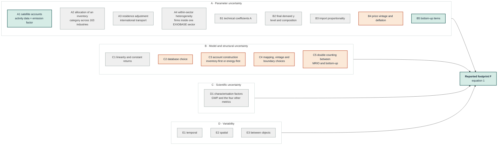

# Sources of uncertainty in the Danish health-care footprint

**Purpose.** This document identifies every source of uncertainty that bears on
the results of this study, states which sources are quantified and which are
not, and gives the reason in each case. It is written to be read by a
non-specialist and to survive a methods referee. Sections 2 to 4 can be lifted
into the manuscript's Methods and Limitations with light editing; section 6 is
the honest ledger of what remains unquantified.

**Why a document of this kind is necessary.** A single reported interval invites
the reader to treat it as the total uncertainty of the estimate. It is not, and
saying so requires naming what the interval excludes. The Greenhouse Gas
Protocol states the obligation directly: inventories should always include a
detailed qualitative discussion of the likely causes of uncertainty, and the
direction and relative magnitude of any systematic bias should be discussed even
where it cannot be quantified (GHG Protocol, n.d., sections 2.2 and 9).

---

## 1. What the study computes, and where uncertainty can enter

The health-care footprint is

$$
F \;=\; \mathbf{c}\,(\mathbf{I}-\mathbf{A})^{-1}\,\mathbf{y} \;+\; \mathbf{d} \;+\; \sum_{c} B_{c}
\tag{1}
$$

where

| symbol | meaning | unit |
|---|---|---|
| $F$ | the reported footprint for one impact category | kt CO₂-eq, kt, Mm³, or km² |
| $\mathbf{c}$ | impact intensity of each producing node | impact per M.EUR of output |
| $\mathbf{A}$ | technical coefficients: input required per unit of output | dimensionless |
| $(\mathbf{I}-\mathbf{A})^{-1}$ | Leontief inverse: total output pulled by one unit of demand | dimensionless |
| $\mathbf{y}$ | Danish health-care final demand, by product and origin | M.EUR |
| $\mathbf{d}$ | direct operational impact of the Danish health industry | as $F$ |
| $B_{c}$ | bottom-up items outside the input-output model | as $F$ |

Every term in equation (1) is an estimate, and so is the procedure that
assembled it. The taxonomy below follows that structure.



**Reading the diagram.** Green sources are propagated in the Monte Carlo. Orange
sources are reported as discrete scenarios, because they are decisions rather
than measurement error. Grey sources are named, and where possible bounded by
citation, but not quantified in this study; section 6 states why in each case,
together with the direction of the likely bias. A rendered copy of the diagram
is at `figures/diagrams/uncertainty_taxonomy.png` for readers whose viewer does
not draw Mermaid; `scripts/render_diagrams.py` produces it.

Two of the grey boxes deserve emphasis, because they are the largest omissions
rather than the smallest: the allocation of inventory categories across
industries (A2), and the level and composition of final demand (B2).

---

## 2. The taxonomy

The classification follows the Greenhouse Gas Protocol's division into
scientific and estimation uncertainty, with estimation split into model and
parameter uncertainty (GHG Protocol, n.d., section 2), and adds the
uncertainty-versus-variability distinction that Huijbregts (1998) introduced and
that Schulte et al. (2024) adopt for multi-regional input-output analysis. Their
own assessment is worth quoting, because it explains why no single scheme is
canonical: to the best of their knowledge, no proper framework exists for
distinguishing types of uncertainty in this setting.

### 2.1 Parameter uncertainty in the satellite accounts

**A1. Raw inventory uncertainty.** The national emission account is itself an
estimate, being an activity level multiplied by an emission factor. Schulte et
al. (2024) propagate this using the confidence intervals countries report to the
UNFCCC and the element-level uncertainties of Solazzo et al. (2021) for EDGAR.
*Captured here only implicitly*, inside the single joint factor described in
section 3.

**A2. Allocation of an inventory category across industries.** A national total
for, say, road transport must be split across the 163 EXIOBASE industries using
proxies. This allocation is the specific problem Schulte et al. (2026) solve,
and the consequences of ignoring it are large: neglecting the correlations that
the accounting identity forces on the shares changed individual sector
multiplier standard deviations by between minus 34 and plus 130 per cent in
their German case study, and overstated the national footprint's uncertainty by
46 per cent. *Not captured.* See section 6.

**A3. Residence adjustment.** Moving from a territorial to a residence basis
requires reallocating international transport emissions. Schulte et al. (2024)
find this the dominant source of carbon-account uncertainty for small open
economies and name Denmark among the countries where methane from international
water transport is a significant contributor. This transport-allocation problem
is the same structural weakness that the sea-transport correction addresses on
the transaction side. *Not captured as a distribution*; addressed as a
correction, and the correction itself is documented separately.

**A4. Within-sector heterogeneity.** EXIOBASE assumes every firm in an industry
shares one impact intensity. Rodrigues et al. (2018) report that the
within-sector coefficient of variation of carbon per unit output exceeded one
for 17 of 23 Japanese manufacturing sectors. Schulte et al. (2024) state the
consequence precisely: their uncertainty estimates are on the *mean* emissions
of a sector, and within-sector variability may be substantially larger. This
heterogeneity matters most for pharmaceuticals and medical devices, which sit
inside broad sectors. *Not captured.*

### 2.2 Parameter uncertainty in the economic core

**B1. Technical coefficients.** Lenzen et al. (2010) perturb the transaction
matrix, gross output, and direct intensities together, deriving standard
deviations by regressing raw-data dispersion on flow size. Schulte et al.
(2024) exclude the technical coefficients from their own assessment and say so.
*Captured here only implicitly.*

**B2. Final demand.** Wood et al. (2019) rank the total and composition of final
demand third among the drivers of variation between databases, above the
technical coefficients. Given that this study has already found and corrected a
demand-vector omission of roughly a third of health-care services expenditure,
this is not a hypothetical concern. *Not captured as a distribution.* See section
6.

**B3. Import proportionality.** Imported commodities are distributed over
purchasing industries pro rata because destination data do not exist. Schulte
et al. (2021) randomised this assumption on EXIOBASE at the same resolution
used here and found national footprint coefficients of variation generally
below 4 per cent, but a quarter of industry-level footprints above 10 per cent
for carbon and above 30 per cent for land, material, and water. *Not captured*,
but bounded by citation.

**B4. Price vintage and deflation.** The question is which price year converts
expenditure to basic prices. Jakobs et al. (2021) show price variance alone
moves hybrid footprint intensities by a median of minus 2 to plus 4 per cent,
with a strongly skewed study-level interval. *Run as a discrete scenario.*

**B5. Bottom-up items.** These items are anaesthetic gases, inhaler
propellants, staff commuting, patient and visitor travel, and direct
operational impacts. *Captured*, each with its own spread, in section 3.

### 2.3 Model and structural uncertainty

**C1. Linearity and constant returns to scale.** The Leontief model assumes
impacts scale proportionally with demand. Schulte et al. (2024) list this as the
canonical example of model uncertainty in this field; no study in the literature
quantifies it. *Not captured, and not quantifiable within the same model.*

**C2. Database choice.** Wood et al. (2019) compare five global databases and
report an unweighted mean relative standard deviation of 8.3 per cent for
production-based and 11.9 per cent for consumption-based accounts. For Denmark
specifically their Table 1 gives 19.3 per cent and 8.8 per cent respectively.
*Not captured as a distribution*, but this study's own comparison of five
published Danish national footprints spans 9.77 to 13.19 t CO₂-eq per capita, a
coefficient of variation of 12.8 per cent, which is wider than the parametric
interval reported here.

**C3. Account construction.** EXIOBASE builds its greenhouse-gas accounts from
energy balances and emission factors; national inventories are an alternative
starting point. Schulte et al. (2024) show that for methane the choice between
EDGAR and UNFCCC can change a country's emissions by as much as 300 per cent.
*Not captured.* Their published accounts at exactly this study's resolution make
this the most valuable structural scenario still available.

**C4. Mapping, vintage, and boundary choices.** These choices are the
pharmaceutical sector mapping, the waste-account vintage, the sector boundary,
and the capital treatment. *Run as discrete scenarios*, which is what Schulte
et al. (2024) recommend and what the IPCC (2000, section 6.5.6) sanctions.
Their finding that uncertainty due to choices outweighs parametric uncertainty
for most sectors means these scenarios are likely the larger term.

**C5. Double counting between the input-output model and the bottom-up items.**
Jakobs et al. (2021) measure the difference between two accepted correction
methods at a factor of almost two. *Not captured.*

### 2.4 Scientific uncertainty

**D1. Characterisation factors.** This source is the uncertainty of the metric
that converts gases to a common unit, and of the equivalent factors for the
other four categories. Both the IPCC (2000, section 6.1) and the GHG Protocol
place this outside a standard uncertainty assessment, the IPCC explicitly
excluding global-warming-potential uncertainty from its own chapter while
noting that a complete assessment would have to consider it. *Excluded, with
that warrant.* The study does report a separate global-warming-potential
vintage sensitivity.

### 2.5 Variability

**E1. Temporal.** The study is a single-year snapshot. **E2. Spatial.**
Regional differences within Denmark are not resolved. **E3. Between objects.**
The issue is the same as in A4. *None captured.*

---

## 3. What the Monte Carlo does

### 3.1 The model that is simulated

Because equation (1) is linear in final demand and additive in the bottom-up
items, the footprint can be written as a sum of fourteen deterministic amounts,
nine supply-chain contribution groups and five bottom-up items:

$$
F \;=\; \sum_{g} M_{g} \;+\; \sum_{c} B_{c}
\tag{2}
$$

A draw therefore recombines those fourteen numbers with random multipliers, and
the Leontief inverse is never recomputed. This shortcut is the same
simplification the IEooc teaching implementation makes, and it must be stated:
the technical coefficient matrix and the Leontief inverse are held fixed, so
uncertainty in the technology structure is carried by the factor of section 3.3
rather than by resampling the matrix.

### 3.2 The form of the multiplier

Each uncertain quantity enters as a multiplicative factor

$$
h \;=\; e^{\sigma z}, \qquad z \sim \mathcal{N}(0,1)
\tag{3}
$$

lognormal with median one, so that the median of the simulation reproduces the
deterministic estimate. Two warrants are needed and both are available.
Lenzen et al. (2010, section 2) choose the lognormal because it preserves sign,
where a normal distribution would place probability on negative flows and
require a biasing truncation. Schulte et al. (2026, section 3.4) note that the
strict maximum-entropy distribution for a variable with a known mean and
standard deviation on the natural scale is the truncated normal, and adopt the
lognormal as the more common and more tractable choice. This study follows them,
and states the departure rather than leaving it implicit.

The spread is reported as a geometric standard deviation, $\mathrm{GSD} =
e^{\sigma}$, whose 95 per cent factor range is
$[\mathrm{GSD}^{-1.96},\,\mathrm{GSD}^{1.96}]$. Where a coefficient of variation
is given instead,

$$
\sigma \;=\; \sqrt{\ln\!\left(1+\mathrm{CV}^{2}\right)}
\tag{4}
$$

### 3.3 The input-output factor, and the correlation it implies

EXIOBASE publishes no element-level standard deviations, so the supply-chain
term carries one factor per contribution group,

$$
f_{g} \;=\; \exp\!\left[\sigma_{M}\left(\sqrt{\rho_{M}}\,z_{0} + \sqrt{1-\rho_{M}}\,z_{g}\right)\right]
\tag{5}
$$

calibrated to the relative standard deviation of 8.35 per cent that Lenzen et al.
(2020) obtain for the Danish health-care greenhouse-gas footprint, the only
published Monte Carlo of that quantity.

The correlation $\rho_{M}$ is the one parameter in this analysis that cannot be
chosen freely, and the reason is a theorem rather than a convention. Rodrigues
(2016) shows that the assumption of uncorrelated disaggregates and the
assumption of a known aggregate uncertainty are **mutually exclusive**. If the
aggregate uncertainty is known, the correlations among its parts are determined,
and their sign depends on the relative sizes of the aggregate and disaggregate
uncertainties. Where the shares are known precisely and the aggregate is not,
the correlations are strongly positive, which is the case here and corresponds
to $\rho_{M}=1$.

**A correction made on 8 September 2026.** The earlier implementation held
$\sigma_{M}$ fixed while varying $\rho_{M}$. Because each group's own spread was
then unchanged, the total's spread fell as the correlation fell, and the
independence case reported a supply-chain coefficient of variation of 4.27 per
cent against the calibrated 8.35 per cent. In other words, the sensitivity
silently abandoned the calibration it was supposed to be testing, and understated
the interval by roughly half, which is exactly the error Rodrigues et al. (2018)
measure between dependent and independent sampling of country accounts.

The spread is now re-solved at every correlation so that the calibrated total is
held:

$$
\operatorname{Var}(M) \;=\; \sum_{i}\sum_{j} a_{i}a_{j}\left(e^{\rho_{ij}\sigma^{2}}-1\right)e^{\sigma^{2}},
\qquad \rho_{ii}=1
\tag{6}
$$

solved for $\sigma$ at each $\rho_{M}$. The consequence is that $\rho_{M}$ is now
a sensitivity on how variance is **distributed**, which is what a reader wants
it to be, rather than on how much of it there is.

| $\rho_{M}$ | $\sigma$ required | Total CV | Median group CV | Supply-chain CV if not re-solved |
|---|---|---|---|---|
| 1.00 (default) | 0.083 | 7.85 % | 8.4 % | 8.38 % |
| 0.76 | 0.092 | 7.83 % | 9.2 % | 7.60 % |
| 0.00 | 0.161 | 7.72 % | 16.2 % | 4.27 % |

The three rows come from a sensitivity sweep run separately from the headline
estimate, at 40,000 draws with an independent seed against the headline's
100,000 at seed 42. The default row therefore reads 7.85 % where the headline
reads 7.87 %; the gap is Monte Carlo noise of the expected size, not a
disagreement between the two.

The final column is the size of the corrected defect. The middle value of 0.76 is
not an arbitrary midpoint: it is the median correlation Rodrigues et al. (2018)
measure between country consumption-based accounts.

### 3.4 Correlated bottom-up items

Employee commuting and patient travel share a derivation method, so their
factors share a random component:

$$
\ln h_{C} = \sigma_{C}\!\left(\sqrt{\rho}\,z_{0} + \sqrt{1-\rho}\,z_{C}\right),
\qquad
\ln h_{V} = \sigma_{V}\!\left(\sqrt{\rho}\,z_{0} + \sqrt{1-\rho}\,z_{V}\right)
\tag{7}
$$

This construction preserves each declared geometric standard deviation exactly
while giving the log-factors correlation $\rho$; $\rho = 0.8$ is used, and 0,
0.5, and 0.8 are reported.

### 3.5 The parameters

| Parameter | GSD | 95 % factor range | Basis |
|---|---|---|---|
| Input-output model | 1.087 | 0.85 to 1.18 | Lenzen et al. (2020), the only published Monte Carlo of this quantity |
| Direct operations | 1.10 | 0.83 to 1.21 | Statistics Denmark national accounts |
| Inhaler propellants | 1.15 | 0.76 to 1.32 | Danish EPA F-gas inventory |
| Employee commuting | 1.25 | 0.65 to 1.55 | Ratio method on Danish employment and travel-survey distances |
| Anaesthetic gases | 1.30 | 0.60 to 1.67 | Danish national inventory, activity and emission factor |
| Patient and visitor travel | 1.40 | 0.52 to 1.93 | Danish travel survey; the visitor component has no Danish source |

The ordering is the argument. The two quantities taken from a national account
are the tightest; the quantity with no Danish source at all is the loosest, at
roughly a factor of two either way.

---

## 4. Results, and the two tiers

The IPCC (2000) distinguishes Tier 1, which combines uncertainties by an
error-propagation formula, from Tier 2, which simulates. Sections 6.3.1 and 6.4.2
require a Tier 1 result to be reported alongside a Tier 2 one, noting that it
costs hardly any additional effort. Both are now reported.

| | Climate change |
|---|---|
| Deterministic estimate | 4,712 kt CO₂-eq |
| Simulation median | 4,734 kt CO₂-eq |
| Simulation mean | 4,751 kt CO₂-eq |
| Coefficient of variation, Tier 2 | 7.87 % |
| Coefficient of variation, Tier 1 | 7.84 % |
| 95 % interval | 4,064 to 5,531 kt CO₂-eq |

The two tiers agreeing to 0.03 percentage points is expected rather than
fortunate: the model is additive, and every spread is well below the 30 per
cent limit at which the Tier 1 formula degrades (IPCC, 2000, section 6.3).

**Convergence.** The IPCC (2000, section 6.4, step 5) criterion is that the 95
per cent range is determined to within 1 per cent. Measured across the two halves
of the simulation, the largest relative difference in the interval endpoints is
**0.21 per cent**, so the criterion is met at 100,000 draws.

**Variance decomposition.** Because the model is additive, the variance splits
in closed form,

$$
\operatorname{Var}(F) = \sum_{j} a_{j}^{2}\!\left(e^{\sigma_{j}^{2}}-1\right)e^{\sigma_{j}^{2}}
\;+\; 2a_{C}a_{V}e^{(\sigma_{C}^{2}+\sigma_{V}^{2})/2}\!\left(e^{\rho\sigma_{C}\sigma_{V}}-1\right)
\tag{8}
$$

| Contributor | Share of variance |
|---|---|
| Input-output model | 78.8 % |
| Covariance of the travel pair | 9.3 % |
| Patient and visitor travel | 6.7 % |
| Employee commuting | 5.1 % |
| Direct operations | 0.09 % |
| Anaesthetic gases | 0.007 % |
| Inhaler propellants | 0.002 % |

The share attributed to the input-output model is stable at 78.6 to 78.9 per
cent across all three correlation assumptions, so it is a property of the
calibration rather than of the correlation choice. That stability had to be
tested: at a fixed spread, a perfect-correlation assumption would maximise that
share by construction.

---

## 5. Publishing the uncertainty, not only summarising it

Schulte et al. (2026, section 4) rank the ways of communicating correlated
results. Sharing the full simulated sample preserves all information; sharing
the covariance matrix with the medians is second best; sharing only the mean and
standard deviation, with no information on correlation, is the option they
identify as capable of seriously misestimating uncertainty.

The nine contribution groups here are correlated by construction, so this study
publishes both the full sample of group draws and the covariance matrix:

- `04_uncertainty_lenzen_ieooc/uncertainty_group_draws_gwp.npy`
- `04_uncertainty_lenzen_ieooc/uncertainty_group_covariance_gwp.csv`

---

## 6. What is not quantified, and what that means

Following the structure the writing guidelines require, each entry names the
source, states what it changes about the conclusion, and states what would
reduce it.

**The interval is parametric uncertainty conditional on one model.** It does
not capture the effect of using a different database, a different construct, or
a nationally consistent table. Schulte et al. (2024) find median coefficients
of variation of 3 per cent for country-level carbon footprints but 18 per cent
at the sector level, a factor of six; a health-care footprint aggregates many
sectors and therefore sits between the two, nearer the country end, but nothing
in the present design places it precisely. This imprecision constrains any
claim that the reported interval bounds the true value. A study using the
published inventory-first accounts of Schulte et al. (2024), which exist at
exactly this resolution and carry element-level uncertainties and correlations,
would resolve it.

**The calibration target may be too narrow.** The 8.35 per cent is derived from
a propagation that treats disaggregates as uncorrelated, and Rodrigues (2016)
shows that assumption is incompatible with a known aggregate uncertainty.
Rodrigues et al. (2018) measure the penalty in a comparable setting: assuming
independence between country accounts understated the world account's
uncertainty by half. This independence assumption biases the reported interval
**downward**, plausibly substantially. Recalibrating against a dependence-aware
benchmark would reduce it; the candidates are Rodrigues et al.'s median country
coefficient of variation of 7.5 per cent and Wood et al.'s (2019) Denmark
figure of 8.8 per cent, both of which are close to the value used, which is
mildly reassuring but not decisive.

**The calibration is a carbon statistic applied to five impact categories.**
Schulte et al. (2021), on this database and this resolution, find
industry-level footprint coefficients of variation above 10 per cent for carbon
but above 30 per cent for land, material, and water. The four non-carbon
categories are therefore reported with an interval that is too narrow, and the
degree is unknown. A bounding run at three times the carbon spread is reported
alongside the default, and gives coefficients of variation of 21 to 25 per cent
rather than 7 to 8 per cent. That bound is not an estimate, and is labelled as
such.

**Within-sector heterogeneity is not represented.** Pharmaceuticals and medical
devices sit inside broad sectors whose internal intensity spread is large. This
omission biases the reported interval downward for precisely the contribution
group that dominates the footprint. Resolving it requires product-level or
firm-level data that the model does not contain.

**Final demand carries no distribution.** Wood et al. (2019) rank it above the
technical coefficients as a driver of between-database variation, and this study
has already found and corrected a demand-vector omission. The direction of the
residual bias is unknown. A distribution on the expenditure vector, or at
minimum a scenario, would address it.

**Allocation of inventory categories to industries is not represented.** This
allocation is the source Schulte et al. (2026) show can change sector-level
standard deviations by minus 34 to plus 130 per cent. Their published software
makes it tractable in principle; it requires per-category proxy uncertainties
this study does not hold.

**Double counting between the input-output model and the bottom-up items is not
varied.** Jakobs et al. (2021) measure a factor of almost two between two
accepted correction methods. The direction here is likely **upward** on the
footprint if the correction is too weak, and this is the omitted term most
likely to rival the input-output factor in size.

**Characterisation-factor uncertainty is excluded**, on the explicit warrant of
the IPCC (2000, section 6.1) and the GHG Protocol.

**Uncertainty due to choices is likely the larger term.** Schulte et al. (2024)
find that at sector level, uncertainty due to choices outweighs parametric
uncertainty for most sectors. This study's own structural scenarios bear that
out: the alternative pharmaceutical mapping moves the median to 3,605 kt, which
lies outside the parametric 95 per cent interval of 4,064 to 5,531 kt entirely.
That divergence is the strongest single argument for reporting the scenarios
beside the interval rather than in an appendix.

**Therefore the interval should be read as the precision of this model, not the
accuracy of the estimate.** It should be reported together with that sentence,
or not at all.

---

## 7. Where the numbers come from

| Output | File |
|---|---|
| Totals, median, mean, interval | `04_uncertainty_lenzen_ieooc/uncertainty_totals.csv` |
| Variance decomposition | `uncertainty_variance_shares.csv` |
| Tier 1 error propagation | `uncertainty_tier1_error_propagation.csv` |
| Convergence against the IPCC criterion | `uncertainty_convergence.csv` |
| Correlation sensitivity | `uncertainty_mrio_correlation.csv` |
| Non-carbon bounding run | `uncertainty_noncarbon_bound.csv` |
| Structural scenarios | `uncertainty_structural_scenarios.csv` |
| Full group sample and covariance | `uncertainty_group_draws_gwp.npy`, `uncertainty_group_covariance_gwp.csv` |
| Audit of the simulation, 19 checks | `uncertainty_audit.csv` |

```bash
HC_ANALYSIS_YEAR=2022 HC_BACKGROUND_TAG=_snacship PYTHONPATH=src python -m analysis.uncertainty_2025
HC_ANALYSIS_YEAR=2022 HC_BACKGROUND_TAG=_snacship PYTHONPATH=src python -m analysis.uncertainty_audit
```

---

## References

Full entries with DOIs are in [`docs/REFERENCES.md`](../REFERENCES.md).

- GHG Protocol. (n.d.). *Guidance on uncertainty assessment in GHG inventories
  and calculating statistical parameter uncertainty*. World Resources Institute
  and World Business Council for Sustainable Development.
  https://ghgprotocol.org/calculation-tools-and-guidance
- Huijbregts, M. A. J. (1998). Application of uncertainty and variability in LCA.
  *The International Journal of Life Cycle Assessment, 3*(5), 273-280.
  https://doi.org/10.1007/BF02979835
- Intergovernmental Panel on Climate Change. (2000). *Quantifying uncertainties
  in practice* (Chapter 6). IPCC National Greenhouse Gas Inventories Programme.
  https://www.ipcc-nggip.iges.or.jp/public/gp/english/
- Jakobs, A., Schulte, S., & Pauliuk, S. (2021). Price variance in hybrid-LCA
  leads to significant uncertainty in carbon footprints. *Frontiers in
  Sustainability, 2*, 666209. https://doi.org/10.3389/frsus.2021.666209
- Lenzen, M., Wood, R., & Wiedmann, T. (2010). Uncertainty analysis for
  multi-region input-output models. *Economic Systems Research, 22*(1), 43-63.
  https://doi.org/10.1080/09535311003661226
- Lenzen, M., Malik, A., Li, M., Fry, J., Weisz, H., Pichler, P.-P., Chaves,
  L. S. M., Capon, A., & Pencheon, D. (2020). The environmental footprint of
  health care: A global assessment. *The Lancet Planetary Health, 4*(7),
  e271-e279. https://doi.org/10.1016/S2542-5196(20)30121-2
- Perkins, J., & Suh, S. (2019). Uncertainty implications of hybrid approach in
  LCA: Precision versus accuracy. *Environmental Science & Technology, 53*(7),
  3681-3688. https://doi.org/10.1021/acs.est.9b00084
- Rodrigues, J. F. D. (2016). Maximum-entropy prior uncertainty and correlation
  of statistical economic data. *Journal of Business & Economic Statistics,
  34*(3), 357-367. https://doi.org/10.1080/07350015.2015.1038545
- Rodrigues, J. F. D., Moran, D., Wood, R., & Behrens, P. (2018). Uncertainty of
  consumption-based carbon accounts. *Environmental Science & Technology,
  52*(13), 7577-7586. https://doi.org/10.1021/acs.est.8b00632
- Schulte, S., Jakobs, A., & Pauliuk, S. (2021). Relaxing the import
  proportionality assumption in multi-regional input-output modelling. *Journal
  of Economic Structures, 10*, 20. https://doi.org/10.1186/s40008-021-00250-8
- Schulte, S., Jakobs, A., & Pauliuk, S. (2024). Estimating the uncertainty of
  the greenhouse gas emission accounts in global multi-regional input-output
  analysis. *Earth System Science Data, 16*(6), 2669-2700.
  https://doi.org/10.5194/essd-16-2669-2024
- Schulte, S., Jakobs, A., & Lupton, R. (2026). When correlation matters: A
  practical guide to dealing with uncertainty in the case of data
  disaggregation. *Journal of Industrial Ecology, 30*, 665-681.
  https://doi.org/10.1007/s44498-026-00048-6
- Solazzo, E., Crippa, M., Guizzardi, D., Muntean, M., Choulga, M., &
  Janssens-Maenhout, G. (2021). Uncertainties in the Emissions Database for
  Global Atmospheric Research (EDGAR) emission inventory of greenhouse gases.
  *Atmospheric Chemistry and Physics, 21*(7), 5655-5683.
  https://doi.org/10.5194/acp-21-5655-2021
- Wood, R., Moran, D. D., Rodrigues, J. F. D., & Stadler, K. (2019). Variation in
  trends of consumption based carbon accounts. *Scientific Data, 6*, 99.
  https://doi.org/10.1038/s41597-019-0102-x
